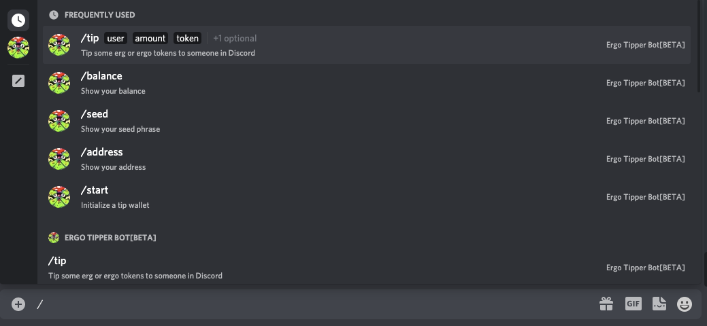

# Ergotipper

This page describes how to set up the **ErgoTipperBot** on each platform. This bot allows you to tip other members erg, or any of the supported native tokens. Simply set up your wallet, fund it, and start tipping! If you tip someone without a wallet, one will automatically be generated for them. 

You can restore using the same seed phrase, and use the same tip wallet across all platforms.  

- [Supported coins/tokens](https://github.com/Luivatra/ergotipper-tokens#supported-token-list)

## Adding a token

To add a token to the list, simply create a pull request [on Github](https://github.com/Luivatra/ergotipper-tokens#supported-token-list) that adds your token to the list. A token name should not contain whitespace, so if your token does have whitespace in the name make sure to replace/remove it. To avoid clutter in the token list add NFT's to the separate list below.

## Supported Platforms

- [Reddit](https://www.reddit.com/message/compose/?to=ErgoTipperBot&subject=BotTalk&message=!start) 
- [Discord](https://discord.gg/SnTHHkcR6x) (Ergo Tipper Bot[BETA]#0902)
- [Telegram](https://t.me/ergotipperbot)
- [Twitter](https://twitter.com/ErgoTipperBot)

This is a bot that runs on a server managed by u/Luivatra. It is not unhackable (nothing is). Do not use this as a main wallet!

To have your token added to the bot, please start a poll in one of the community spaces.

## Getting Started

### Reddit

1. Send a [private message](https://www.reddit.com/message/compose/?to=ErgoTipperBot&subject=BotTalk&message=!start) (**not chat!**) to u/ErgoTipperBot with the text: `!start`
2. Once the wallet is created, send a pm with `!address` to show your tip address.
3. Copy your tip address and open your Yoroi wallet.
4. Click the send tab and transfer some ERG's to the tip wallet address. (Any transaction requires at least 0.001 erg in fees, on top of that funds in utxo are stored in a box. Each box needs to have a small amount of erg in them. So on the tip bot a token tip will require 0.00115 erg)
5. If you want to tip a token like Kushti for example, transfer the token to the same tip wallet address. 
6. Once the transactions are sent (~ 2 minutes), send a PM to u/ErgoTipperBot: `!balance`
7. Your balance should look like this:

| token  | amount |
|--------|:-------|
| Erg    | 0.1    |
| Kushti | 100    |

8. You are good to go! In one of the subreddits where u/ErgoTipperBot is activated write a comment to the person you want to tip with the following command (without the brackets):
`!tip <amount> <token> <any remaining text will be stored in the transaction database so you can both view it later>`

### Commands

- In comments:
    - `!tiphelp`: Show this message
    - `!tip <amount> <token> <any remaining text will be stored in the transaction database so you can both view it later>:` tip the person you reply to
- In PM:
    - [!start](https://www.reddit.com/message/compose/?to=ErgoTipperBot&subject=BotTalk&message=!start): Initialize a tip wallet
    - [!changepw <currentPassword> <newPassword>](https://www.reddit.com/message/compose/?to=ErgoTipperBot&subject=BotTalk&message=!changepw%20%3CcurrentPassword%3E%20%3CnewPassword%3E): Change tip wallet pw
    - [!address](https://www.reddit.com/message/compose/?to=ErgoTipperBot&subject=BotTalk&message=!address): Show tip wallet address
    - [!seed <password>](https://www.reddit.com/message/compose/?to=ErgoTipperBot&subject=BotTalk&message=!seed%20%3Cpassword%3E): Show tip wallet seed phrase
    - [!balance](https://www.reddit.com/message/compose/?to=ErgoTipperBot&subject=BotTalk&message=!balance): Show tip wallet balance
    - [!restore <password> <seed phrase>](https://www.reddit.com/message/compose/?to=ErgoTipperBot&subject=BotTalk&message=!restore%20%3Cpassword%3E%20%3Cseed%20phrase%3E): Restore an existing wallet to be used as your tip wallet (use this to use the same wallet across Discord & Reddit)

### Telegram
  
#### Commands

- In comments:
    - `/t <amount> <token> <any remaining text will be stored in the transaction database so you can both view it later>`: tip the person you reply to, make sure to tag @ErgoTipperBot
- In DM with @ErgoTipperBot:
    - `/start`: Initialize a tip wallet
    - `/changepw currentPassword newPassword`: Change tip wallet pw
    - `/address`: Show tip wallet address
    - `/seed password`: Show tip wallet seed phrase (Note that the password you need to retrieve your seed phrase is the one given to you by the tipbot in it's first message.)
    - `/balance`: Show tip wallet balance
    - `/restore password seedphrase`: Restore an existing wallet to be used as your tip wallet (use this to use the same wallet across Discord, Reddit, Twitter & Telegram)
  
### Restoring
  
You can restore the generated wallet in any supported Ergo wallet by using the retrieved seed. 
  
### Discord
  
Simply DM the bot *Ergo Tipper Bot[BETA]#0902* on Discord and a menu will appear when you type `/`
  

  
### Twitter
  
Please note the bot on Twitter has a ~10min delay in responding.

Send a direct message to [ErgoTipperBot](https://twitter.com/ErgoTipperBot) with !start 

