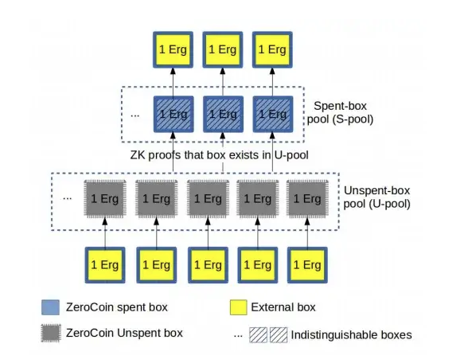

# ZeroJoin

Mixers are basic tools that restore the fungibility of digital notes.

The first scheme on Ergo, ZeroJoin, is based on ring signatures and proof of knowledge for a Diffie-Hellman tuple *(for publicly known g, h, u, v, there exists w, such as g&w == u && hw == v)*

ZeroJoin is based on two-party interactions called Σ-protocols. Specifically, we need two types of Σ-protocols described below. 

Let `G` be a multiplicative group of prime order `q` where the Decision Diffie-Hellman (DDH) problem is *hard*. 

1. The **first protocol**, denoted `proveDlog(u)`, is a proof of knowledge of the Discrete Logarithm of some group element `u` with respect to some fixed generator `g`. 
      1. That is, the prover proves knowledge of `x` such that u = gx by using Schnorr signatures.  
2. The **second protocol primitive**, denoted `proveDHTuple(g, h, u, v)`, is a proof of knowledge of Diffie-Hellman Tuple, where the prover proves knowledge of `x` such that u = gx and v = hx for arbitrary generators `g` and `h`. 

This is two instances of the first protocol running in parallel.

1. The prover picks r ←R Zq, computes (t0, t1) = (gr , hr ) and sends (t0, t1) to the verifier.
2. The verifier picks c R ← Zq and sends `c` to prover.
3. The prover sends `z = r + cx` to the verifier, who accepts if gz = t0 · uc and hz = t1 · vc.

We use the non-interactive variant of the above protocol obtained via a Fiat-Shamir transformation, where c = H(t0‖t1‖m) for some message `m` to be signed. 

Observe that `proveDHTuple` requires four exponentiations for verification, while `proveDlog` requires 2. 

ErgoScript supports both protocols and thus has all the primitives needed to implement ZeroJoin.

- [ZeroJoin Presentation](https://storage.googleapis.com/ergo-cms-media/docs/CBT_2020_ZeroJoin_Combining_Zerocoin_and_CoinJoin_v3.pdf)