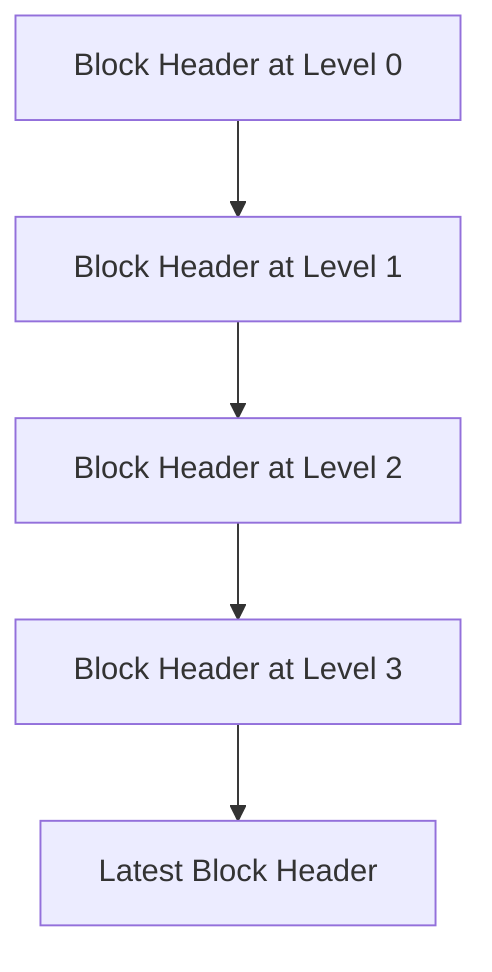

# Interlink Vectors in Ergo

## Overview

Interlink vectors are a fundamental component of the [Proof-of-Proof-of-Work (PoPow) protocol](popow.md) in the Ergo blockchain. These vectors allow lightweight clients to verify the correctness of the blockchain without needing to download and validate the entire chain. By storing references to previous block headers at varying heights, interlink vectors create a hierarchical structure that supports efficient validation and compression of blockchain data, making them particularly useful for devices with limited resources such as mobile phones or IoT devices.

Interlink vectors work in conjunction with [Merkle trees](merkle-tree.md) and PoPow proofs to ensure that the blockchain follows the longest chain rule, which is critical for maintaining the security and integrity of the network.

## Purpose of Interlink Vectors

In traditional blockchains, each block references its immediate predecessor, forming a simple linear chain. For lightweight clients, downloading and validating every block in this chain is impractical due to resource constraints. Interlink vectors solve this problem by storing references to previous blocks in a hierarchical manner. This allows clients to verify the chain's integrity by checking only a subset of blocks, drastically reducing the amount of data they need to process.

Interlink vectors are essential for enabling efficient and secure blockchain validation in scenarios where full nodes are impractical. They are a key part of ensuring that the network remains decentralized and accessible to a wide range of participants, including those with limited computing power.

## Structure of Interlink Vectors

An interlink vector is essentially an array of block headers, where each element points to a previous block header at a certain level of the chain. The levels in the interlink vector are determined by the number of leading zeros in the block’s hash, which corresponds to the difficulty level of the block.

### Key Properties:

- **Efficiency**: Interlink vectors allow clients to verify the longest chain without needing to download the entire blockchain, making the process more efficient.
- **Scalability**: They support the participation of lightweight clients by minimizing the data required for verification.
- **Security**: By adhering to the longest chain rule, interlink vectors help ensure that the blockchain remains secure and that all participants can trust its integrity.

### Example Structure:

For instance, if a block has two leading zeros in its hash, it might be placed at the second level of the interlink vector. Higher levels correspond to blocks with more leading zeros, indicating higher difficulty.



This hierarchical structure allows clients to verify the blockchain's integrity by checking only the relevant levels in the interlink vector.

## Implementation in Ergo

Interlink vectors are implemented in the Ergo blockchain as part of the PoPow protocol and are stored in the block headers. The implementation involves recursively hashing previous block headers, starting from the genesis block, and updating the interlink vector with each new block.

### 1. **Creating the Interlink Vector**:

When a new block is mined:

- The block’s hash is computed.
- The number of leading zeros in the hash determines the block's level in the interlink vector.
- The block header is added to the vector at the corresponding level.

**Code Reference**: The logic for creating and managing interlink vectors is implemented within the [Scorex repository](https://github.com/ScorexFoundation/scrypto) used by the Ergo blockchain. Specifically, you can find the relevant code in the [BlockHeader.scala](https://github.com/ergoplatform/ergo/blob/master/ergo-core/src/main/scala/org/ergoplatform/modifiers/history/header/Header.scala) file.

### 2. **Updating the Interlink Vector**:

As new blocks are added:

- The interlink vector is updated by adding references to new block headers.
- If a block with more leading zeros (indicating a higher level) is found, it replaces the previous block at that level.

**Code Reference**: The interlink vector update mechanism is handled within the [Ergo block header construction process](https://github.com/ergoplatform/ergo/blob/master/ergo-core/src/main/scala/org/ergoplatform/modifiers/history/header/Header.scala).

### 3. **Verifying the Chain with Interlink Vectors**:

To verify the blockchain:

- A client checks the blocks referenced in the interlink vector.
- By verifying that each block in the vector adheres to the required difficulty level, the client confirms that the chain follows the longest chain rule.

**Code Reference**: Chain verification using interlink vectors is integrated into the block validation logic in the [Ergo codebase](https://github.com/ergoplatform/ergo/blob/master/ergo-core/src/main/scala/org/ergoplatform/nodeView/history/ErgoHistory.scala), particularly within the [ErgoHistory.scala](https://github.com/ergoplatform/ergo/blob/master/ergo-core/src/main/scala/org/ergoplatform/nodeView/history/ErgoHistory.scala) file.

### 4. **Batch Merkle Proofs and Interlink Vectors**:

Interlink vectors are often combined with batch Merkle proofs to enhance efficiency:

- A batch Merkle proof allows the simultaneous verification of multiple elements in the interlink vector.
- This reduces the computational overhead and ensures secure validation.

**Code Reference**: Batch Merkle proof logic is implemented in the [sigma-rust library](https://github.com/ergoplatform/sigma-rust), specifically in the [batchmerkleproof.rs](https://github.com/ergoplatform/sigma-rust/blob/develop/ergo-merkle-tree/src/batchmerkleproof.rs) file.

## Example Usage

Consider a scenario where a lightweight client wants to verify the blockchain up to a certain height. The client can download the interlink vector from the latest block and check the references to previous blocks at each level. By verifying the Merkle proofs for these references, the client can confirm that the chain is valid without downloading the entire chain.

Here’s an example of how the interlink vector might be used in practice:

```rust
use sigma_merkle_tree::batchmerkleproof::BatchMerkleProof;
use sigma_merkle_tree::merkletree::MerkleTree;
use sigma_merkle_tree::MerkleNode;

fn verify_interlink_vector(tree: &MerkleTree, proof: &BatchMerkleProof) {
    // Verify the Merkle proof for the interlink vector
    assert!(proof.valid(tree.root_hash().as_ref()));
    println!("Interlink vector is valid.");
}
```

**Code Reference**: The example demonstrates the use of batch Merkle proofs from the [sigma-rust library](https://github.com/ergoplatform/sigma-rust/blob/develop/ergo-merkle-tree/src/batchmerkleproof.rs) to verify the interlink vector against the blockchain's Merkle root.

## Conclusion

Interlink vectors are a key component of Ergo's PoPow protocol, enabling efficient and secure blockchain validation for lightweight clients. By understanding and utilizing interlink vectors, developers can ensure that their applications and clients maintain the highest standards of security and efficiency, even in resource-constrained environments.