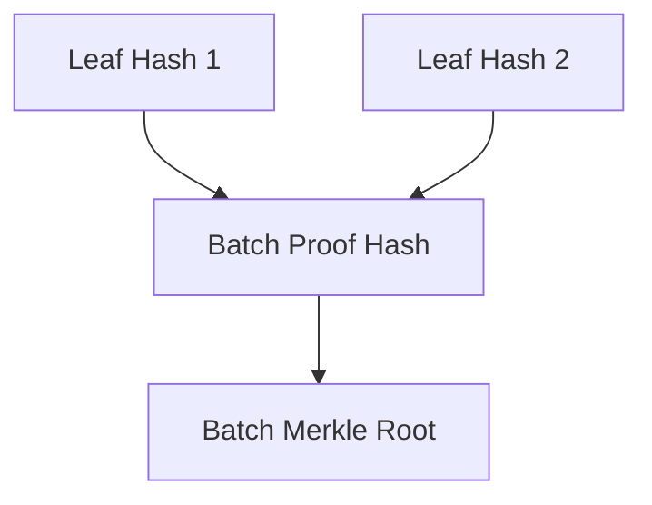

---
tags:
  - Merkle
---

# Merkle Batch Proofs in Ergo

Merkle Batch Proofs are an advanced cryptographic structure used in the Ergo blockchain to efficiently verify the inclusion of multiple data elements within a Merkle tree. This guide explains the concept of Merkle Batch Proofs, their benefits, and how they are utilized within the Ergo ecosystem, focusing on their implementation in both the `sigma-rust` library (for Rust-based applications) and the `scrypto` library (for JVM-based applications).

## Introduction to Merkle Batch Proofs

Merkle trees are a fundamental data structure in blockchain technology, providing a way to efficiently and securely verify the contents of large datasets. A Merkle tree is a binary tree where each leaf node represents a hash of a block of data, and each non-leaf node is a hash of its respective children. The root of the tree, known as the Merkle root, can be used to verify any piece of data in the tree.

A Merkle proof is a series of hashes that demonstrate the inclusion of a specific piece of data in a Merkle tree. A **Merkle Batch Proof** extends this concept by allowing the verification of multiple pieces of data simultaneously. This is particularly useful in scenarios where multiple data elements need to be verified together, as it reduces the computational overhead and the amount of data required for verification.

## Why Use Merkle Batch Proofs?

### Efficiency

Merkle Batch Proofs provide a more efficient way to verify the inclusion of multiple elements in a Merkle tree compared to verifying each element individually. By batching the proofs, the overall size of the proof is reduced, and fewer cryptographic operations are required during verification.

### Scalability

In decentralized applications (dApps) and blockchain protocols, scalability is crucial. Merkle Batch Proofs contribute to scalability by enabling the efficient verification of large datasets. This is particularly important in use cases like Proof-of-Proof-of-Work (PoPow), where interlink vectors (used to prove the correctness of blockchain headers) require efficient verification mechanisms.

### Reduced Storage and Bandwidth

Batching proofs reduces the amount of data that needs to be transmitted and stored. This is beneficial in scenarios where bandwidth or storage is limited, such as in lightweight nodes or mobile devices.

## Use Cases in Ergo

### Proof of Proof-of-Work (PoPow)

In the Ergo blockchain, Merkle Batch Proofs are integral to PoPow protocols. PoPow enables lightweight clients to verify that a blockchain follows the longest chain rule without having to download the entire chain. The interlink vectors in PoPow, which are critical for proving the correctness of block headers, can be efficiently verified using batch Merkle proofs.

### Efficient State Verification

Merkle Batch Proofs are also used in verifying the state of a blockchain, such as checking the inclusion of multiple unspent transaction outputs (UTXOs) in the current state. This is particularly useful for off-chain applications and second-layer solutions that require frequent state verification.

## How to Use Merkle Batch Proofs in Ergo

Merkle Batch Proofs are a powerful tool for efficiently verifying the inclusion of multiple data elements within a Merkle tree. In the Ergo ecosystem, they are utilized in various contexts, such as Proof-of-Proof-of-Work (PoPow) protocols, efficient state verification, and more.

For detailed guides on how to use Merkle Batch Proofs in Ergo, including code examples and step-by-step instructions, please refer to the dedicated page: [How to Use Merkle Batch Proofs in Ergo](merkle-batch-impl.md).

## Testing Merkle Batch Proofs

Testing Merkle Batch Proofs is crucial to ensure the correctness and reliability of their implementation. The following section provides an overview of testing Merkle Batch Proofs, with examples in both Rust and Scala. For detailed test cases and code samples, refer to the dedicated page: [Merkle Batch Proof Testing](merkle-batch-testing.md)

## Conclusion

Merkle Batch Proofs are a powerful tool in the Ergo blockchain, enabling efficient and scalable verification of multiple data elements within a Merkle tree. By using the appropriate tools from `sigma-rust` for Rust applications or `scrypto` for JVM applications, developers can easily create, verify, and manage these proofs, contributing to the robustness and scalability of their decentralized applications.

Whether you are building a lightweight client, developing a PoPow protocol, or simply need efficient state verification, Merkle Batch Proofs offer a solution that balances security, efficiency, and scalability.
