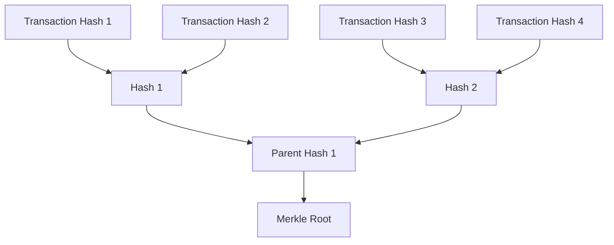

---
tags:
  - Merkle
---

# Merkle Tree Format in Ergo

Merkle Trees are a fundamental data structure in the Ergo blockchain, used to ensure the integrity and authenticity of data. This page explains the specific structure, encoding scheme, and cryptographic methods used in the Merkle Tree format within Ergo, providing essential information for developers working with Merkle proofs and validating transaction inclusion.

## Overview

A Merkle Tree is a binary tree where each node contains a cryptographic hash. Leaf nodes represent the hash of individual data elements, such as transactions, while non-leaf nodes represent the hash of their child nodes. The topmost node, known as the Merkle Root, serves as a cryptographic commitment to the entire dataset. This structure allows for efficient verification of data integrity, ensuring that even if only a small portion of the data is checked, the entire dataset can be trusted.

## Leaf Nodes

Each leaf node in the Merkle Tree represents a transaction and its corresponding spending proofs. The leaf node is a **64-byte data block**, consisting of:

- A **32-byte transaction identifier** (a 256-bit hash of the transaction)
- A **32-byte digest** of the transaction's spending proofs

The leaf node hash is computed by concatenating a **1-byte prefix** (used for domain separation), the **position** of the transaction within the block, and the **64-byte data block** itself. The prefix for a leaf node is `0x00`. This data is then hashed using the `Blake2b256` hash function.

- **Code Reference**: The implementation of leaf node hashing can be found in the [MerkleTree.scala](https://github.com/input-output-hk/scrypto/blob/master/shared/src/main/scala/scorex/crypto/authds/merkle/MerkleTree.scala) file in the `scrypto` repository.

## Internal Nodes

Internal nodes are constructed by hashing the concatenation of their two child nodes. The hash function used is the `Blake2b256` cryptographic hash function. Internal nodes do not include keys in their hash inputs, optimizing proof sizes by focusing only on the hashes of child nodes.

To construct an internal node, the following steps are taken:

1. **Concatenate**: Combine the **1-byte prefix** for internal nodes (`0x01`) with the hashes of the left and right child nodes.
2. **Hash**: Apply the `Blake2b256` function to the concatenated result to produce the hash for the internal node.

**Code Reference**:  The code for internal node construction is also part of the [MerkleTree.scala](https://github.com/input-output-hk/scrypto/blob/master/shared/src/main/scala/scorex/crypto/authds/merkle/MerkleTree.scala) file in the `scrypto` repository.

## Merkle Root

The Merkle Root is the final hash at the top of the Merkle Tree. It is computed by recursively hashing the tree from the leaf nodes up to the root. The Merkle Root serves as a cryptographic commitment to all the transactions included in the block, ensuring that any tampering with the data can be detected.

In Ergo, the Merkle Root is included in the block header, providing a way for nodes to efficiently verify the integrity of the entire block by only checking the root hash.

- **Code Reference**: The Merkle Root calculation and its inclusion in the block header are managed in the [BlockTransactions.scala](https://github.com/ergoplatform/ergo/blob/master/ergo-core/src/main/scala/org/ergoplatform/modifiers/history/BlockTransactions.scala) file in the Ergo repository.

## Merkle Proof Encoding

Merkle proofs in Ergo are encoded in a specific format to enable efficient verification. A Merkle proof provides the necessary data to verify that a particular leaf node is part of the Merkle Tree.

The encoding consists of the following elements:

1. **1-byte prefix**: Indicates whether the computed value (hash) is on the right (`0x01`) or the left (`0x00`) side of the node.
2. **32-byte stored value**: This is the sibling hash for the current node. The proof provides the path of sibling hashes from the leaf to the root, allowing the verifier to recompute the root hash.

When verifying a proof, the verifier reconstructs the path from the leaf node to the Merkle Root using the provided sibling hashes and the original leaf hash. If the computed root matches the expected Merkle Root, the proof is valid.

- **Code Reference**: The `BatchMerkleProof` class, handling Merkle proof generation and verification, is implemented in the [BatchMerkleProof.scala](https://github.com/input-output-hk/scrypto/blob/master/shared/src/main/scala/scorex/crypto/authds/merkle/BatchMerkleProof.scala) file.

## Validation

For details on the validation process for Merkle proofs, including examples and step-by-step instructions, please refer to the [Merkle Validation](merkle-validation.md) page.
