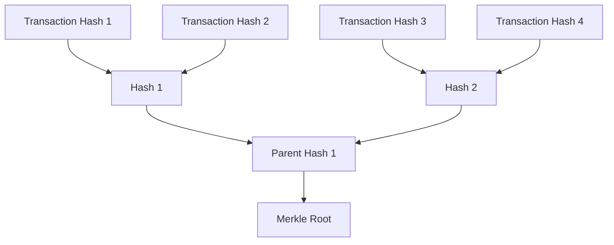

# Merkle Tree Format

The Merkle Tree format used in Ergo follows a specific structure and encoding scheme, essential for developers working with Merkle proofs and validating transaction inclusion.

A Merkle Tree is a binary tree where each node contains a cryptographic hash. Leaf nodes represent the hash of individual data elements, such as transactions, while non-leaf nodes represent the hash of their child nodes. The topmost node, known as the Merkle Root, serves as a cryptographic commitment to the entire dataset. This structure allows for efficient verification of data integrity, ensuring that even if only a small portion of the data is checked, the entire dataset can be trusted.

## Leaf Nodes

Each leaf node in the Merkle Tree represents a transaction and its corresponding spending proofs. The leaf node is a **64-byte data block**, consisting of:

- A **32-byte transaction identifier** (a 256-bit hash of the transaction)
- A **32-byte digest** of the transaction's spending proofs

## Internal Nodes

Internal nodes are constructed by hashing the concatenation of their two child nodes. The hash function used is the `Blake2b256` cryptographic hash function. The internal nodes do not include keys in their hash inputs, optimizing proof sizes by focusing only on the hashes of child nodes .

## Merkle Proof Encoding

Merkle proofs in Ergo are encoded in a specific format to enable efficient verification. The encoding consists of the following elements:

- A **1-byte prefix** indicating whether the computed value is on the right (`1`) or the left (`0`) side of the node.
- A **32-byte stored value**, which is the sibling hash for the current node.

## Validation

For details on the validation process for Merkle proofs, please refer to the [Merkle Validation](merkle-validation.md) page.

