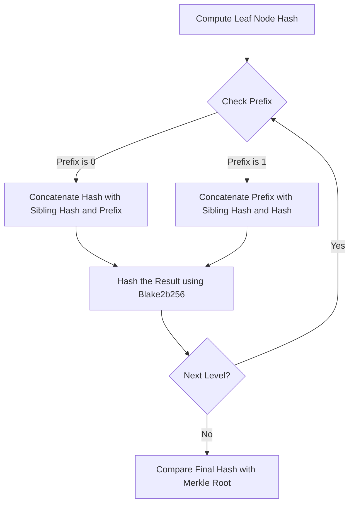

---
tags:
  - Merkle
---

# Validation of Merkle Proofs in Ergo

## Overview

Merkle proofs are fundamental to ensuring the integrity of data within a blockchain. By validating a Merkle proof, you can confirm that a specific piece of data, such as a transaction, is included in a block without having to download the entire blockchain. This document outlines the detailed process for validating Merkle proofs in Ergo, using cryptographic hash functions and a structured approach.

## Validation Process

The validation process involves computing a series of hashes based on the provided proof elements and comparing the final result with the expected Merkle root. The steps below describe this process in detail:

### 1. Compute the Leaf Node Hash

Begin by computing the hash of the leaf node, which represents the transaction or data element you want to prove is included in the block. This is done by prepending a **1-byte zero prefix** to the leaf data and then hashing the result using the `Blake2b256` hash function.

**Code Implementation**: The leaf node hash computation is implemented within the Ergo codebase, primarily found in the `scorex.crypto.authds.merkle` package of the [Scrypto](https://github.com/input-output-hk/scrypto) library, which is used by Ergo.

```scala
val leafData = Base16.decode(txId).get
val leafHash = Blake2b256(0.toByte +: leafData)
```

### 2. Iterate Through the Proof

The proof consists of multiple levels, each providing information about the position of the node within the Merkle tree and its sibling hash. For each level, the following steps are performed:

- **Check the 1-Byte Prefix**:
    - If the prefix is `0`, this indicates that the computed hash from the previous step should be on the left side.
    - If the prefix is `1`, this indicates that the computed hash should be on the right side.
    
- **Compute the Hash for the Next Level**:
    - Depending on the prefix, concatenate the computed hash from the previous step with the sibling hash and the prefix. Then, hash the concatenated result using `Blake2b256`.

**Code Implementation**: The iteration process and validation logic are crucial for verifying the correctness of the Merkle proof. This is implemented in the [BatchMerkleProof.scala](https://github.com/input-output-hk/scrypto/blob/master/shared/src/main/scala/scorex/crypto/authds/merkle/BatchMerkleProof.scala) file in the `scrypto` repository.

```scala
val levels = Seq("0139b79af823a92aa72ced2c6d9e7f7f4687de5b5af7fab0ad205d3e54bda3f3ae")
val computedHash = levels.foldLeft(leafHash) { case (hash, level) =>
    val bytes = Base16.decode(level).get
    val prefix = bytes.head
    val siblingHash = bytes.tail

    val concatenated = if (prefix == 0.toByte) {
        hash ++ siblingHash
    } else {
        siblingHash ++ hash
    }

    Blake2b256(prefix +: concatenated)
}
```

### 3. Compare with Merkle Root

After iterating through all levels of the proof, the final computed hash should be compared with the expected Merkle root value. If the hashes match, the proof is valid, confirming that the transaction or data element is included in the block.

**Code Implementation**: The comparison of the computed hash with the expected Merkle root is the final step in the validation process. This ensures that the entire proof is correct and that the data has not been tampered with.

```scala
assert(computedHash == expectedMerkleRoot)
```

### Flowchart of Merkle Proof Validation

The following flowchart visualizes the Merkle proof validation process described above:



## Example: Validating a Transaction's Inclusion in a Block

Here is a concrete example of how to validate a Merkle proof for a transaction included in an Ergo block header:

**Code Implementation**: This example demonstrates how to validate a transaction's inclusion in a block using a Merkle proof. The code is based on the structures and functions provided in the [Scrypto](https://github.com/input-output-hk/scrypto) library and the Ergo codebase.

```scala
import scorex.crypto.authds.merkle.MerkleProof
import scorex.crypto.authds.{LeafData, Side}
import scorex.crypto.hash.{Blake2b256, Digest32}
import scorex.util.encode.Base16

implicit val hashFn: Blake2b256.type = Blake2b256

val txId = "642c15c62553edd8fd9af9a6f754f3c7a6c03faacd0c9b9d5b7d11052c6c6fe8"
val msgPreimage = Base16.decode("01fb9e35f8a73c128b73e8fde5c108228060d68f11a69359ee0fb9bfd84e7ecde6d19957ccbbe75b075b3baf1cac6126b6e80b5770258f4cec29fbde92337faeec74c851610658a40f5ae74aa3a4babd5751bd827a6ccc1fe069468ef487cb90a8c452f6f90ab0b6c818f19b5d17befd85de199d533893a359eb25e7804c8b5d7514d784c8e0e52dabae6e89a9d6ed9c84388b228e7cdee09462488c636a87931d656eb8b40f82a507008ccacbee05000000").get

val txsRoot = msgPreimage.slice(65, 97)
val leafHash = Blake2b256(0.toByte +: Base16.decode(txId).get)

val levelsEncoded = Seq("0139b79af823a92aa72ced2c6d9e7f7f4687de5b5af7fab0ad205d3e54bda3f3ae")
val levels = levelsEncoded.map { le =>
    val leBytes = Base16.decode(le).get
    val side: Byte = leBytes.head
    val digest = leBytes.tail
    (Digest32 @@ digest, Side @@ side)
}

val merkleProof = MerkleProof[Digest32](LeafData @@ Base16.decode(txId).get, levels)
assert(merkleProof.valid(Digest32 @@ txsRoot))
```

## Conclusion

Validating Merkle proofs is a crucial process that ensures data integrity and enables efficient verification without the need to download the entire blockchain. By understanding and implementing this process in Ergo, you can enhance the security and efficiency of your blockchain applications.

### Source References:

- **[Scrypto: Merkle Proofs Implementation](https://github.com/input-output-hk/scrypto)**: This repository contains the core cryptographic components used in Ergo, including the implementation of Merkle proofs.
- **[Ergo: BlockTransactions.scala](https://github.com/ergoplatform/ergo/blob/master/ergo-core/src/main/scala/org/ergoplatform/modifiers/history/BlockTransactions.scala)**: Provides the logic for handling transactions within a block, including Merkle Tree construction and proof validation.

