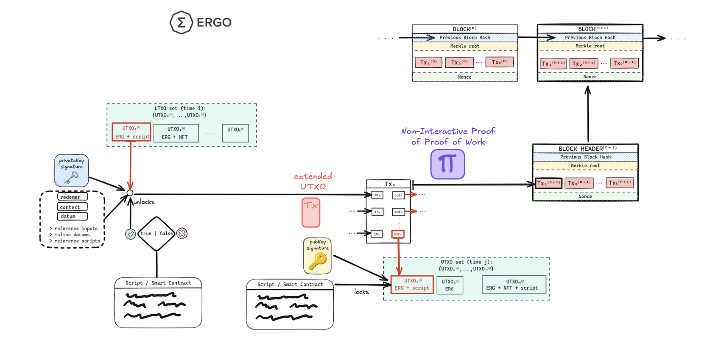

---
tags:
  - Developer Guide
  - Getting Started
  - Overview
---

# Developer's Guide

/// admonition | Welcome to the Ergo Developer's Guide

Welcome to the comprehensive **Ergo Developer's Guide**! Whether you're a seasoned blockchain developer or just starting out, this guide is designed to provide you with an in-depth understanding of the Ergo platform and the resources available to you. Explore the unique features of Ergo, learn how to develop on our platform, and connect with our vibrant community.

///

## Ergo Platform Overview

Ergo is a next-generation **Proof-of-Work (PoW)** blockchain platform designed for secure, efficient, and decentralized smart contract execution. It lays the foundation for a new wave of blockchain-based applications, focusing on scalability, security, and privacy. Ergo leverages advanced technologies like the powerful scripting language **ErgoScript**, flexible **Zero-Knowledge Proofs**, and the **eUTXO model**, an evolution of Bitcoin's UTXO model.

- Get a concise overview of Ergo, its standout features, and the technology and decisions that power it on the **[*Why Ergo?*](why.md)** page.
- Find answers to the most common questions about Ergo in our **[FAQ](faq.md)**.

### Key Features

- **ErgoScript**: A simple high-level language that enables clear descriptions of contractual logic. ErgoScript supports the creation of flexible crypto-contracts based on Σ-protocols (a class of Zero-Knowledge Proofs), allowing for privacy-preserving transactions and complex smart contract functionality.

- **Extended UTXO Model (eUTXO)**: The [eUTXO](eutxo.md) model allows each UTXO to carry arbitrary data and be protected by an arbitrary predicate or spending condition. This flexibility enables the representation of various assets, tokens, and smart contract states within the blockchain.

- **Mining with Autolykos**: Ergo utilizes [Autolykos](autolykos.md), an efficient, ASIC-resistant Proof-of-Work algorithm designed for a fair launch.
    - Learn about Ergo's [Emission](emission.md) schedule.

- **[NiPoPoWs](nipopows.md)**: Short for Non-Interactive Proofs of Proof-of-Work, these are compact data structures that validate blockchain events without needing full network connectivity or downloading all block headers. They enable efficient light clients, log-space mining, and trustless sidechains.

- **Storage Rent**: Also known as [demurrage](rent.md), this mechanism mitigates blockchain bloat and turns it into a profitable venture by charging for on-chain storage.

- **Turing-Complete Smart Contracts**: Ergo supports [Turing-complete smart contracts](#multi-stage-protocols), enabling complex on-chain computations.

::cards::

[
  {
    "title": "📚 DeCo EU Layman Class - Basics of eUTxO",
    "content": "A great introductory course aimed at the layman from Decentralised Collaboration.",
    "url": "https://www.youtube.com/watch?v=SAWeW6wajEw"
  },
  {
    "title": "🧾 Learning Ergo 101: eUTXO Explained for Human Beings",
    "url": "https://dav009.medium.com/learning-ergo-101-blockchain-paradigm-eutxo-c90b0274cf5e"
  },
  {
    "title": "📹 Learning Blockchains like Cardano and Ergo",
    "content": "Discusses the process of learning blockchain concepts, emphasizing the importance of understanding theoretical aspects and practical interaction through playgrounds and nodes.",
    "url": "https://www.youtube.com/watch?v=HDn49bToTMI"
  }
]

::/cards::

### Transactional Model

Ergo adopts a transactional approach similar to Bitcoin's UTXO model. In this model, transactions utilize and produce single-use entities known as ['boxes'](box.md). Every [transaction](transactions.md) in Ergo represents an atomic state transition, consuming boxes from the state and creating new ones in their place. The eUTXO model allows each UTXO to carry arbitrary data and be protected by an arbitrary predicate (or [spending condition](types.md#sigmaprop)). The data can represent various tokens or smart contract states.

*This image illustrates the structure and process flow of a blockchain transaction on the Ergo platform using its **extended UTXO model** (eUTXO).*

#### Boxes & Their Components

- **[Registers within Boxes](registers.md)**: Boxes come equipped with multiple registers capable of holding various assets and complex [ErgoScript](#ergoscript) types.

- **[Assets in Ergo](tokens.md)**: Dive deeper into the different assets that can be held within these boxes.

Ergo also supports advanced [data structures](data-structures.md) like [AVL+ Trees](data-structures.md) which can be used to store and authenticate large amounts of data on-chain.

### Transactional Basics

#### Tutorials & Guides

- **[Ergo Platform Basic Starter Tutorial](basics.md)**

- **[Create & Send a Transaction](https://www.youtube.com/watch?v=Md5s-XV6-Hs)**: A video tutorial on creating and sending a transaction using AppKit.

- **[Sign a Transaction](sign-tx.md)**: Learn how to sign a transaction with Sigma Rust.

- **[Sending a Chained Transaction](chained-tx.md)**: A guide on sending a chained transaction using Ergpy.

- **[Getting Started with Fleet SDK](https://fleet-sdk.github.io/docs/getting-started)**: A beginner's guide to the Fleet SDK.

#### Tokens & NFTs

- **[Issuing a Token](tokens.md)**: A step-by-step guide on how to issue a token on Ergo.

- **[Burning a Token](burn.md)**: Learn how to burn a token, effectively removing it from circulation.

- **[Minting an NFT](create.md)**: A comprehensive guide on creating a Non-Fungible Token (NFT) on Ergo.

- **[Minting an On-Chain NFT](on-chain.md)**: Don't want to rely on third-party storage? You can squeeze an NFT directly into the registers!

## ErgoScript

ErgoScript is a super-simple subset of Scala, enabling clear descriptions of contractual logic that can be Turing-complete. It is flexible enough to allow for ring signatures, multi-signatures, multiple currencies, atomic swaps, self-replicating scripts, and long-term computation.

The Account model of Ethereum is imperative, meaning that sending coins from Alice to Bob requires changing balances in storage through a series of operations. In contrast, Ergo's UTXO-based programming model is declarative. ErgoScript contracts specify conditions for a transaction to be accepted by the blockchain, not changes to be made in the storage state as a result of the contract execution.

### Introduction

- [Quick Primer](ergoscript-primer.md)
- [Core Concepts of ErgoScript](ergoscript-key-concepts.md)
- [Sigma Language](sigma-lang.md)
- [Creating a Simple Pay-to-Script App](p2s.md)

### Experimenting

- **[escript.online](https://escript.online/)**

- **[PlutoMonkey](plutomonkey.md)**: Compile any ErgoScript contract into a P2S. Check out these [simple examples](p2s.md).

- **[Scastie](scastie.md)**: An online compiler tailored for Scala, perfect for developers eager to experiment, share, or learn Scala.

- **[Kiosk](stack/kiosk.md)**: A web-based UI to explore ErgoScript. *(Corrected path)*

- **[Ergo-Puppet](puppet.md)**: An advanced tool built on the Ergo Playground, designed for off-chain experimentation and unit testing of Ergo contracts.

### Tooling

- **[Ergo Development Generics Elements](https://github.com/Ergo-Lend/edge)**

- **[VSCode ErgoScript Language Support](https://github.com/GuapSwap/vscode-ergoscript-language-support)**

- **[ErgoScala](ergoscala.md)**: A compiler for Ergo smart contracts written in ErgoScala (a subset of Scala).

- **[CLI Compiler](compiler.md)**: A Command Line Interface tool to compile ErgoScript code into an Ergo address.

- **[FlowCards](flowcards.md)**: A declarative framework for developing Ergo dApps.

- **[ergo-playgrounds](https://github.com/ergoplatform/ergo-playgrounds)**: Run contracts and off-chain code in the browser.

- **[ergo-script-re](https://github.com/ross-weir/ergo-script-re/tree/main)**: Libraries for Ergo Script reverse engineering and analysis.

### Courses

If you're interested in deepening your understanding of ErgoScript and the Ergo ecosystem, consider taking one of the following courses:

- [DeCo Education: Into the Woods](https://deco-education.github.io/deco-docs/docs/category/into-the-woods): This course provides a comprehensive introduction to the Ergo ecosystem.

- [ErgoScript 101 Crash Course](https://docs.google.com/presentation/d/10gYO82z_7qloRrFOcCxTFuzpP40IImPyIKMV2ZFd9M4/edit#slide=id.p) (Slides): A crash course covering the basics of ErgoScript, perfect for beginners.

- [Learn ErgoScript By Example Via The Ergo Playground with Robert Kornacki (Video)](https://www.youtube.com/watch?v=8l2v1asHgyA): This video tutorial offers practical examples of how to use ErgoScript in the Ergo Playground.

- [DeCo-Education/ErgoScript-Developer-Course](https://github.com/DeCo-Education/ErgoScript-Developer-Course): A more advanced course for developers looking to build on their ErgoScript knowledge.

### Tutorials

- [ErgoScript by Example Repository](https://github.com/ergoplatform/ergoscript-by-example)

- [Testing Ergo Contracts Off-chain](https://github.com/anon-real/contract-testing)

- [Debugging ErgoScript](debugging.md)

- [ergo-playground](https://github.com/jaysee260/ergo-playground): A collection of miscellaneous scenarios implemented on the Ergo blockchain.

### Boilerplate

- [scala-play-next-ergo](https://github.com/kii-dot/scala-play-next-ergo)

- [ergo-scala-skeleton-app](https://github.com/dav009/ergo-scala-skeleton-app)

- [The Ergo Web Template](https://github.com/SavonarolaLabs/ergo-web-template): An introductory guide for individuals new to Ergo, offering a hands-on experience with essential Ergo functionalities.
- **[ergo-play-boilerplate](https://github.com/kii-dot/ergo-play-boilerplate)**: Barebone code to jump into Ergo development quickly.

### Advanced Tutorials

- [ErgoScript Tutorial](https://ergoplatform.org/docs/ErgoScript.pdf)

- [Advanced ErgoScript Tutorial](https://ergoplatform.org/docs/AdvancedErgoScriptTutorial.pdf)

### Interpreters

ErgoScript has two compiler and ErgoTree interpreter implementations for the [*Sigma Language*](sigma-lang.md):

- **[Sigmastate-interpreter](sigmastate-interpreter.md)**: For JVM languages, utilized by [AppKit](appkit.md).

- **[Sigma-Rust](sigma-rust.md)**: A simpler alternative for the ErgoTree interpreter and transaction tools.

## Cryptography

Ergo has generic support for ring and threshold signatures, as well as a variety of cryptographic protocols via composable [sigma-protocols](crypto.md) built into the core.

Sigma Protocols (Σ-Protocols) are the foundation of Ergo’s smart contracts. Their advantage is that they are composable using simple AND/OR logic. When combined with a blockchain, these composable proofs enable very powerful use cases, allowing for the implementation of sophisticated tasks that would otherwise be impossible, risky, or expensive on other platforms.

### Crypto Primitives

- **Hash Functions**:
    - `Sha256`: Secure Hash Algorithm 256-bit.
    - `Blake2b256`: A cryptographic hash function faster than MD5 and SHA-256, providing security similar to the strongest hash functions available.

- **Encoding**:
    - `Base58`: A binary-to-text encoding scheme used for encoding Bitcoin addresses and other text-based data.

- **Signing Algorithms**:
    - `ECDSA (secp256k1)`: Elliptic Curve Digital Signature Algorithm over the secp256k1 curve, widely used in Bitcoin and other cryptocurrencies.
    - `Schnorr`: A digital signature scheme that is simple, provably secure in the random oracle model, and allows for the aggregation of multiple signatures into a single signature, enhancing efficiency and privacy.

- **Primitive Secrets**:
    - **[Schnorr Signature](schnorr.md)**: A proof of knowledge of a discrete logarithm with respect to a fixed group generator.
    - **[Diffie-Hellman Tuple](diffie.md)**: A proof of equality of discrete logarithms, enabling secure exchange of cryptographic keys over a public channel.

- **Non-Interactive Proofs**:
    - The proofs of sigma-statements are made non-interactive with the [**Fiat-Shamir transformation**](diffie.md#fiat-shamir-transformation), which converts an interactive proof of knowledge into a non-interactive one by using a cryptographic hash function.

- **Additional Cryptographic Standards**:
    - **[EIP-0003: Deterministic Wallet Standard](eip3.md)**: A standard defining the structure and operation of deterministic wallets in the Ergo platform.

See [this page](scs/global-functions.md#cryptographic-functions) for a description of the global cryptographic functions available in ErgoScript. *(Corrected path and anchor)*

### Tutorials

- [Creating a 3-out-of-5 Threshold Signature](sig.md)

- [Message Signing and User Authentication](message-signing.md)

- [Verifying Schnorr Signatures in ErgoScript](https://www.ergoforum.org/t/verifying-schnorr-signatures-in-ergoscript/3407)

- [Updateable Multisig Pattern](https://www.ergoforum.org/t/updateable-multisig-pattern/3356)

- [Making and Implementing a Signature, Elliptic Curves, and Extended Keys: Ergo with C#](https://www.youtube.com/watch?v=aUuki-fAxwc&list=PLUWruihtE-HtL-JZk8Vb4Yn_H18aE3rb6)

### Tools

- **[Scrypto](scrypto.md)**: A comprehensive open-source cryptographic toolkit, specifically engineered to simplify and safeguard the process of integrating cryptography into your applications. Supports AVL+ Trees and Batch Merkle Proof Serialization and Deserialization.

## Advanced Concepts

### Merkle Trees

**[Merkle Trees](merkle-tree.md)** are a fundamental data structure in the Ergo blockchain, ensuring the integrity and authenticity of data. They play a crucial role in various blockchain operations, from verifying transactions within blocks to securing additional metadata in the Extension Block. Ergo extends the concept of Merkle Trees by combining transactions and their corresponding spending proofs into a single Merkle Tree.

Developers should familiarize themselves with Merkle Trees and their associated code implementations to effectively leverage them in their Ergo projects.

### AVL Trees (Plasma)

**[AVL trees](avl.md)** are highly efficient authenticated data structures natively supported in Ergo. These trees offer several benefits, including the ability to authenticate data properties without accessing the entire dataset. Developers can seamlessly integrate AVL trees into their Ergo applications using one of the **[Plasma](plasma.md)** libraries.

### Multi-Stage Protocols

[Multi-Stage Contracts](multi.md) is a technique where, using transaction trees, we can emulate persistent storage in UTXO-based systems by linking several UTXOs containing small pieces of code to form a large multi-stage protocol. This enables *on-chain computations*, making it possible to process parallelized actions on top of smart contracts and construct **Turing-complete** applications.

## App Development

Developers have a plethora of tools, libraries, SDKs, frameworks, and utilities at their disposal to seamlessly interact with the blockchain, craft applications, and present them to users. Navigate through the [Developer Section](start.md) to use grid buttons that help refine your technical stack requirements and pinpoint the ideal tooling.

If you're aiming to develop a comprehensive decentralized application on Ergo, consider the following SDKs and frameworks tailored to your specific needs:

/// admonition | As a spreadsheet!
    type: info

Most repositories are also categories on [Grist](https://ergo.getgrist.com/jf9KPR1HUDJH/Project-Management). This is a great place to start if you're looking for a specific repository or want to see what's currently being worked on.

///

### Primary SDKs

- **[AppKit](appkit.md)**: The go-to SDK for JVM developers, supporting Java, Scala, Kotlin, and Mobile platforms.
    - [General Example](tutorial.md)
    - [Using AppKit with Python](https://github.com/ergoplatform/ergo-appkit/wiki/Using-Appkit-from-Python)
    - [AppKit by Example](https://www.youtube.com/watch?v=Md5s-XV6-Hs)

- **[Fleet SDK](fleet.md)**: A pure JS library designed for effortless Ergo transaction creation.
    - [Getting Started with Fleet SDK](https://fleet-sdk.github.io/docs/getting-started)
    - [The Ergo Web Template](https://github.com/SavonarolaLabs/ergo-web-template): An introductory guide for individuals new to Ergo, offering a hands-on experience with essential Ergo functionalities.

- **[SigmaRust](sigma-rust.md)**: An ErgoTree interpreter with transaction tools and bindings for JS/TS/Swift/Java/C/Ruby.
    - [Address Generation Demo](https://github.com/ergoplatform/sigma-rust/tree/develop/bindings/ergo-lib-wasm/examples/address-generation-demo)
    - [Create Transaction Demo](https://github.com/ergoplatform/sigma-rust/tree/develop/bindings/ergo-lib-wasm/examples/create-transaction-demo)

### Alternative SDKs

- **[Ergpy](ergpy.md)**: A Python-JVM wrapper facilitating interactions with the Ergo blockchain.

- **[Mosaik](mosaik.md)**: A dedicated UI system crafted for Ergo dApps.

- **[JSON dApp Environment](jde.md)**

- **[Headless dApp Framework](headless.md)**: A Rust-based framework for creating Ergo Headless dApps, marking the debut of a portable UTXO-centric headless dApp development framework on any blockchain.

- **[RustKit (In Development)](rustkit.md)**: An upcoming toolkit aiming to align the Rust development experience with the JVM.

### Payments

- **[ErgoPay](ergo-pay.md)**: Ergo's dApp connector for non-web wallets.

- **[dApp Connector](dApp.md)**: For connecting dApps to web-based wallets like Nautilus and SAFEW.

- **[Proxy Contracts](proxy.md)**: A smart contract design used in blockchain ecosystems to enable secure and controlled interaction between users and decentralized applications.

### Libraries

- [ergo-lib-go](https://github.com/ergoplatform/ergo-lib-go): Go wrapper around C bindings for ErgoLib from sigma-rust.

- [ergo-lib-wasm](https://github.com/ergoplatform/ergo-lib-wasm): Ergo-lib bindings for JS/TS.

- [ergo_client](https://github.com/ross-weir/ergo_client): Rust library containing HTTP clients for various Ergo applications.

- [sigma-builders](https://github.com/GuapSwap/sigma-builders): Easy-to-use library for creating protocol abstractions interacting with the Ergo blockchain.

### Templates

::cards::

[
  {
    "title": "📕 Side Tooling for Building dApps on Ergo",
    "url": "https://dav009.medium.com/ergo-101-side-tooling-for-building-dapps-on-ergo-c71889d60826",
    "content": "Building functional dApps on Ergo requires more than just smart contracts and transactions."
  },
  {
    "title": "📕 DeCo Education: DApp Components - Backend",
    "url": "https://deco-education.github.io/deco-docs/docs/into-the-woods/trail2-ergo-coding/dapp-components"
  },
  {
    "title": "📕 DeCo Intro Lessons: Build a Mobile App on Android or iOS",
    "url": "https://www.youtube.com/watch?v=qR0_k7VH6KI&list=PLopsKGshj0B4BpMoSMh5hQk8gVfWk-si6"
  }
]

::/cards::

## Ergo Infrastructure

### Ergo Node & Network

- **[Ergo Node](install.md)**: The Ergo Node forms the core of Ergo's P2P network, maintaining and synchronizing the entire blockchain.
   - **[Bootstrap from UTXO Snapshot](pruned-full-node.md)**: Expedite the setup of a pruned full node on the [testnet](testnet.md) by bootstrapping from a UTXO snapshot.
   - **[Fork Your Own Chain](mine-your-own-chain.md)**: Learn how to customize and create your own chain with specific parameters.

### API & Programmatic Access

- **[Node API](swagger.md)**: Gain a comprehensive overview of the Ergo node API functionalities.
  - **[Public APIs](api.md)**: If you prefer not to run your own node, you can utilize these public APIs for a variety of functionalities.

### Explorers

- **Public Explorers** can be accessed at [explorer.ergoplatform.com](https://explorer.ergoplatform.com/) and [testnet.ergoplatform.com](https://testnet.ergoplatform.com/).

- Delve deeper into blockchain data with **[GraphQL](graphql.md)**.

- **[Explorer & Node Bundles](explorer.md#toolkits)**: Install both locally for a comprehensive blockchain experience.
    - **[uExplorer](explorer.md)**: A lightweight Ergo explorer backed by CassandraDB.
    - **[Blockchain Explorer with Raspberry Pi](rpi-blockchain-explorer.md)**: Learn how to set up an explorer using Raspberry Pi.

### Toolkits

- **[danaides](https://github.com/ergopad/danaides)**: A high-performance blockchain toolkit.

### Off-chain

- [Bootstrap an Oracle Pool on Testnet](oracle-bootstrap.md)

- [Running Off-chain Bots](dex_bots.md)

## Documentation & Reports

- **[Foundational Papers](documents.md)**: Explore the academic and technical papers that laid the groundwork for Ergo.

- **[EF Transparency Report](ergo-foundation.md)**: Gain insights into the Ergo Foundation's operations and transparency initiatives.

- **[Ergo's Social Contract](social_contract.md)**: Delve into the principles and commitments that guide Ergo's community and development.
- **[Howey Test Analysis](security.md)**: Understand how Ergo measures up against the Howey Test for securities.

### Further Resources

- **[Completeness of Ergo | Kushti | Ergoversary Summit 2023](https://www.youtube.com/watch?v=49UmOkx6pj0&list=PL8-KVrs6vXLRxmOmprVdXkHDcO4IaQZOY&index=2)**: Video discussing the completeness aspects of the Ergo platform.

## Introductory Resources

::cards::

[
  {
    "title": "📚 DeCo Intro Lessons",
    "content": "Programming basics for the layman from Decentralised Collaboration (DeCo).",
    "url": "https://www.youtube.com/watch?v=qR0_k7VH6KI&list=PLopsKGshj0B4BpMoSMh5hQk8gVfWk-si6"
  },
  {
    "title": "📚 DeCo Education Docs",
    "content": "DeCo steps you through eUTXO & NFTs, dApp Development, and Multi-Stage Transactions & Smart Contracts.",
    "url": "https://deco-education.github.io/deco-docs/docs/category/into-the-woods"
  },
  {
    "title": "📹 Ergo Blockchain Crash Course",
    "content": "Ergo crash course presented by developer Luca (lgd), covering the eUTXO model, anatomy of Ergo, and more.",
    "url": "https://www.youtube.com/playlist?list=PL8-KVrs6vXLTVXGwmYXjOBRx3VymB4Vm2"
  }
]

::/cards::

## Connect with Our Community

If you encounter any issues or have questions, feel free to connect with us on any of the following platforms. All our chat platforms are bridged, ensuring seamless communication:

::cards::

[
  {
    "title": "Come Chat!",
    "content": "Join the action on Discord",
    "image": "../assets/img/dev-grid/discord.png", # Corrected image path
    "url": "https://discord.gg/ergo-platform-668903786361651200"
  },
  {
    "title": "ERGOHACK",
    "content": "We host regular hackathons which are a great opportunity to get involved.",
    "image": "../assets/img/grid/05.png", # Corrected image path
    "url": "../events/ergohack.md" # Corrected link path
  },
  {
    "title": "Contribute",
    "content": "See the Contributing Guidelines for information on bounties and grants.",
    "image": "../assets/img/grid/05.png", # Corrected image path
    "url": "../contribute/standards/guidelines.md" # Corrected link path to likely target
  }
]

::/cards::

/// admonition | Chatbots!
    type: info

To further explore and understand Ergo's concepts, you can interact with the following chatbots:

- [General Chatbot](https://www.chatbase.co/chatbot-iframe/zxB2uzZfYoHIpA98eTzgM)

- [ErgoScript Chatbot](https://www.chatbase.co/chatbot-iframe/INAIfQ2ts4E6ykf4rseVu)

///

## Ergo Community Resources

### Analytics & Insights

- **[Ergo Watch](https://ergo.watch/)**: Dive into on-chain analytics and data.

### Community Knowledge Base

- **[Ergonaut Space](https://ergonaut.space/)**: Discover Ergo's community-driven wiki, filled with insights and information.

### Explore the Ecosystem!

- **[Sigmaverse.io](https://sigmaverse.io/)**: Explore a diverse range of dApps built on Ergo.

- **[ErgCube](https://ergcube.com/)**: Another platform to discover and interact with Ergo dApps.

- The [**Ecosystem**](../uses/use-cases-overview.md) section on this site acts as a directory for projects building on Ergo and potential future ideas.
