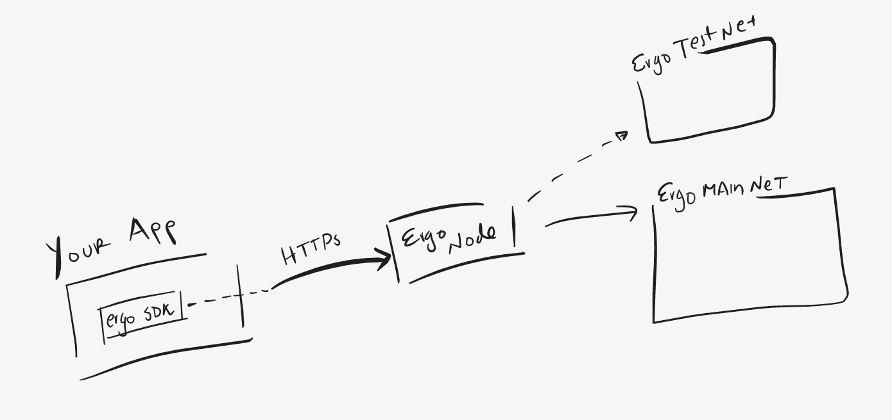

# Developers

This page should provide an entry-point to every section of Ergo development. For a high-level introduction to Ergo please see the [protocol page](/dev/protocol)

## Architecture 

Apps in the Ergo ecosystem looks a bit like this. 

Your application will communicate with the blockchain via a locally run instance of the Ergo Node. The Node provides an API that is used by your SDK logic to carry out operations on the blockchain.

- [Set up a local Node](/node/)

## Libraries

- [Back-end libraries (SDKs)](stack/back-end)
- [Front-end libraries](stack/front-end/)

## Languages

- [Start coding in JVM (Scala/Java)](/dev/stack/appkit/)
- [Start coding in Rust](/dev/Languages/rust)
- [Start coding in Python](/dev/Languages/python)
- [Start coding in JSON](/dev/stack/jde)
- [Start coding in ErgoScript](scs/ergoscript/)

## Other entry points

- DeCo (Decentralised Collaboration) teaches participants will learn about extended UTXO and boxes, registers, ErgoScript, designing simple systems, multi-transaction systems, and much more. Join the [ErgoLend Discord](https://discord.gg/NBJ68Fvr) for more information or watch their full courses on [youtube.](https://www.youtube.com/channel/UCyOIxD7YSHN5QwLIulOWrew)
- [ErgoTutorials](https://www.youtube.com/channel/UCyOIxD7YSHN5QwLIulOWrew)
- [The Future of ErgoGames.io — Hosting Educational Classes on Game Building and Design](https://medium.com/@lgmeister/the-future-of-ergogames-io-hosting-educational-classes-on-game-building-and-design-679afd2632d4)
