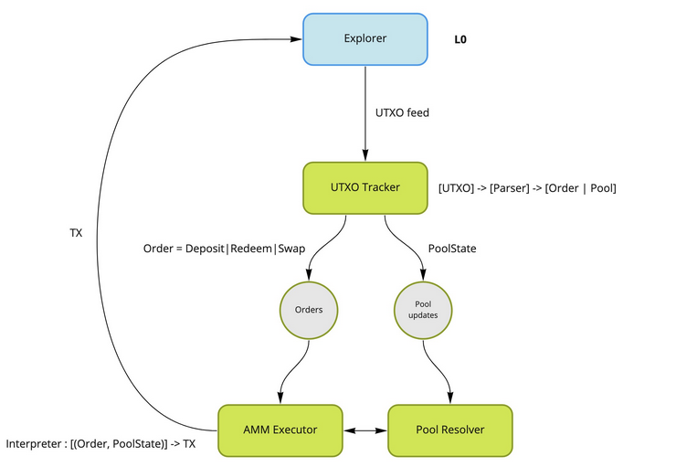

---
tags:
  - DEX
  - Bots
  - Off-chain
  - Spectrum
owner: docs
last_reviewed: 2026-05-31
source_repos:
  - repo: spectrum-finance/ergo-dex-backend
    branch: master
    paths:
      - README.md
      - config-example.env
      - docker-compose.yml
  - repo: spectrum-finance/spectrum-offchain-ergo
    branch: master
    paths:
      - conf/offchain_lm.yml
      - docs/streams_lm.md
source_of_truth:
  - https://github.com/spectrum-finance/ergo-dex-backend
  - https://github.com/spectrum-finance/spectrum-offchain-ergo
---

# Spectrum.DEX off-chain services

Spectrum/ErgoDEX uses off-chain services to watch Ergo, identify executable DEX orders, build transactions, and submit valid state transitions. The contracts validate those transitions on-chain; the bots provide discovery, ordering, transaction construction, and execution.

This page is for operators. For general architecture, see [Off-Chain Services](off-chain-overview.md).

## Repositories

| Repository | Role |
| --- | --- |
| [spectrum-finance/ergo-dex-backend](https://github.com/spectrum-finance/ergo-dex-backend) | Docker Compose stack for Ergo AMM/order execution services. |
| [spectrum-finance/spectrum-offchain-ergo](https://github.com/spectrum-finance/spectrum-offchain-ergo) | Rust off-chain workspace with chain sync, mempool sync, backlog, executor, and liquidity-mining components. |
| [spectrum-finance/ergo-dex](https://github.com/spectrum-finance/ergo-dex) | DEX contracts and protocol specification. |

## Classic Docker stack

The public operator guide for Spectrum bots is based on `spectrum-finance/ergo-dex-backend`. It runs several services around Kafka, Redis, and an Ergo node.

| Service | Role |
| --- | --- |
| `utxo-tracker` | Extracts DEX orders, pool state, ledger events, and mempool events from Ergo data. |
| `amm-executor` | Executes AMM orders into submitted transactions. |
| `poolresolver` | Tracks current pool state for execution. |
| `events-tracker` | Tracks bot events with local RocksDB-backed state. |
| `kafka` / `init-kafka` | Internal event bus and topic setup. |
| `redis` | Cache dependency used by the stack. |

The older README also describes order-book components:

- UTXO Tracker: extracts order-book orders from the UTXO feed.
- Matcher: order-book matching engine.
- Orders Executor: executes matched orders.
- Markets API: aggregates market data and exposes API access.



## Prerequisites

- A synced Ergo node.
- Private access to the node HTTP API.
- Git.
- Docker and Docker Compose.
- A dedicated bot seed phrase with funds for miner fees and any SPF-fee cases.

Public node usage is not recommended for competitive execution because latency lowers the chance that your transaction wins the race for the same input boxes.

## Building & Running the off-chain services

### 1. Clone the stack

```bash
git clone https://github.com/spectrum-finance/ergo-dex-backend.git
cd ergo-dex-backend
```

### 2. Create config

```bash
cp ./config-example.env ./config.env
```

The current example config contains:

```env
JAVA_TOOL_OPTIONS="-Dnetwork.node-uri=http://<my node ip>:9053 -Dexchange.mnemonic='<my ergo mnemonic>' "
URL=http://<my node ip>:9053
```

Set the node URI to a reachable host address. `localhost` inside a container may point to the container, not the host node. Put the bot mnemonic in `exchange.mnemonic`, and fund the address that the bot derives from that seed.

### 3. Run

```bash
docker-compose up -d
```

Some systems use the newer plugin form:

```bash
docker compose up -d
```

### 4. Check logs

```bash
docker-compose logs -f
```

or:

```bash
docker compose logs -f
```

Look for repeated node connection failures, missing funds, invalid mnemonic, Kafka startup failures, and rejected transactions.

### 5. Update

After every pull, compare `config-example.env` with your local `config.env`.

```bash
git pull
docker-compose pull
docker-compose up -d
```

## Seed handling

Use a bot-only seed phrase. The Spectrum guide notes that bots derive the first address using the EIP-3 path and can only use funds at the address generated from the configured seed. Keep ERG for miner fees in that address, and do not reuse a normal wallet seed.

## Newer Rust off-chain workspace

`spectrum-finance/spectrum-offchain-ergo` is a Rust workspace. It is not the same Docker operator guide, but it is useful for understanding the newer off-chain architecture:

| Component | Role |
| --- | --- |
| `ergo-chain-sync` | Reads blocks from node routes such as `/blocks/at/{height}`, `/blocks/{id}/transactions`, `/blocks/{id}/header`, and `/info`. |
| `ergo-mempool-sync` | Mempool sync library. |
| `spectrum-offchain` | Shared off-chain primitives for event sources, event sinks, box resolution, backlog, streaming, and execution. |
| `spectrum-offchain-lm` | Liquidity-mining off-chain app using chain sync, confirmed pool streams, order backlog, schedules, bundles, funding, and an executor. |

The sample `conf/offchain_lm.yml` shows the operator shape:

- `node_addr`
- chain sync starting height
- RocksDB paths for chain cache, backlog, pools, programs, bundles, funding, and schedules
- `operator_reward_addr`
- `operator_funding_secret`
- retry and order timing settings

Do not treat the sample seed or public node value as production configuration.

## Operations checklist

- Run the node and bot host on the same LAN or host network where practical.
- Keep node wallet/API endpoints firewalled.
- Keep only operational funds in the bot seed.
- Monitor node height, bot logs, submitted transaction IDs, wallet balance, Kafka/Redis health, and disk usage for volumes/RocksDB.
- Expect transaction races. If another executor spends an input first, your transaction can fail without indicating a local bug.
- Before updating, read upstream config changes and restart cleanly.

## Related pages

- [Off-the-Grid Bot](off_the_grid_tut.md)
- [Grid Trading](grid_trading.md)
- [Node API Reference](swagger.md)
