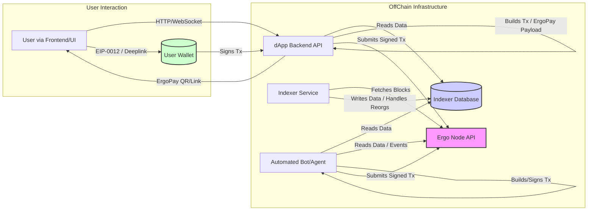

---
tags:
  - Off-Chain
  - dApps
  - Backend
  - Services
  - Architecture
  - SDK
  - Fleet SDK
  - Sigma-Rust
  - Appkit
  - Guide
  - Overview
  - Wallet Integration
  - ErgoPay
  - Testing
  - Deployment
  - Scaling
---

# Building Off-Chain Services for Ergo dApps

While ErgoScript smart contracts define the on-chain logic and validation rules, most decentralized applications (dApps) require **off-chain components** to provide user interfaces, manage application state, construct complex transactions, monitor the chain, and interact with wallets. This guide provides a comprehensive overview of patterns, tools, and considerations for building these essential off-chain services.

## Why Off-Chain Services?

Off-chain services bridge the gap between the user and the blockchain, enabling functionalities that are impractical or impossible to implement purely on-chain:

*   **User Interfaces (UI/UX):** Web and mobile frontends.
*   **Complex Transaction Construction:** Assembling inputs, outputs, data inputs, and context according to protocol rules.
*   **State Management:** Tracking application-specific state (order books, user data).
*   **Event Monitoring & Reaction:** Watching for specific on-chain events (box creation, token transfers) and triggering actions.
*   **Data Indexing:** Efficiently querying blockchain data (See [Indexing Guide](../tutorials/blockchain-indexing.md)).
*   **Wallet Interaction:** Connecting to user wallets for address fetching and transaction signing ([EIP-0012](../wallet/eip-standards.md), [ErgoPay](../wallet/payments/ergopay/ergo-pay.md)).
*   **Automation:** Running bots for tasks like liquidations or arbitrage.
*   **External Integrations:** Connecting to off-chain data sources or APIs.

## Common Off-Chain Patterns

### 1. Watchers / Monitors

Services that scan new blocks/mempool for relevant events.

**Real-world example:** SigmaUSD's reserve monitoring system watches for changes in the reserve ratio by tracking the SigRSV and SigUSD token amounts in circulation, triggering UI updates when thresholds are crossed.

```typescript
// Fleet SDK example of a basic watcher
// Note: Requires node access and likely an indexer for efficiency in production
import { ErgoNodeApi } from "@fleet-sdk/common"; // Use appropriate API client

const nodeApi = new ErgoNodeApi({ url: "http://your-node-ip:9053" }); // Replace with actual node URL
let lastHeight = 0; // Store last processed height persistently

async function watchForBoxes() {
  try {
    const info = await nodeApi.getNodeInfo(); // Get current node info
    const currentHeight = info.fullHeight;
    
    if (currentHeight > lastHeight) {
      console.log(`Scanning blocks ${lastHeight + 1} to ${currentHeight}`);
      
      // Iterate through each new block
      for (let height = lastHeight + 1; height <= currentHeight; height++) {
        const headerIds = await nodeApi.getHeaderIdsAtHeight(height);
        if (!headerIds || headerIds.length === 0) continue; // Skip if no block found (unlikely on main chain)

        const block = await nodeApi.getBlockById(headerIds[0]); // Assuming only one block at height
        if (!block || !block.blockTransactions) continue;

        // Process each transaction in the block
        for (const txSummary of block.blockTransactions) {
          // Check each output box
          for (const box of txSummary.outputs) {
            // Example: Check if box contains a specific NFT
            if (box.assets.some(asset => asset.tokenId === "YOUR_TOKEN_ID")) { // Replace with actual Token ID
              console.log(`Found relevant box: ${box.boxId} in Tx: ${txSummary.id} at Height: ${height}`);
              // Process the box (e.g., update database, trigger notification)
              // await processRelevantBox(box); 
            }
          }
        }
      }
      
      lastHeight = currentHeight;
      // Persist lastHeight here (e.g., save to file or database)
    }
  } catch (error) {
    console.error("Error in watcher:", error);
    // Implement retry logic or error handling
  } finally {
      // Schedule next run
      setTimeout(watchForBoxes, 30000); // Check every 30 seconds
  }
}

// Initialize: Load lastHeight from persistent storage before starting
// loadLastHeight().then(height => { lastHeight = height; watchForBoxes(); }); 
watchForBoxes(); // Start the watcher loop (initial height might need setting)
```
*(Note: Production watchers need robust error handling, reorg detection (frameworks like `ergoplatform/scanner` help here), and often use an indexer for efficiency).*

**Real-world example (Cross-Chain):** [Rosen Bridge Watchers](../../eco/rosen/watcher.md) monitor deposit events on connected blockchains (like Cardano or Bitcoin) and relay them securely to Ergo, enabling cross-chain asset transfers. Becoming a watcher involves technical setup, providing collateral (ERG and RSN), monitoring transactions, and earning rewards.

### 2. Bots / Agents

Automated services that construct and submit transactions based on logic or events.

**Real-world example:** The Oracle Pool core software includes bots that automatically post new price data on-chain at regular intervals, ensuring DeFi protocols have up-to-date price feeds.

```typescript
// Fleet SDK example of a simple bot reacting to price data (conceptual)
// Note: Requires secure key management and robust logic
import { 
  OutputBuilder, 
  TransactionBuilder, 
  ErgoAddress, 
  RECOMMENDED_MIN_FEE,
  ErgoNodeApi,
  ErgoProver // Assuming a prover interface for signing
} from "@fleet-sdk/core"; 

const nodeApi = new ErgoNodeApi({ url: "http://your-node-ip:9053" });
const botSecretKey = process.env.BOT_SECRET_KEY; // Load securely, NEVER hardcode!
const botProver = new ErgoProver(botSecretKey); // Hypothetical prover setup
const ORACLE_POOL_BOX_ID = "YOUR_ORACLE_POOL_BOX_ID"; // ID of the box to update

async function updateOraclePrice() {
  try {
    // 1. Get current external price data (e.g., from an exchange API)
    const externalPrice = await getExternalPrice("ERG-USD"); // Replace with actual price fetching logic
    if (!externalPrice) {
        console.error("Failed to fetch external price.");
        return;
    }
    const newPriceLong = BigInt(Math.round(externalPrice * 100)); // Example: Price in cents

    // 2. Get the current oracle pool box
    const currentOracleBox = await nodeApi.getBoxById(ORACLE_POOL_BOX_ID);
    if (!currentOracleBox) {
        console.error(`Oracle box ${ORACLE_POOL_BOX_ID} not found.`);
        return;
    }
    
    // 3. Build the update transaction
    const creationHeight = await nodeApi.getCurrentHeight();
    const unsignedTx = new TransactionBuilder(creationHeight)
      .from([currentOracleBox]) // Spend the current oracle box
      .to(
        new OutputBuilder(currentOracleBox.value, currentOracleBox.ergoTree) // Recreate the box
          .setAdditionalRegisters({
            // Update R4 with the new price (assuming R4 stores price as Long)
            R4: SLong(newPriceLong).toString(), // Update price register
            // Preserve other registers R5, R6 etc. from currentOracleBox.additionalRegisters
            R5: currentOracleBox.additionalRegisters.R5, 
            R6: currentOracleBox.additionalRegisters.R6,
            // ...
          })
          // Preserve tokens if any
          .addTokens(currentOracleBox.assets) 
      )
      .sendChangeTo(botProver.getAddress()) // Send change back to bot address
      .payFee(RECOMMENDED_MIN_FEE)
      .build();
      
    // 4. Sign and submit transaction
    console.log(`Updating oracle price to ${newPriceLong}`);
    const signedTx = await botProver.sign(unsignedTx);
    const txId = await nodeApi.submitTransaction(signedTx);
    
    console.log(`Oracle update transaction submitted: ${txId}`);
    
  } catch (error) {
    console.error("Error in oracle bot:", error);
  } finally {
      // Schedule next run (e.g., every 5 minutes)
      setTimeout(updateOraclePrice, 300000); 
  }
}

updateOraclePrice(); // Start the bot
```
*(Note: Real bots need sophisticated error handling, state management, fee calculation, input selection, and extremely secure key management).*

**Real-world example (Oracle Providers):** Oracle providers integrate dependable external data sources (e.g., price feeds) with the Ergo blockchain. They deploy oracle contracts and maintain reliability to earn compensation, often through transaction fees or subscriptions. See [Oracle Pools V2](../../eco/oracles-v2.md) for details.

### 3. Backend APIs for dApps

Central API layer for frontends that handles state, indexing queries, transaction building, and wallet interaction orchestration.

**Real-world example:** The Auction House backend provides REST endpoints for listing auctions, placing bids, and retrieving auction history, while handling the complex transaction construction behind the scenes.

```typescript
// Express.js backend API example with Fleet SDK (Conceptual Snippet)
import express from 'express';
import { ErgoNodeApi } from '@fleet-sdk/common';
// ... other Fleet imports (TransactionBuilder, OutputBuilder, SConstant etc.)

const app = express();
app.use(express.json());
const nodeApi = new ErgoNodeApi({ url: "http://your-node-ip:9053" });

// Endpoint for frontend to request parameters for building an auction tx
app.post('/api/build-auction-tx', async (req, res) => {
  try {
    const { sellerAddress, tokenId, startPrice, auctionLength } = req.body;
    // ... input validation ...

    const currentHeight = await nodeApi.getCurrentHeight();
    const deadline = currentHeight + auctionLength; // Example deadline calculation

    // Define the output box parameters for the auction contract
    const auctionOutput = {
        value: startPrice.toString(), // Use strings for bigint transport
        ergoTree: "YOUR_AUCTION_CONTRACT_TREE", // Replace with actual compiled tree
        assets: [{ tokenId: tokenId, amount: "1" }],
        additionalRegisters: {
            R4: SGroupElement(ErgoAddress.fromBase58(sellerAddress).getPublicKey()).toHex(), // Store seller PK
            R5: SLong(BigInt(deadline)).toHex() // Store deadline
        },
        creationHeight: currentHeight
    };

    // In a real scenario, you might return parameters for the frontend 
    // to build the transaction using the dApp connector (EIP-0012)
    // OR use ErgoPay if the backend needs to initiate signing
    
    // Simplified: Return necessary parameters
    res.json({ 
        auctionOutput: auctionOutput,
        fee: RECOMMENDED_MIN_FEE.toString(),
        creationHeight: currentHeight
    });

  } catch (error) {
    console.error('Error building auction tx params:', error);
    res.status(500).json({ error: 'Failed to build auction transaction parameters' });
  }
});

// Endpoint to get active auctions (would query an indexer)
app.get('/api/auctions', async (req, res) => {
  try {
    // const activeAuctions = await queryIndexerForActiveAuctions(); 
    const activeAuctions = []; // Placeholder - fetch from your indexer DB
    res.json(activeAuctions);
  } catch (error) {
    console.error('Error fetching auctions:', error);
    res.status(500).json({ error: 'Failed to fetch auctions' });
  }
});

app.listen(3000, () => {
  console.log('dApp Backend API server running on port 3000');
});
```

### 4. Indexer Services

Dedicated services for processing and storing blockchain data efficiently. (See [Indexing Guide](blockchain-indexing.md) and its sub-pages for details and examples).

## Choosing Your Tools: SDK Comparison

Selecting the right Software Development Kit (SDK) is crucial:

| Feature / SDK        | [Fleet SDK (JS/TS)](fleet.md) | [Sigma-Rust](sigma-rust.md) | [Appkit (Scala)](appkit.md) |
| :------------------- | :----------------------------------- | :---------------------------- | :-------------------------------- |
| **Primary Language** | JavaScript / TypeScript              | Rust                          | Scala (JVM)                       |
| **Environment**      | Node.js, Web Browsers                | Native, WASM                  | JVM                               |
| **Strengths**        | Web ecosystem integration, Ease of use, Good for UI/Backend APIs | Performance, Safety, WASM support, Low-level control | Strong typing, JVM ecosystem, Node integration |
| **Weaknesses**       | Performance (vs Rust), Less mature type safety (vs Scala/Rust) | Steeper learning curve, Smaller web ecosystem | Less common for web frontends, JVM overhead |
| **Ideal Use Cases**  | Web dApp Backends, Frontend Libraries, Simple Bots/Scripts | High-performance Indexers, Bots, Core Libraries, WASM modules | JVM Backends, Complex Protocol Logic, Android Apps |

## Core Tasks & Conceptual Code Snippets

*(Note: These are simplified conceptual examples. Refer to specific SDK documentation for exact syntax and complete implementations.)*

### 1. Connecting to a Node

```typescript
// Fleet SDK (Conceptual)
import { ErgoNodeApi } from "@fleet-sdk/common"; // Assuming an API client exists

const nodeApi = new ErgoNodeApi({ url: "http://your-node-ip:9053" }); 
async function getNodeHeight() {
  try {
    const info = await nodeApi.getNodeInfo(); // Method name is hypothetical
    console.log("Node Height:", info.fullHeight);
  } catch (e) { console.error("Error connecting to node", e); }
}
```

```rust
// Sigma-Rust (Conceptual)
use ergo_node_interface::NodeInterface; // Check actual crate/module

async fn get_node_height() {
    let node = NodeInterface::new("127.0.0.1", "9053", "your_api_key_hash"); // Hypothetical
    match node.get_node_info().await {
        Ok(info) => println!("Node Height: {}", info.full_height),
        Err(e) => eprintln!("Error connecting to node: {:?}", e),
    }
}
```
*(See also: Node [REST API](swagger.md))*

### 2. Monitoring for New Boxes (Watcher Pattern)

*(See example under "Common Off-Chain Patterns" above)*

### 3. Building & Submitting a Transaction

*(See example under "Common Off-Chain Patterns" above)*

## Wallet Integration (EIP-0012 & ErgoPay)

Interacting with user wallets securely is paramount.

*   **[EIP-0012 (dApp Connector)](../wallet/eip-standards.md):** The standard for browser extension and mobile wallets to expose functionality (getting addresses, signing) to dApps via a JavaScript interface (`ergoConnector` / `ergo`). This is the primary method for dApps where the user initiates actions directly in their browser. See the [EIP Standards page](../wallet/eip-standards.md) for details and connection flow.
*   **[ErgoPay (EIP-0020)](../wallet/payments/ergopay/ergo-pay.md):** A protocol using QR codes or deeplinks, allowing backends or other services to request transaction signing from compatible mobile wallets without a direct browser connection. Ideal for payment flows, minting initiated from external systems, or when the backend prepares the full transaction. See the [ErgoPay Tutorial](../wallet/payments/ergopay/ep-tutorial.md).

## Development Workflow

A typical workflow involves iterating between on-chain and off-chain development (inspired by [Dav009's Learning Ergo 101](https://dav009.medium.com/learning-ergo-101-development-workflow-aa17dd63ef6)):

1.  **Design:** Define the protocol, on-chain contracts (ErgoScript), and required off-chain interactions/logic.
2.  **On-Chain Dev:** Write and compile ErgoScript contracts. Test basic logic using playgrounds or Scastie.
3.  **Off-Chain Dev:** Build the backend service, watcher, or bot using an appropriate SDK. Implement logic for monitoring, state management, and transaction construction.
4.  **Testing (Off-Chain Simulation):** Use SDK testing frameworks (Appkit Mockchain, Fleet Mockchain, Sigma-Rust test utils) to simulate blockchain interactions. Unit test off-chain logic, transaction building, and contract interactions *without* needing a live node or wallet. Mock external API calls.
5.  **Testing (Integrated - Testnet):** Deploy contracts and off-chain services to the Testnet. Perform end-to-end tests using real Testnet nodes and wallets (Nautilus Testnet mode, Ergo Mobile Wallet Testnet mode).
6.  **Deployment (Mainnet):** Deploy rigorously tested off-chain services and final contracts to Mainnet. Implement monitoring and alerting.

## Testing Strategies for Off-Chain Services

*   **Unit Testing:** Isolate and test individual functions (data parsing, state updates, API request formatting).
*   **Mocking Blockchain Interactions:** Crucial for reliability. Use SDK features (e.g., Appkit `Mockchain`, Fleet `MockChain`) or standard mocking libraries (e.g., Jest mocks, `unittest.mock` in Python) to simulate responses from the node API, indexer API, or wallet connector *without* live connections. Test specific scenarios like reorgs, API errors, empty responses, or wallet rejection.
*   **Integration Testing (Testnet):** Verify the entire system flow on the public Testnet. This includes deploying contracts, running the off-chain service(s), interacting via a frontend/API, and using real Testnet wallets.
*   **Component Testing:** Test interactions between different parts of your off-chain system (e.g., does the watcher correctly trigger the backend API? Does the backend correctly query the indexer?).
*   **Load Testing (Optional):** Simulate high traffic or concurrent requests against your backend API and indexer to identify performance bottlenecks.

## Deployment & Scaling Considerations

*   **Infrastructure:** Choose hosting (cloud providers like AWS/GCP/Azure, VPS, bare metal) for your node(s), indexer, database, and backend API. Consider redundancy (multiple nodes/servers), backups, and security configurations (firewalls).
*   **Node Access:** Ensure reliable, low-latency access to a synced Ergo node API. Running your own node(s) offers the most control. Consider load balancing if querying multiple nodes.
*   **Database Scaling:** Select a database that meets your query needs and can scale. Options include read replicas for SQL databases, sharding for NoSQL, or choosing inherently scalable architectures. Monitor query performance and disk usage.
*   **Service Scaling:** Design backend APIs and indexers to be potentially stateless and horizontally scalable (running multiple instances behind a load balancer) if high throughput is anticipated. Use efficient background job queues for intensive tasks.
*   **Monitoring & Alerting:** Implement robust monitoring (e.g., Prometheus/Grafana, Datadog) for your node sync status, indexer progress, database performance, API response times, and error rates. Set up alerts for critical failures.

## Common Challenges & Solutions

*   **Reorg Handling:** Blockchain reorganizations require indexers/watchers to invalidate data from dropped blocks and re-process the new canonical chain. *Solution:* Use frameworks like `ergoplatform/scanner` that handle this internally, or implement careful block header tracking and database rollback logic. This is non-trivial.
*   **Node Issues:** Nodes can go offline, fall out of sync, return errors, or have performance issues. *Solution:* Implement resilient API clients with retry logic, timeouts, health checks, and potentially use multiple fallback nodes/APIs (including public ones as a last resort).
*   **State Consistency:** Keeping off-chain indexed state perfectly consistent with on-chain reality, especially during reorgs or high network load. *Solution:* Use database transactions carefully, potentially mark data with block height/hash, and rely on robust reorg handling.
*   **Key Management:** Securely handling private keys for bots or services that automatically submit transactions. *Solution:* **ABSOLUTELY NEVER store keys directly in code or unsecured config files.** Use hardware security modules (HSMs), cloud provider secret managers (AWS Secrets Manager, GCP Secret Manager), HashiCorp Vault, or encrypted environment variables with strict access controls. Limit the permissions and value held by automated keys.
*   **Complex Transaction Building:** Ensuring correct input selection (coin selection), fee calculation, change output creation, and accurate encoding of registers/tokens. *Solution:* Rely heavily on the abstractions provided by SDK transaction builders (Fleet `TransactionBuilder`, Appkit `UnsignedTransactionBuilder`, Sigma-Rust builders) and test edge cases thoroughly (dust amounts, token limits, etc.).
*   **Indexing Performance:** Slow initial sync or falling behind the chain tip. *Solution:* Optimize database writes (batching), use efficient data structures, consider selective indexing (only storing necessary data), potentially run multiple indexer instances in parallel (if logic permits).

## Real-World Examples (Inspiration)

Study open-source Ergo projects to see how they handle off-chain logic:

*   **SigmaUSD:** ([github.com/anon-real/sigma-usd](https://github.com/anon-real/sigma-usd)) - Interacts with oracle data and manages reserve dynamics.
*   **Oracle Core:** ([github.com/ergoplatform/oracle-core](https://github.com/ergoplatform/oracle-core)) - The reference implementation for oracle pool operation, including off-chain bots for posting data.
*   **Auction House / Raffle Contracts:** Often require off-chain monitoring to detect bids/entries and trigger finalization transactions. (Search GitHub for `Ergo Auction` or `ErgoRaffle`).
*   **Ergo Explorer Backend:** ([github.com/ergoplatform/explorer-backend](https://github.com/ergoplatform/explorer-backend)) - A complex example of a full-chain indexer.
*   **DEX Bots (Grid Trading):** Projects like [Off the Grid](https://github.com/Telefragged/off-the-grid/) and [Machina Finance](../../eco/machina-finance.md) use off-chain bots to match grid trading orders with other liquidity sources.
*   **Transaction Bots:** Systems like the [Exle Tx Bot](https://exlebot.com/docs) automate transaction composition and processing for specific dApp workflows.
*   **External Trading Bots:** Tools like [HummingBot](https://hummingbot.org/) or [KuPyBot](https://github.com/FlyingPig69/KuPyBot) can potentially be adapted to interact with Ergo DEXs via their APIs (if available).

## Best Practices for Off-Chain Operations

*   **Stay Informed**: Remain abreast of the latest Ergo ecosystem developments, including protocol updates and emerging off-chain earning opportunities.
*   **Security**: Prioritize the security of your setup, particularly when managing private keys or substantial ERG quantities.
*   **Community Engagement**: Engage with Ergo's community forums and channels to share insights and collaborate, thereby enhancing your strategies and influence.
*   **Compliance**: Adhere to all relevant legal and regulatory requirements associated with your financial data or asset-related activities.

## Resources

*   **SDKs:** [Fleet SDK](fleet.md), [Sigma-Rust](sigma-rust.md), [Appkit](appkit.md)
*   **EIPs:** [EIP-0012 (dApp Connector)](../wallet/eip-standards.md), [EIP-0020 (ErgoPay)](../wallet/payments/ergopay/ergo-pay.md), [Official EIP Repo](https://github.com/ergoplatform/eips)
*   **Indexing:** [Indexing Guide](../tutorials/blockchain-indexing.md), [Ergo Scanner](https://github.com/ergoplatform/scanner)
*   **Node API:** [Swagger UI](swagger.md)
*   **Community:** [Ergo Discord](https://discord.gg/ergo-platform-668903786361651200) (`#development`, `#sigmastate`, `#appkit`, `#fleet` channels), [Ergo Forum](https://www.ergoforum.org/)

## Updated Architecture Diagram (Conceptual)



Building robust off-chain services requires careful architectural planning, choosing the right tools, prioritizing security (especially key management), and thorough testing across various scenarios.
