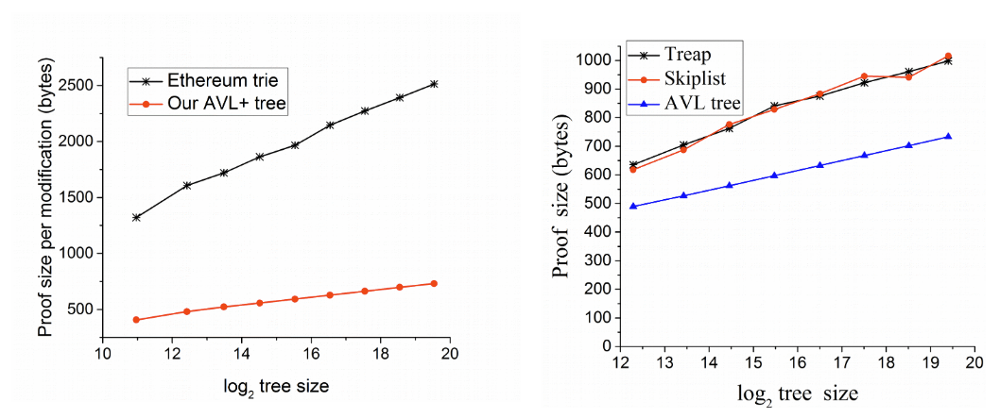
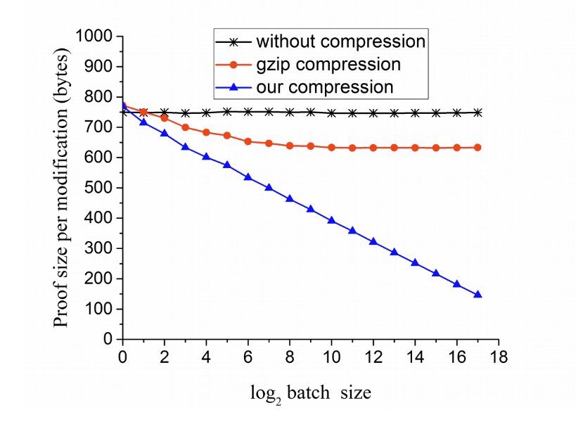
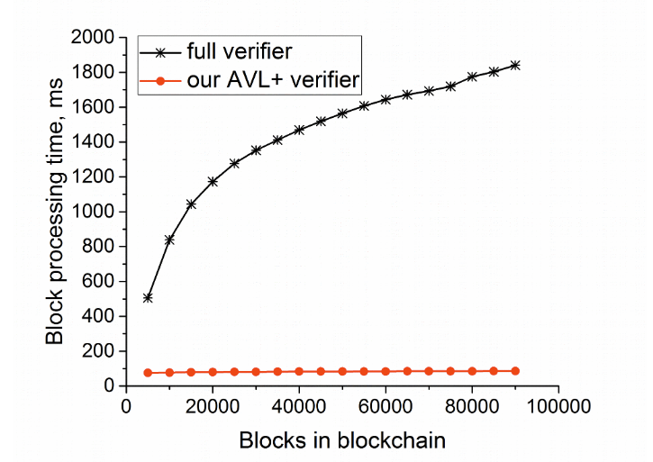

---
tags:
  - AVL Trees
  - Data Structures
  - Ergo
---

# AVL Trees in Ergo: An Overview

AVL trees, a type of highly efficient authenticated [data structure](data-structures.md), are natively supported in Ergo. They offer numerous advantages, such as the ability to authenticate data properties without the need to access the entire dataset. This document provides a comprehensive overview of AVL trees, their integration with Ergo, and their performance metrics.

## The Role of AVL Trees in Ergo

Ergo utilizes AVL trees to bolster the security and efficiency of a variety of applications. These authenticated dictionary data structures facilitate verification and updates without the need for trust in the prover. By curtailing the length of modification proofs and reducing storage requirements for verification, AVL trees provide a sturdy foundation for data integrity within the Ergo ecosystem.

## Integrating AVL Trees with Ergo Using GetBlok Plasma

Developers can effortlessly integrate AVL trees into their Ergo applications with the help of the [GetBlok Plasma](plasma.md) library, which is built on the [Ergo Appkit](appkit.md). This library streamlines the integration process by offering an abstraction layer that aids in incorporating AVL trees (also referred to as Plasma) into [off-chain code](off-chain.md). It provides developers with a convenient method to utilize AVL trees as a [Layer-2 scaling solution](layer2.md) in [smart contracts](ergoscript.md), off-chain code, and distributed systems that manage the Plasma infrastructure.

## Efficiency and Proof Size of AVL Trees

The compact proof sizes of AVL trees significantly contribute to their efficiency. AVL trees in Ergo provide succinct and effective authentication proofs, ensuring streamlined storage and verification processes within the [Ergo blockchain](protocol-overview.md).

### Proof Size for a Single Operation

The figure above depicts the proof size for a single operation.

### Proof Size for Multiple Operations

The figure above demonstrates the proof size for multiple operations.

## Validation and Verification Time

AVL trees in Ergo showcase superior performance in validation and verification processes. The verification time is optimized to enable quick and efficient data authentication. This efficient validation process enhances the overall performance and scalability of Ergo applications.

### Time Required for Validation

The figure above represents the time taken for validation of AVL trees.

By leveraging AVL trees, developers can significantly improve the security, efficiency, and scalability of their Ergo projects.

For more in-depth information, please refer to the [Improving authenticated dynamic dictionaries, with applications to cryptocurrencies](https://eprint.iacr.org/2016/994.pdf) paper.
