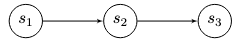

# Transaction Chains

In a multi-stage protocol, a **transaction chain** is a sequence of transactions executed in a specific order to achieve a particular outcome or goal. Each transaction in the chain depends on the successful execution of the previous one, and the overall success of the protocol relies on the successful execution of the entire chain.

For example, a transaction chain in a decentralized exchange (DEX) protocol might involve several steps to execute a trade between two parties. This chain could include steps such as:

- Approving the DEX contract to spend the required tokens from the user's wallet.
- Depositing the tokens to be traded into the DEX's smart contract box.
- Placing an order to buy or sell tokens at a specific price.
- Matching the order with a corresponding buy or sell order from another party.
- Executing the trade by creating a transaction that transfers the tokens and corresponding payment between the parties' boxes.
- Withdrawing the traded tokens and payment from the DEX's smart contract box back to the respective parties' wallets.

In this example, each transaction depends on the successful completion of the previous one. The overall success of the trade hinges on the successful execution of the entire transaction chain. If any transaction fails or encounters an error, the entire chain might fail, preventing the trade from being executed.

Transaction chains are a fundamental concept in Ergo's multi-stage protocols. They offer a structured way to achieve specific goals by ensuring transactions execute in the correct order with the necessary dependencies between stages.


## Process

A **transaction chain** is used to create multi-stage protocols where the logic progresses sequentially through different states, represented by UTXOs (boxes). Each stage's script enforces the rules for transitioning to the next stage.

A transaction chain representing a multi-stage protocol can be conceptualized as follows:

### 1: Represent Stages as Nodes
Represent the execution flow as a sequence of `n` states (S<sub>0</sub>, S<sub>1</sub>, ..., S<sub>n</sub>). Each state corresponds to a UTXO protected by a specific script and containing relevant data. A transaction (Tx<sub>i</sub>) acts as the transition between state S<sub>i-1</sub> and state S<sub>i</sub>, consuming the box representing S<sub>i-1</sub> and creating the box representing S<sub>i</sub>. This forms a directed graph where states are nodes and transactions are edges. For example, a 3-stage contract (like the ICO example) can be visualized as:



Each state (box) contains data (in registers) and is protected by script code (propositionBytes).

### 2: Enforce Transitions

To ensure the protocol progresses correctly, the script guarding state S<sub>n-1</sub> must enforce conditions on the transaction (Tx<sub>n</sub>) that spends it. Specifically, it must require that Tx<sub>n</sub> creates an output box representing state S<sub>n</sub> with the correct script and data. This is often done by checking the `propositionBytes` and relevant registers of the output box. An example is shown in the following pseudocode within the script for state S<sub>n-1</sub>:

```scala
// Ensure the output box has the same ErgoScript code as the state box and the same R4 data
// This is used to propagate data from the state box to the output box
out.propositionBytes == state_n_code &&
out.R4[Int].get == SELF.R4[Int].get
```

The code above uses the `propositionBytes` field of a box, which contains the serialized binary representation of its guarding script (ErgoTree).

### 3: Chain the Stages

Repeat Step 2 for all transitions in the chain: the script for S<sub>n-2</sub> enforces the creation of S<sub>n-1</sub>, the script for S<sub>n-3</sub> enforces the creation of S<sub>n-2</sub>, and so on, back to the initial state S<sub>0</sub>.


To avoid embedding potentially large script code within the previous stage's script, it's common practice to work with hashes. Instead of checking `out.propositionBytes == state_n_code`, the script checks `blake2b256(out.propositionBytes) == state_n_code_hash`, where `state_n_code_hash` is a known constant hash of the expected script for the next stage. This optimization significantly reduces script size.

Next, we will look at [Transaction Trees](tx-tree.md)
