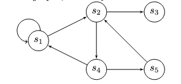

# Transaction Graphs

A transaction graph represents a set of related transactions more flexibly and dynamically than a [transaction tree](tx-tree.md). While a transaction tree is a hierarchical structure depicting a sequence of transactions with specific linear dependencies, a transaction graph is a more general representation allowing for complex and flexible dependencies between transactions.

In a transaction graph, each transaction can be visualized as a node, with directed edges connecting nodes to represent dependencies (i.e., an edge from Tx A to Tx B means Tx B spends an output created by Tx A). Unlike a transaction tree's fixed hierarchy, a transaction graph permits more intricate relationships, such as multiple dependencies (a transaction spending outputs from several previous transactions) and complex branching (a transaction creating outputs spent by multiple subsequent transactions).

Transaction graphs are useful for modeling complex transaction flows and dependencies, particularly in the context of smart contracts and advanced blockchain applications. They provide a more flexible and nuanced view of transaction sequences, enabling the representation of sophisticated relationships and dependencies.

Transaction graphs are a powerful conceptual tool for understanding complex blockchain interactions. They can help analyze the efficiency, scalability, and security of blockchain-based systems, especially in the context of advanced smart contracts and decentralized applications (dApps).

Ergo's eUTXO model inherently supports the formation of transaction graphs. Furthermore, ErgoScript allows contracts to reference each other (e.g., by checking the script hash of an output), enabling the construction of protocols where the graph structure can even involve cycles in these contract references, as illustrated below.

Please see the [Advanced ErgoScript Tutorial](https://storage.googleapis.com/ergo-cms-media/docs/AdvancedErgoScriptTutorial.pdf) Section 3.3.3.
