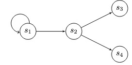

# Transaction Tree

# Transaction Tree

A *transaction tree* represents a sequence of related transactions hierarchically. Each transaction in the tree can have one or more child transactions dependent on its successful execution.

A transaction tree can be seen as a more complex version of a [transaction chain](tx-chains.md). In a chain, each transaction typically leads to a single next transaction. In a tree, however, a transaction might create multiple outputs, each potentially initiating a separate branch or sequence of subsequent transactions. This creates a branching structure resembling a tree, with the initial transaction at the root and subsequent transactions forming the branches.

Transaction trees are useful for representing complex transaction sequences and dependencies, especially within smart contracts and advanced blockchain applications. They help ensure transactions execute in the correct order with appropriate dependencies while offering a detailed and flexible view of the overall transaction flow, including conditional branching.


## Process

A transaction tree extends the concept of transaction chains, allowing for conditional logic (`if` statements) within the scripts that determine which branch of the tree is followed. Simple loops can also be implemented where a transaction recreates a box protected by the same script (effectively transitioning back to the same state node). The following figure illustrates a transaction tree structure with branching:



Conditional branching using an `if` statement within a script is handled conceptually as follows:

```scala
if (condition) {
    out.propositionBytes == state_3_code // if true, set proposition to state_3_code
} else {
    out.propositionBytes == state_4_code // if false, set proposition to state_4_code
}
```

A simple loop (returning to the same state) is conceptually a special case of the `if` statement:

```scala
if (condition) {
    out.propositionBytes == state_2_code // if true, set proposition to state_2_code
} else {
    out.propositionBytes == SELF.propositionBytes // if false, set proposition to SELF.propositionBytes
}
```

Many useful contracts can be represented using these branching structures (trees) and simple loops without requiring arbitrary cycles in the state transitions (as demonstrated in the linked paper). Ergo's eUTXO model allows the creation of such contracts.

Next, we will examine [Transaction Graphs](tx-graphs.md), which allow for even more complex structures, including cycles.
