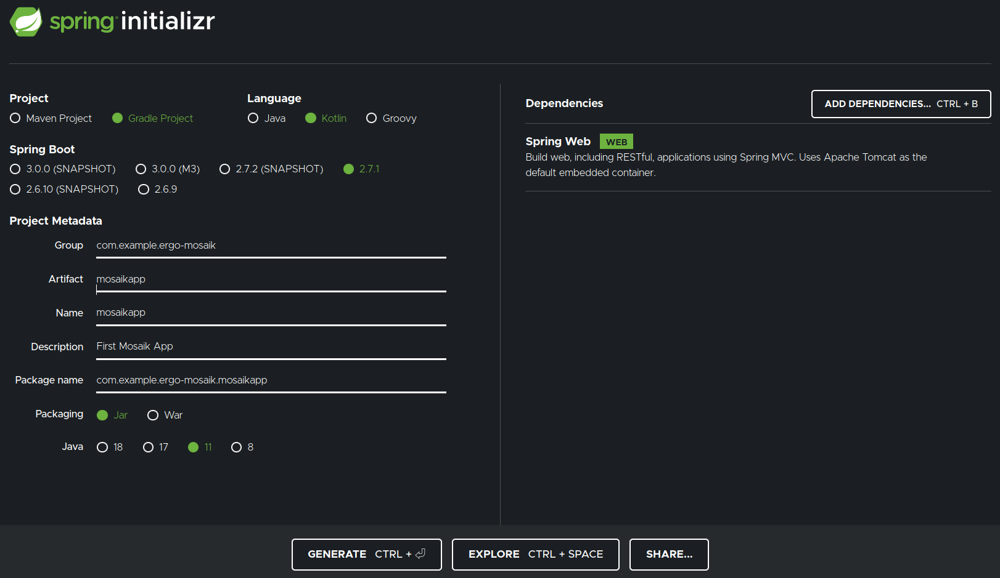
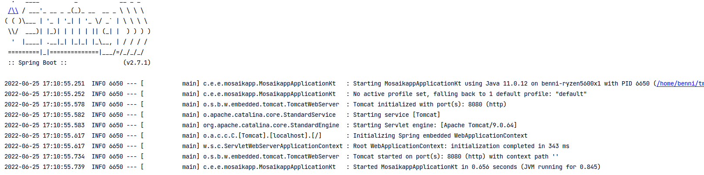
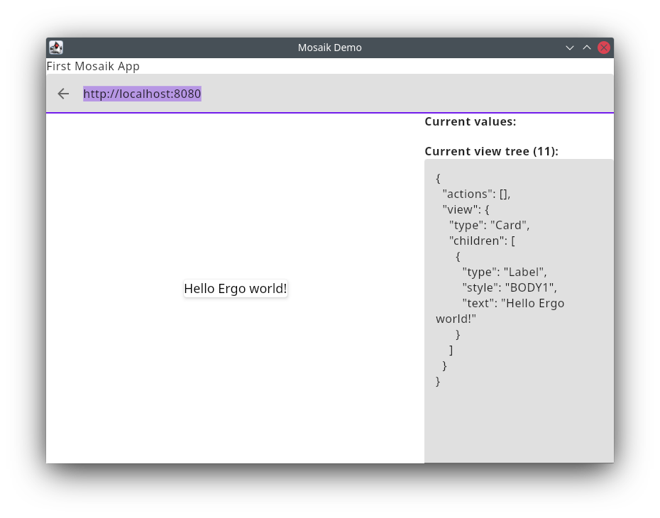

# Ergo Mosaik: A UI system for Ergo dApps


## 2: Building a simple UI with Mosaik Kotlin DSL and Spring Boot

In Part 1 of this tutorial series for Ergo Mosaik, we have seen that Ergo Mosaik is a UI layer for dApps using Ergo. It is not the exclusive UI layer but aims to streamline the development process for dApp developers by providing a way to implement both off-chain code and UI code on the same tech stack. Additionally, some wallet applications ship with a built-in Mosaik executor so that your dApp UI can be used within these wallet applications.

Mosaik apps are a JSON-based markup language and can be generated by the tech stack of your choice. A reference implementation is provided by the Ergo core team to be used from Kotlin/JVM.

This choice was made because Kotlin/JVM can utilize the full functionality of ergo-appkit, Ergo’s first-hand SDK, and all libraries in the Java ecosystem, as well as providing a well-balanced mix of imperative and functional programming. Kotlin can process domain-specific languages and self-defined DSLs. This feature was used to give a _Mosaik DSL_ with which the Mosaik user interface can be described naturally.

Because Kotlin/JVM seamlessly interoperates with the Java ecosystem, we can use Spring Boot to serve our Mosaik app to its executors. Spring Boot is a Java framework for building web services - REST APIs and dynamic websites - battle-tested, feature-rich and well-documented. You don’t need to use it when creating a Mosaik app, but we use it here in our examples because it helps implement REST APIs with very clean code.

So, let’s hop onto coding. You’ll need Java 11 installed on your system (open-source version preferred), and we recommend IntelliJ as the development environment, but you are free to use something else.


### Setting up a Spring Boot project

To set up a Spring Boot project, visit the Spring Initializr on start.spring.io. Change project to “Gradle project”, language to “Kotlin”, “Java” to “11”, and set the names as you want.

As dependencies, choose “Spring Web”.

You should end up with something like this:



Generate the project, extract the zip file and open the directory with the IDE of your choice. Using IntelliJ or another Gradle-compatible IDE will sync some time to download and index all dependencies.

To start the Spring Boot application, you can use the Terminal command

./gradlew bootRun (or gradlw bootRun on Windows)

to start your application server.

The command line will tell you that this worked and that the server is listening on port 8080:



A quick check on [http://localhost:8080](http://localhost:8080) will give you a “Whitelabel error page”. What sounds like an error means success; it is Spring’s way to tell you that there’s nothing defined it can serve and no error handling defined. Hence the “whitelabel error page”.

Let’s change this by adding a class “MosaikAppController.kt” in the same directory (or better: “package”) as our main “MosaikappApplication”. Annotate this class and add a method as shown:


```java
@RestController
class MosaikAppController {
   @GetMapping("/")
   fun getMainPage(): String {
       return "Hello"
   }
}
```


If you start the server again and visit localhost:8080 in your web browser, you will see that “Hello” is printed. That’s even more success.

What did we do to achieve this?

The @RestController annotation on the new class tells Spring that this class should be instantiated as a singleton, and its methods are designed for Rest APIs. Adding a method alone won’t do the trick, though: the API endpoint must be defined. That’s why the method itself has another annotation, which defines this method should be called when a GET request to path “/” comes in.

Returned objects of the REST API methods are automatically serialized to JSON by Spring. In this case, we return a String for which the serialization is profane. Data classes work as well, and we will use this soon.


### Adding Mosaik to the project

After making sure that Spring Boot is working, we now have to add Mosaik to the app. In the JVM ecosystem, libraries are served by Nexus servers, and the build tool fetches these libraries and adds them to the project during the build. We use Gradle as our build tool, and the dependencies for our project are declared in the **build.gradle.kts** file. Open it. You will find the following section:


```scala
dependencies {
  implementation("org.springframework.boot:spring-boot-starter-web")
  implementation("com.fasterxml.jackson.module:jackson-module-kotlin")
  implementation("org.jetbrains.kotlin:kotlin-reflect")
  implementation("org.jetbrains.kotlin:kotlin-stdlib-jdk8")
  testImplementation("org.springframework.boot:spring-boot-starter-test")
}
```


So at the moment, spring boot web and some Kotlin extensions are declared. We add mosaik below the existing entries:


```scala
// Mosaik
val mosaikVersion = "0.5.0"
implementation("com.github.MrStahlfelge.mosaik:common-model:$mosaikVersion")
implementation("com.github.MrStahlfelge.mosaik:common-model-ktx:$mosaikVersion")
implementation("com.github.MrStahlfelge.mosaik:serialization-jackson:$mosaikVersion")
```


We also need to declare another Nexus server that hosts these files. Change the repositories section (it is in the same **build.gradle.kts** file) like this:


```sbt
repositories {
   mavenCentral()
   maven("https://jitpack.io")
}
```


If you use IntelliJ, it will automatically offer to resync the project. Do it, and it will download everything needed to use Mosaik.

Well done! We need one little tweak now. As said before, Spring will automatically serialize objects to JSON. This automated serialization works well in most cases - but for some cases in Mosaik, the default serialization of Jackson, the library used by Spring here, is not what the standard describes and the executing application expects. So we need to tell Spring that some of our Mosaik objects need a different serialization than the default. Configurations like that are done on the Application class, so we change the application class in **<code>MosaikappApplication.kt</code></strong> like the following:


```scala
@SpringBootApplication
class MosaikappApplication {
  @Bean
  @Primary
  fun objectMapper(): ObjectMapper {
     // enables controller methods annotated with @ResponseBody to directly return
     // Mosaik Actions and elements that will get serialized by Spring automatically
     return org.ergoplatform.mosaik.jackson.MosaikSerializer.getMosaikMapper()
  }
}
```


This overrides the default “object mapper” (a class to map objects to JSON) with the one defined by Mosaik.

Our project setup is complete, and we can start implementing a Mosaik app! Do you remember the Mosaik desktop debugging application we compiled and started in Part 1 of the tutorial series? Keep it ready to be used!


### A first simple screen

Now we want to define the first screen users get presented when they open up our Mosaik app. This phrase already said implicit what has to come before the first screen: we must define the Mosaik app itself.

Let's change our getMainPage method to return a Mosaik app:


```scala
@GetMapping("/")
fun getMainPage(): MosaikApp {
   return mosaikApp(
       "First Mosaik App", // app name shown in executors
       1 // the app version
   ) {
       // define the view here
   }
}
```


mosaikApp() is a method defined in our Mosaik Kotlin DSL. It takes some parameters describing the app and, most importantly, the initial view screen.

A view screen consists of multiple view elements, and some layout elements can contain other view elements. Check out the layout elements demo that you’ve started in part 1: You see that the three main group elements are Row, Column, and Box. There’s also Card which is nothing else than a decorated box.

You should use one of these group elements as your root view element on a screen. We will use a card here. Inside the card, we define a label with a standard text for a first project.


```scala
return mosaikApp(
   "First Mosaik App", // app name shown in executors
   1 // the app version
) {
   // define the view here
   card {
       label("Hello Ergo world!")
   }
}
```


Start the Spring Boot server and use the desktop demo application to run your MosaikApp. It will look like this:



We see the app name, a somehow expected screen content, and we can also see how our viewtree looks like in JSON. Let’s spice this up a lot.


```scala
// define the view here
card {
   column(Padding.DEFAULT) {
       label("Hello Ergo world!", LabelStyle.HEADLINE2)

       box(Padding.HALF_DEFAULT)

       button("Click me") {
           onClickAction(showDialog("You clicked the button."))
       }
   }
}
```


Running it results in this view, and the button works and presents a message.


For the first part, we improved the layout by adding padding between the card outline and the card contents. The padding is declared on the new column element, not the card element. This might be surprising for people used to web design as they probably would expect that declaring padding on the card would be the better way to do this. But this would not work here: Paddings in Mosaik are always added on the outer side of the element. If you now think that a better name would be margin because, in web design, spacing on the outer side of an element is called margin, you are not quite right. Unlike web element’s margins and like web element’s paddings, paddings in Mosaik will always add spacing for neighboring elements.

The column element lays out its child elements vertically and linearly so that the button is added below the label, which now has a better suiting style.

The box element between the label and the button has no content and simply adds spacing between the label and button.

On the button, an onClickAction is set and given an action that shows a dialog with a message. This line looks very innocent, but a lot is going on thanks to the Kotlin DSL. If you Ctrl-Click on “showDialog” and follow the code that is revealed, you will see that this expression actually defines the action and gives it a random id (because we did not set an id on our own, but the action needs an id), adds this action to the set of actions defined in our ViewContent (= the whole visible screen) and returns the action. “onClickAction” assigns the id of the action to the view element’s onClickAction property.

Although the code looks like regular programming, it is crucial to keep in mind what is going on behind the scenes to make the JSON serialization work. The behavior implies that defining two different actions with the same id will result in the first action being overwritten:


```scala
column(Padding.DEFAULT) {
   label("Hello Ergo world!", LabelStyle.HEADLINE2)

   box(Padding.HALF_DEFAULT)

   button("Click me") {
       onClickAction(showDialog("You clicked the button.", "myaction"))
   }

   val clashingAction = reloadApp("myaction")
}
```


Although the clashingAction does not seem to be used anywhere in the code, it overwrites the dialog action. Since its ID is assigned to the button, the button will now reload the app.

You can now play around, adding some other view elements and actions. Take a look at the view elements and actions demo to see what is available and how to add it. In the next part of the tutorial series, we take a closer look at how the screen content can be altered.

If you had any problems in creating the code, you will find it [here](https://github.com/MrStahlfelge/mosaik-tutorial-series/tree/20ed591936a959fd6ab640e6520dc01e6d6c2d66) 


