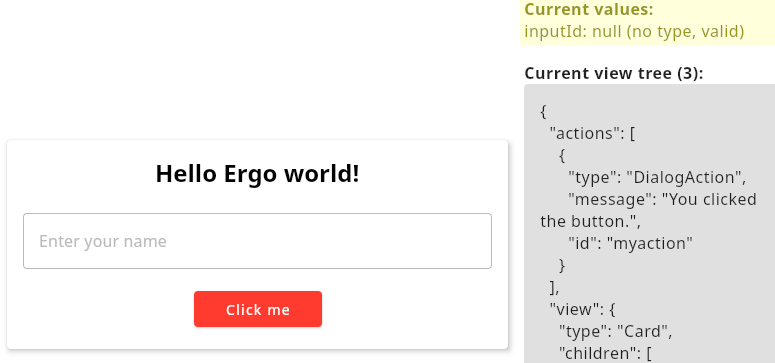
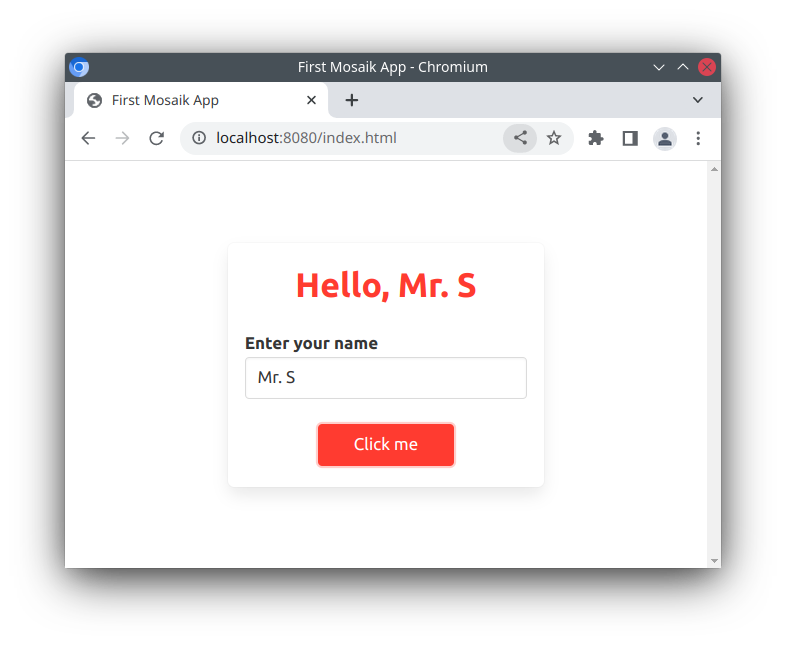

# Ergo Mosaik: A UI system for Ergo dApps

## 3: Processing data

In Part 2 of this tutorial series for Ergo Mosaik, we learned how to define the first simple UI for a dApp that can be shown within Wallet applications (and by using the Mosaik web executors in web browsers as well).


So far, we have seen how to show a card with a label and a button and how to run actions within Mosaik. I recommend you to take a look at the view elements demo again: Start the backend-demo-kotlin subproject from the mosaik repository and start the desktop debugger


```
    ./gradlew backend-demo-kotlin:bootRun
    ./gradlew desktop-demo:run
```


Then navigate to localhost:8080 on the desktop demo. Check out all the sub screens to get a feeling of how much is provided by Mosaik. Every page has a GitHub link at the top that brings you to the source code. Use this to learn how to describe the view elements in the code.

There is also an overview of available actions. Most actions are much like the showDialog action we already learned about: openBrowser, copyToClipboard etc work quite similar.

There are some actions that are more complex. Some enable Mosaik to have real interaction and to process data with your backend, namely backendRequest() and changeView(). Some others allow initiating a blockchain interaction, namely ErgoPay and ErgoAuth. We’ll take a look at the former ones now.


#### Process data with backendRequest

backendRequest() is an action that executes a POST request to your backend containing all input values of the current screen and expects a response with an action to run subsequently. This enables you to write complex logic in your backend resulting in different outcomes for the Mosaik app user. Your logic can operate on input values by the user. To have any input values defined, we need to add an input view element on our current screen. We start with a simple text input field. Open your MosaikController from last time and add it to your card:


```
card {
   column(Padding.DEFAULT) {
       label("Hello Ergo world!", LabelStyle.HEADLINE2)

       box(Padding.HALF_DEFAULT)


       // this is new - begin


       textInputField("inputId", "Enter your name")

       box(Padding.HALF_DEFAULT)


       // this is new - end

       button("Click me") {
           onClickAction(showDialog("You clicked the button.", "myaction"))
       }
   }
}
```


Start your Spring server process and navigate to your app in the desktop debugger. We can observe two things: First, unsurprisingly, is that the text input field is shown and ready for input. The second observation is less obvious and perhaps not expected: The debugger shows the current values for inputs on the right-hand side above the JSON sources with validity information:



When there is nothing entered (like in the screenshot above), the value for “inputId” is “null” which is valid. Enter something. You will see the value reflected and the type switches to String.

What is this validity? On many input types, you can add some properties defining restrictions on which inputs are valid. For example, we can define that only names with a length of 3 to 10 characters are valid by changing our app code like this:


```
textInputField("inputId", "Enter your name") {
   minValue = 3
   maxValue = 10
}
```


Restart the app server and reload the app. You will now see that the text input field will indicate invalid inputs, and the desktop debugger will report them as invalid.

The validity information is not only used for indications to the user but also has an effect on the backendRequest(). But for this to see, we will have to introduce the backendRequest by changing the code for our button like this:


```
button("Click me") {
   onClickAction(backendRequest("enteredName"))
}
```


Just making a backend request does not make much sense without providing an endpoint it can reach. Our endpoint URL is defined as “enteredName” in the code above, so we add the new endpoint with the following code:


```
@PostMapping("/enteredName")
fun userEnteredName(@RequestBody values: Map<String, Any?>) =
   backendResponse(
       1,
       showDialog("User entered ${values["inputId"]}")
   )
```


Let’s break this down line by line.

Line 1: @PostMapping is an annotation to tell Spring POST requests on /enteredName should be mapped to the following method.

Line 2: the Kotlin method declaration. The method expects a Map object parameter, where the keys are Strings and the values can be of any nullable type. The @RequestBody annotation makes springs map the body of the POST request to this Map object. This means every input value of our screen will have a map entry in the values map.

Line 3: backendResponse is a function in our Mosaik DSL returning a response to backendRequest(), which is what we want to have here

Line 4: this repeats our current app version that we sent to the Mosaik executor when the main app was loaded. We used app version 1 in our main app definition, so we give 1 here, too.

Line 5: Here follows our subsequent action that should be run by the Mosaik app. We show a dialog here as we did before, filling it with what the user entered. In case the Kotlin sugar for string replacements and maps confuses you, the following code does exactly the same and might be more familiar and clear for some folks:


```
showDialog("User entered " + values.get("inputId"))
```


Now restart your server and reload the app in the desktop debugger. Observe the following behaviour:


* When a valid name is entered, the backend request is executed and the dialog shows our defined message
* When no valid name is entered, an error message is displayed and the backend request is not made at all

This behaviour will fit a lot of use cases, but maybe not all. There might be situations where you want to have a backend request executed even when some input fields contain invalid values. There is a way to make Mosaik behave like this as well by changing the default behaviour on backendRequest() like this:


```
button("Click me") {
   onClickAction(backendRequest("enteredName") {
       postValues = BackendRequestAction.PostValueType.VALID
   })
}
```


The default value for post values is (enforce) “ALL”, now changing it to “VALID” makes the backendRequest action post in any case, but only sending valid inputs. Restart again and try what happens with invalid inputs.

We have now seen how to send data to the backend and process it. However, reacting with a dialog to all types of methods is not a good user experience. We will now take a look on how we can alter the screen content.


#### Alter the screen content with changeView()

changeView() is an action that contains a new mosaikView view content to attach it to the current screen. A view content is what you already delivered with your first main screen: it is an object holding a list of actions, and a root view element.


>    **Excursus: View element, view group, view content**
>
>    We already know all of these objects, but to make sure no one gets confused, we list a clarification definition here.
>
>    A **view element** is a basic element in a Mosaik view, like a label or a button.
> 
>    A **view group** is a special view element containing other view elements, like Box, Column, Row, Card.
>
>    A **view content** defines the state of what Mosaik shows for your app. It is made up of is a _root view element_ and a _list of actions_ (which can be empty). Usually, the root view element should be a view group - otherwise, the screen would look very boring.

The behavior of changeView() action needs some more explanation regarding how it actually affects existing screen content:


* the new actions defined by the view content of the changeView() action are added to the existing set of actions. (If any of the new actions’ IDs equal an ID of an already defined action, the new action replaces the existing one.)
* the view root of the view content of the changeView() action will replace an existing view with the same id. If no view is found, or if the view root does not have an ID, the complete view tree is replaced

This behavior allows to alter the entire screen, or only change some single view elements.

To demonstrate this, let’s use our existing screen, but instead of showing a message box when a name was submitted, we change the title of the screen to show the name.

We will give the full code here and explain the annotated changes below:


```
@RestController
@CrossOrigin
class MosaikAppController {
   @GetMapping("/")
   fun getMainPage(): MosaikApp {
       return mosaikApp(
           "First Mosaik App", // app name shown in executors
           1 // the app version
       ) {
           // define the view here
           card {
               column(Padding.DEFAULT) {
                   label("Hello Ergo world!", LabelStyle.HEADLINE2) {
                       id = "titleLabel" // (1)
                   }

                   box(Padding.HALF_DEFAULT)

                   textInputField("inputId", "Enter your name") {
                       minValue = 3
                       maxValue = 10
                   }

                   box(Padding.HALF_DEFAULT)

                   button("Click me") {
                       onClickAction(backendRequest("enteredName")) // (2)
                   }
               }
           }
       }
   }

   @PostMapping("/enteredName")
   fun userEnteredName(@RequestBody values: Map<String, Any?>) =
       backendResponse(
           1,
           changeView(mosaikView { // (3)
               box {
                   id = "titleLabel"

                   label(
                       "Hello, ${values["inputId"]}",
                       LabelStyle.HEADLINE2,
                       textColor = ForegroundColor.PRIMARY
                   )
               }
           })
       )
}
```


Change (1): We have attached an ID “titleLabel” to the title label. With this ID, we can replace this element.

Change (2): We removed the postValues = BackendRequestAction.PostValueType.VALID so that invalid inputs are not allowed any more

Change (3): We replaced the showDialog() action with changeView(). The changeView() gets a mosaikView(). It does not contain any new actions, but a box as the root view. This box has the ID “titleLabel” assigned, which will make this box replace the former title label.

The box contains exactly a new label.

(Excursus: You might ask: Why is the new label wrapped in a box, isn’t using a new label as view root enough? The answer is: Yes. It would be enough. The reason why we are using a wrapping box here is caused by the  Mosaik DSL which only defines view groups as root elements.)

Restart the Spring server and reload the app in the desktop demo. You can now see the title label changing.

As you can not only replace single elements but complete view groups of elements and even the former view root. This way, the whole screen content can be replaced.

You will find some examples demonstrating the data flow and changing screen content in the two demo projects in the Mosaik repository. You can also take a look at the open-sourced AgeUSD Mosaik UI example [here](https://github.com/MrStahlfelge/mosaik-ageusddemo)  (the AgeUSD and blockchain part is a mock so that you only have interface-relevant code here by intention).

You will find the example project in its state after completing this tutorial series part on [GitHub](https://github.com/MrStahlfelge/mosaik-tutorial-series/tree/656a3aff847d57892442309f3f8b3d58c4fba3f8)

The next part of this tutorial series will demonstrate how to implement a Send Ergo amount screen: The user can choose one of his wallet addresses and an Ergo amount and start a transaction that gets submitted to the Ergo network. All in all, if you followed this course and also followed the [ErgoPay introduction](ep-tutorial.md), you have all ingredients together to do the job - we just have to mix it together.

We close this course with a sneak peek at how our example looks using the [Mosaik web executor](https://github.com/MrStahlfelge/mosaik-kt-js). As you can see, it looks similar to how the desktop debugger and the Ergo Wallet App show our implemented screen, which is exactly how it should be.



See you in part 4!
