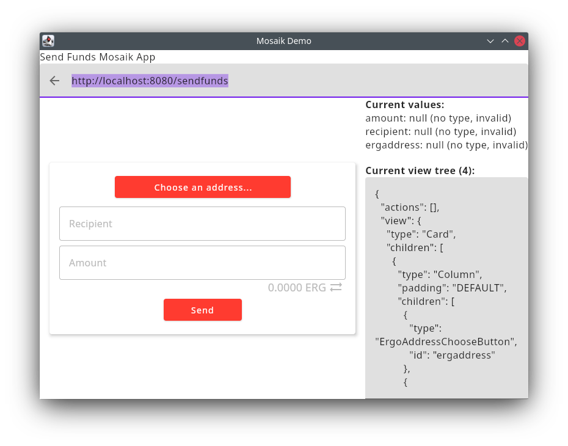
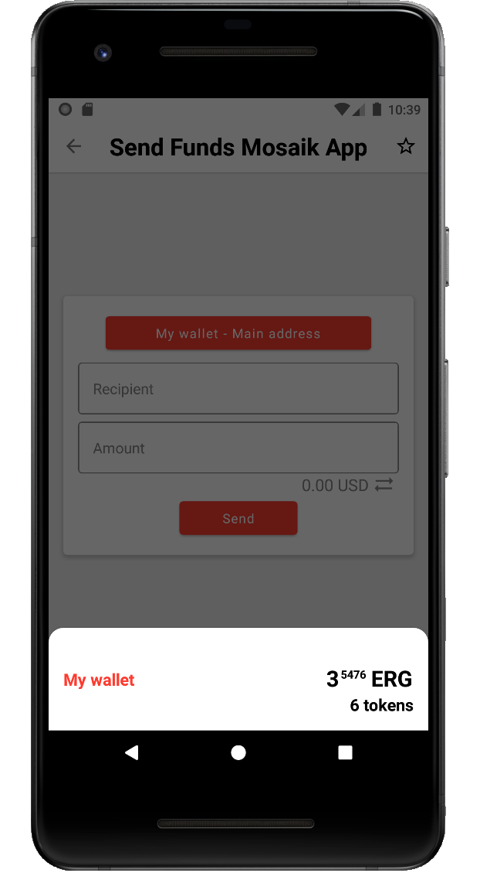

# Ergo Mosaik: A UI system for Ergo dApps

## Part 4: Implementing Sending Funds screen

Welcome back to the Ergo Mosaik tutorial series! In this part of the series, we want to implement a Send Funds screen as an example application on how to execute transactions on the ergo network based on user input. 
For this, we use the lessons learned in Part 2 (implementing a simple screen) and Part 3 (processing data) of this tutorial, and mix in some new knowledge regarding ErgoPay. You can find an in-depth tutorial for 
ErgoPay in [1], but we cover everything needed here as well.

Our plan is the following: We want to implement a screen where the user can connect his wallet and can enter a recipient and an ERG amount to send. When clicking send, the user should be able to sign a 
transaction reflecting the entered data - and we are done.

Implementing the screen is, after completing the former tutorials, just a simple exercise for us.


* We will lay out all elements in a Column
* Connecting the wallet is done with an “AddressChooseButton” (we could also use the “WalletChooseButton”, but we keep it a bit simpler for this exercise)
* Recipient address is done with an “ErgAddressInputField”
* Entering the ERG amount is done with a “FiatOrErgAmountInputField” (we could also use “ErgAmountInputField”, but why not use the free extra functionality?)
* User can send the amount by pushing a button


#### Implementing the UI

We will implement our new send funds app in our existing tutorial project, but we will add a new controller class and use a new endpoint to separate it from our former demo app we’ve implemented so far.
This serves also as an example that a single Spring Boot process can serve multiple separated Mosaik apps, if this is needed. Our bare new controller will look like this (see Part 2 “A first simple screen”)


```
@RestController
class SendFundsAppController {
   @GetMapping("/sendfunds")
   fun getSendFundsApp(): MosaikApp {

   }
}
```


So, let’s get to it and fill it with actual useful content!


```
private val idSenderAddress = "ergaddress"
private val idRecipient = "recipient"
private val idAmountToSend = "amount"

@GetMapping("/sendfunds")
fun getSendFundsApp(): MosaikApp {
   return mosaikApp(
       "Send Funds Mosaik App",
       appVersion = 1
   ) {
       card {
           column(Padding.DEFAULT) {

               ergoAddressChooser(idSenderAddress)

               ergAddressInputField(idRecipient, "Recipient", mandatory = true)

               ergAmountInputField(idAmountToSend, "Amount", canUseFiatInput = true) {
                   minValue = 1000 * 1000
               }

               button("Send")
           }
       }
   }
}
```


There is no surprise here, we reused all our knowledge from part 2 and part 3 and took some inspiration from the view element demo app’s source code as well. Running the app in 
the demo executor shows the expected:





A remark regarding the functionality of the “Choose an address…” button: The desktop debugger will show an ugly input dialog to enter an address when clicked. This is of course not 
what an end user will see. When using the Android app and clicking the button, the user will get presented the known address selection dialog:




What is missing is the actual action of the send button.


#### ErgoPay: Preparing a transaction for the user to sign

When the Send button is clicked, we want to prepare a transaction with the entered data which the user needs to sign before submitting it to the ergo network. This is exactly what ErgoPay 
is intended for: ErgoPay is a protocol to transfer a prepared “reduced transaction” to a wallet and let the user sign and submit it. What is a “reduced transaction”? It is an unsigned 
transaction with all blockchain context-dependent variables already replaced by actual data (In case of a simple payment without any smart contracts, it is nearly the same as an unsigned 
transaction). That means we have three task to tackle:


* Building a reduced transaction based on user input
* wrap it into ErgoPay protocol
* make the send button use ErgoPay


#### Building a reduced transaction based on user input

This task is already completely covered by [1]. We will do all necessary steps here together, but without much explanation - you can find more explanation in [1].

To build a reduced transaction, we need to import ergo-appkit, Ergo’s SDK for JVM languages into our project. We do this by adding it as a dependency to our build.gradle.kts file 
in the dependencies section:


```
    // ErgoPay
    implementation ("org.ergoplatform:ergo-appkit_2.12:4.0.10")
```


When we have done that, we can add a helper method that builds a reduced transaction to send a given nanoerg amount from a given sender to a given recipient:


```
private fun getReducedSendTx(
   amountToSend: Long,
   sender: Address,
   recipient: Address
): ReducedTransaction {
   val networkType = recipient.networkType
   return RestApiErgoClient.create(
       getDefaultNodeUrl(networkType),
       networkType,
       "",
       RestApiErgoClient.getDefaultExplorerUrl(networkType)
   ).execute { ctx: BlockchainContext ->
       val contract = recipient.toErgoContract()
       val unsignedTransaction = BoxOperations.createForSender(sender, ctx)
           .withAmountToSpend(amountToSend)
           .putToContractTxUnsigned(contract)
       ctx.newProverBuilder().build().reduce(unsignedTransaction, 0)
   }
}

// this class processes all requests from the an ErgoPay wallet application
val nodeMainnet = "http://213.239.193.208:9053/"
val nodeTestnet = "http://213.239.193.208:9052/"

private fun getDefaultNodeUrl(networkType: NetworkType): String =
   if (networkType == NetworkType.MAINNET) nodeMainnet else nodeTestnet
```


You can change the node used here to your own, or find another one on [2].


#### Wrapping the reduced transaction

Now we have to wrap this transaction into the ErgoPay protocol. ErgoPay protocol is defined in [3]: according to it, we need to wrap the transaction into a 
json with the following content:


      - transaction: ReducedTransaction (optional*)


      - p2pkaddress: String (optional)


      - message: String (optional*)


      - messageSeverity: String (optional) "INFORMATION", "WARNING", "ERROR"


      - replyToUrl: String (optional)

Model classes like “ErgoPay for ErgoPay are already defined to be used in Spring projects in another dependency that we can pull in by adding it to our build.gradle.kts file:


```
    implementation ("com.github.MrStahlfelge:ergoplatform-jackson:4.0.10")
```


The json should be served on an own http endpoint, so we add the ErgoPay endpoint to our SendFundsAppController class:


```
@GetMapping("/sendFunds/{sender}/{recipient}/{amount}")
fun sendFundsSigningRequest(
   @PathVariable sender: String,
   @PathVariable recipient: String,
   @PathVariable amount: Long
): ErgoPayResponse {
   val response = ErgoPayResponse()
   try {
       val reduced = getReducedSendTx(amount, Address.create(sender), Address.create(recipient)).toBytes()
       response.reducedTx = Base64.getUrlEncoder().encodeToString(reduced)
       response.address = sender
       response.message = "Please sign the transaction."
       response.messageSeverity = ErgoPayResponse.Severity.INFORMATION
   } catch (t: Throwable) {
       response.messageSeverity = ErgoPayResponse.Severity.ERROR
       response.message = t.message
   }
   return response
}
```


As you can see, the ErgoPay endpoint URL contains exactly the parameters the user can enter. Because we added the @PathVariable annotation, Spring will automatically map the URL path placeholders to the method parameters. The returned ErgoPayResponse object will be converted to json by Spring, too.


#### Make the Send button use ErgoPay

All we have to do now is map the Mosaik user inputs to the ErgoPay endpoint URL and make the executing wallet application fetch it as an ErgoPay input.

We know from part 3 of the tutorial series, that we can process user inputs with a ServerRequestAction/BackendRequest, and that this request will return a new action. When we 
return an ErgoPayAction here, we will get exactly the needed behavior. So we make the send button perform a backend request:


```
    button("Send") {
       onClickAction(backendRequest("sendfundsClicked"))
    }
```


We also need to provide the endpoint for this request:


```
@PostMapping("/sendfunds/sendfundsClicked")
fun sendFundsClicked(@RequestBody values: Map<String, Any?>, request: HttpServletRequest): FetchActionResponse {
   val sender = values[idSenderAddress] as? String
   val recipient = values[idRecipient] as? String
   val amount = (values[idAmountToSend] as? Number)?.toLong()   // 1

   // 2
   val ok =
       sender != null && recipient != null && amount != null && (amount >= Parameters.MinChangeValue)

   val responseAction: Action = if (!ok) {
       showDialog("Inputs are not valid", id = "errorDialog")
   } else {
       // 3
       val thisEndpointHostname = request.requestURL.toString().substringAfter("://").substringBefore("/")
       val ergoPayUrl = "ergopay://$thisEndpointHostname/sendFunds/$sender/$recipient/$amount"
       invokeErgoPay(ergoPayUrl, id = "epSendFunds")
   }

   return backendResponse(
       1,
       responseAction
   )
}
```


So far, this is how we’ve learned it, but there are some marked lines to comment on:

For 1), the cast to number and then conversion to long might surprise. We know that the ErgAmountInputField always use Long - what is going on here? To understand this, 
you must remind yourself that the actual long value is transmitted by JSON format and automatically converted back by Spring. JSON has only a number format, and when Spring 
converts this number back into a JVM object, it does not know if this number is a Long or an Integer, so it choses Integer when the value is not too large. That’s why the amount 
value can be wrapped in an Integer or a Long object. Casting to Number and converting to Long makes sure we have a Long value in our amount variable.

For 2), our backend request makes sure all values are set with valid inputs, so this check seems unnecessary. We recommend you to double check values: The executor-side checks
are more meant for convenience for the user, but you should not rely on them. Different Mosaik executors might do less strict checks.

Finally, we have 3): The ergoPay url is build with the use of request.requestUrl, with request being a HttpServletRequest object automatically provided by Spring when 
declared on an endpoint method. This is used here to automatically use the hostname the client wallet used to connect to our endpoint to; the hostname can be completely different, 
for example, while testing, you might connect to [http://localhost:8080](http://localhost:8080) or from within your network to [http://192.178.0.10:8080](http://192.178.0.10:8080). 
By using the HttpServletRequest, you can make sure to build the ergoPay Url in a way the client can reach it.

When you run this Mosaik app in the desktop debugger, it gives the expected behavior. Far more fun is it to run the app in the Android wallet app, which will really make a 
transaction on the ergo network. The only task left is a minor issue: When the ErgoPay transaction was performed, we are sent back to the Mosaik app which is still showing the 
former inputs. It is better to empty them by simply reloading the app. You will find this implemented in the GitHub repository for this example [4].


#### Conclusion

We implemented a Mosaik app that sends funds based on user inputs in a trustless way. Your app don’t need access to the user’s secrets, and the user can review every transaction 
made from your app before signing it. This is all done from a single simple codebase in Kotlin, served by a Spring Boot process.

The tutorial on implementations is now done. The next part will take a look at what comes next: Deployment, and how you can make your Mosaik app working on web browsers. See you next time!


---

[1] [https://medium.com/@bschulte19e/implement-a-dapp-using-ergopay-d95e17a51410](https://medium.com/@bschulte19e/implement-a-dapp-using-ergopay-d95e17a51410)

[2] [https://api.tokenjay.app/peers/list](https://api.tokenjay.app/peers/list)

[3] [https://github.com/ergoplatform/eips/blob/master/eip-0020.md](https://github.com/ergoplatform/eips/blob/master/eip-0020.md)

[4] [https://github.com/MrStahlfelge/mosaik-tutorial-series/blob/af520069f88163aa833d330a060cde136d7a070e/src/main/kotlin/com/example/ergomosaik/mosaikapp/SendFundsAppController.kt](https://github.com/MrStahlfelge/mosaik-tutorial-series/blob/af520069f88163aa833d330a060cde136d7a070e/src/main/kotlin/com/example/ergomosaik/mosaikapp/SendFundsAppController.kt) 
