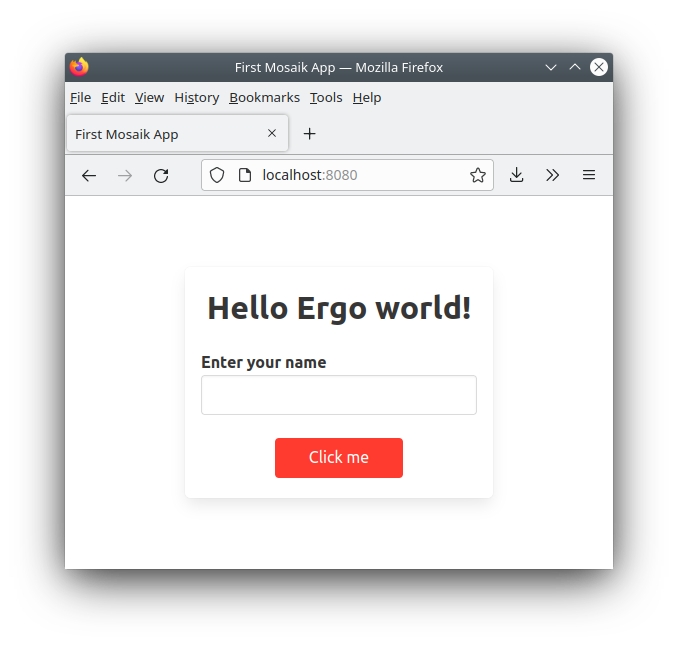

# Ergo Mosaik: A UI system for Ergo dApps


## Part 5: The Web

Welcome back to the Ergo Mosaik tutorial series! In the previous parts of this series, we already implemented a full-fledged Mosaik app for sending ERG that is working 
smoothly when launched in a Mosaik executor like the Ergo Wallet app or the Mosaik desktop debugger. But there are people out there without Mosaik executing wallet apps, 
or people using the app but not being aware that they can use Mosaik dApps within their wallet app, or people preferring to have a clear separation… long story short, 
we need to keep care of web browsers, as they are the go-to app for most users to visit an URL or host name.

This tutorial will show you how to handle two use cases:


1. You only want your Mosaik app to be used from within wallet apps. But you want web browsers visiting your app URL to show a nice site explaining the users to open the app URL from within a wallet app
2. You want your Mosaik app to run within a web browser

Let’s focus on 1) first.


#### Show an informational page in web browsers visiting your Mosaik app

Let’s go back to our tutorial app and start up the Spring Boot process. We know that our Mosaik app is living on [http://localhost:8080/](http://localhost:8080/) now, 
and opening it in the desktop debugger works as great as expected. However, when we open up the app in a web browser…we only get to see the json output that is our 
serialized app. Let’s do this better!

There is no way in getting web browsers understanding what a Mosaik app is, so we use a simple trick to achieve what we want: We move the Mosaik app away from the URL, 
and instead serve HTML content we want the user to see there. But we leave a hint for Mosaik executors where to find the actual Mosaik app.

Moving the Mosaik app is easy. Let’s open MosaikAppController and change the annotation for getMainPage:


```
@GetMapping("/firstapp")
fun getMainPage(): MosaikApp {...}
```


We also need to change the annotation for userEnteredName:


```
@PostMapping("/firstapp/enteredName")
fun userEnteredName(@RequestBody values: Map<String, Any?>) = …
```


Now we need to define new content for the main page.

Create a new directory “static” in the src/main/resources directory and create a file “nobrowser.html” with the following content:


```
<html>
<head>
   <link rel="mosaik" href="firstapp">
</head>
<body>
Please navigate to this page with a Mosaik executor application.
</body>
</html>
```


This is the content to be served. The important part for Mosaik executors is the link &lt;rel=”Mosaik” …> tag, while all other content is for web browsers to show.

We tell Spring to serve this file for the main page with the following addition to MosaikAppController.kt.


```
@GetMapping("/")
fun browserHintPage(): ModelAndView {
   return ModelAndView("nobrowser.html")
}
```


And that’s it! After restarting Spring, web browsers show a hint message when visiting localhost:8080, while Mosaik executors automatically load the linked Mosaik app.

Of course, you don’t need to show an ugly hint message, but can instead serve your main web page here.

You can find this version of the example app on [https://github.com/MrStahlfelge/mosaik-tutorial-series/tree/2dc2af35eae0592b7f9a1f252353be0585ddd57f](https://github.com/MrStahlfelge/mosaik-tutorial-series/tree/2dc2af35eae0592b7f9a1f252353be0585ddd57f)


#### Run your Mosaik app in web browsers

Mosaik apps are platform agnostic and can be executed in wallet applications on different operating systems and architectures. There is also a Mosaik executor 
available to run your apps from within a web browser. It is not a browser plugin, but instead an interactive website consisting only of a single html page, a 
single Js file and a configuration file that you host on your web site. The configuration file specifies where the web executor loads your Mosaik app from, so 
you can reuse your Mosaik apps for the wallet apps here - in most cases without a change.

Before we do the necessary steps to run our apps with the web executor, some words on what to expect and what it is meant for:

Since Mosaik is platform agnostic and meant to be used for wallet plugins, the Mosaik UI defines certain elements and its placements in a view hierarchy. There 
is no absolute way to define how elements look like, so it is expected that buttons or icons do not look the same when run with another executor. Hence, Mosaik 
will never support pixel-pefect element positioning or coloring elements in all available colors. If you need this, Mosaik web is not for you, you need to 
develop your own web UI.

However, Mosaik web is designed to _behave_ the same as Mosaik executed in wallet applications. Your apps will behave the same without a code change on your side, and
you can publish your app as a web app with practically no effort regarding web development.

Now let’s start using the web executor. You can find it on its Git repository [https://github.com/MrStahlfelge/mosaik-kt-js](https://github.com/MrStahlfelge/mosaik-kt-js) 
under releases as a zip file. In most cases, it is not needed that you build it yourself - this is only needed if you need the latest working version, or if you want to 
customize the colors. See the README on the repository for infos on this.

Download the latest zip file. It contains the three files mentioned above. You can host these files on any static web hosting provider so that it integrates well into 
your existing web presence, or you can use the Spring application that serves the Mosaik app to serve it as well. We go with the latter by dropping the three files 
into the resources/static directory next to our nobrowser.hml page.

Now do the following changes:


* Change our method browserHintPage we defined above to serve the index.html file
* Open the index.html file and add the <code>&lt;<strong>link rel="mosaik" href="firstapp"</strong>> </code>entry to its header section. Do other changes you like to this file (changing title, changing loading screen etc)
* Open the mosaikconfig.json and change the “startupurl” entry to “firstapp”
* <strong>Make sure all your @RestController annotations are accompanied by a @CrossOrigin annotation</strong>

Restart the Spring process and visit localhost:8080 in your browser will show you the following page:



Enter your name and click “Click me” changes the title label as expected.

But how can we visit our second app for sending ERG? Sure, we could add a button to our main screen with a navigateToApp action. But Mosaik Web executor has a built-in way to 
directly link to certain Mosaik apps by adding “routes” entries in the mosaikconfig.json.

Let’s change the routes entry as follows:


```json
{
  "starturl": "firstapp",
  "routes": {
   "send": "http://127.0.0.1:8080/sendfunds"
  }
}
```


Now you can access and link directly to the sendfunds app with [http://localhost:8080/#send](http://localhost:8080/#send) - this way, navigating between apps automatically 
supports the browser’s back/forward history functionality.

When you visit our send funds app in browser, you may notice that the following features already work:


* choosing a wallet address manually or by using an installed browser extension wallet
* send button checks validity of input fields and a dialog opens for the user to scan an ErgoPay QR code or to start an ErgoPay-compatible wallet app
* mobile support

The wallet address chooser is even more configurable. You can disable the manual address entry, and you can enable connecting the wallet with ErgoPay. This should be done so 
that mobile users don’t need to copy their p2pk address manually.


#### Add ErgoPay connect wallet support

Connecting a wallet with ErgoPay needs establishing a channel back from the wallet app to the Mosaik web executor, that’s why you need to add two new API endpoints 
and a data holder service to your Spring controllers and configure these two endpoints in web executor’s mosaikconfig.json.

For simplicity, the actual code is not shown here as it is some boilerplate. If you read through it, it is pretty easy to understand that it handles the following: 
Endpoint A is called continuously by the web executor’s connect wallet screen to check if the user already connected. Endpoint B is an ErgoPay endpoint connected 
from the wallet app when the user connects. It saves the user’s wallet address in a temporary map for endpoint A to pick up.

The two endpoints are implemented in UserSessionController and the temporary wallet address map is implemented in UserSessionService. Feel free to copy them as is 
in your own project. You can find them here:  
[https://github.com/MrStahlfelge/mosaik-tutorial-series/tree/fba56d65e8c8a01821ecb1c56037bc5dfa8a652a/src/main/kotlin/com/example/ergomosaik/mosaikapp](https://github.com/MrStahlfelge/mosaik-tutorial-series/tree/fba56d65e8c8a01821ecb1c56037bc5dfa8a652a/src/main/kotlin/com/example/ergomosaik/mosaikapp)

For the web executor to know where to connect to, the mosaikconfig.json file needs to be edited as follows:


```json
{
 "starturl": "firstapp",
 "chooseWalletErgoPay": {
   "getAddressForSessionUrl": "http://127.0.0.1:8080/getUserAddress/#RID#",
   "ergoPaySetAddressUrl": "ergopay://127.0.0.1:8080/setAddress/#RID#/#P2PK_ADDRESS#"
 },
 "routes": {
   "send": "http://127.0.0.1:8080/sendfunds"
 }
}
```


Please note: Since we have a local address (127.0.0.1) here, the connection won’t work when using a mobile device to read the QR code. 
It works when using a local network IP.


#### Conclusion

In the five parts of this tutorial series, you’ve learned what Mosaik is about and how to write Mosaik apps that run as wallet application 
plugins and on the web. Mosaik is still a framework being worked on. To proceed, we need you, the developers, to jump on. What is not working 
well yet, where do the existing view elements have shortcomings? Give us feedback by DM or on the Ergo discord in #dev-support

Happy coding!
