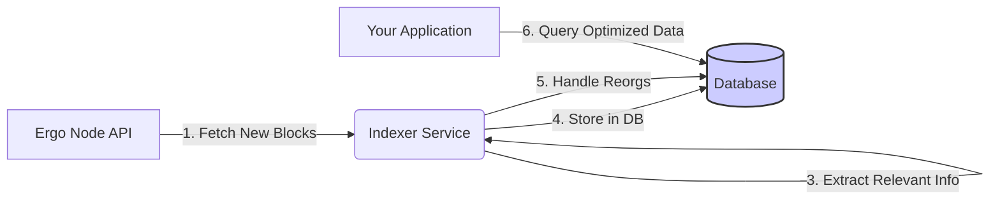

---
tags:
  - Indexing
  - Custom Indexer
  - SDK
  - Fleet SDK
  - Sigma-Rust
  - Appkit
  - Database
  - Off-Chain
  - Ergowatch
  - Scanner
  - Chain Grabber
  - RocksDB
  - PostgreSQL
---

# Indexing Strategy: Building a Custom Indexer

For many production dApps and services on Ergo, building a custom off-chain indexer provides the optimal balance of performance, query flexibility, and control over data. While this approach offers the most power, it also involves the most complexity. However, **leveraging existing tools and frameworks can significantly simplify the process.**

## Concept

A custom indexer is a dedicated service that connects to an Ergo node API, processes blockchain data, and stores relevant information in an optimized database for application queries.

**Core Tasks:**

1.  **Connect:** Establish a connection to a trusted Ergo node API ([your own](./node-api-direct.md) or a reliable public one).
2.  **Fetch:** Retrieve new blocks as they appear on the chain.
3.  **Parse:** Decode block, transaction, and box data.
4.  **Extract:** Identify and pull out data relevant to your application (e.g., boxes matching specific scripts, token transfers, register values).
5.  **Store:** Transform and save the extracted data into your chosen database (e.g., PostgreSQL, RocksDB, MongoDB).
6.  **Handle Reorgs:** Detect blockchain reorganizations and update the database accordingly to maintain consistency.

Your application then queries this custom database, benefiting from optimized performance and data structures.

## Leveraging Existing Tools & Frameworks ("Quick Start")

Building an indexer from scratch involves solving several complex problems (like efficient block fetching and robust reorg handling). Before starting from zero, consider adapting existing open-source tools:

*   **Ergo Blockchain Scanner (`ergoplatform/scanner`):**
    *   **Repository:** [github.com/ergoplatform/scanner](https://github.com/ergoplatform/scanner)
    *   **Description:** A foundational project maintained by the Ergo Platform team, designed specifically for scanning the blockchain for boxes matching certain criteria. It handles node communication and reorgs, providing a solid base upon which to build your custom data extraction and storage logic. Adapting this can be significantly faster than implementing the core scanning and reorg logic yourself.
*   **Explorer Chain-Grabber (`ergoplatform/explorer-backend`):**
    *   **Repository:** [github.com/ergoplatform/explorer-backend/tree/master/modules/chain-grabber](https://github.com/ergoplatform/explorer-backend/tree/master/modules/chain-grabber)
    *   **Description:** The module used by the official Ergo Explorer to fetch and initially process chain data. While potentially more complex to adapt than the dedicated scanner, it contains battle-tested logic for interacting with the node and handling chain events.
*   **Forking Existing Indexers:** Explore open-source indexers like [ErgoWatch](#ergowatch) or [Pragmaxim's Chain Indexer](#pragmaxims-chain-indexer) (see below). Forking and modifying them to suit your specific data needs can be a viable strategy.

**Key Takeaway:** Don't reinvent the wheel for core functionalities like block fetching and reorg handling if existing, well-maintained tools can provide a foundation.

## Tools & SDKs for Custom Logic

Even when using a framework, you'll likely use SDKs for parsing specific data or implementing custom extraction logic:

*   **[Sigma-Rust](sigma-rust.md):** (Rust) Ideal for high-performance parsing and data manipulation within your indexer logic.
*   **[Fleet SDK (JS/TS)](fleet.md):** (Node.js) Useful if building the indexer service in JavaScript/TypeScript, particularly for interacting with node APIs and deserializing data.
*   **[Appkit (Scala)](appkit.md):** (JVM) Suitable for JVM-based indexers, allowing interaction with node APIs and data processing.

## Database Choices

The choice of database impacts performance, query capabilities, and storage requirements:

*   **PostgreSQL:**
    *   **Pros:** Mature, robust relational database. Excellent for complex SQL queries, joins, and structured data. Supports JSONB for semi-structured data.
    *   **Cons:** Can require more careful schema design; potentially higher storage overhead for very simple key-value lookups compared to NoSQL options.
    *   **Used By:** ErgoWatch.
*   **RocksDB:**
    *   **Pros:** High-performance key-value store optimized for fast reads and writes, especially on SSDs. Efficient storage. Suitable for storing raw blockchain data or simple indexed lookups.
    *   **Cons:** Less suited for complex relational queries compared to SQL databases. Often used as an embedded database within the indexer process itself.
    *   **Used By:** Pragmaxim's Chain Indexer, Ergo Node (for UTXO state).
*   **MongoDB:**
    *   **Pros:** Flexible document-oriented database (NoSQL). Good for evolving schemas and storing nested JSON-like data. Scales horizontally well.
    *   **Cons:** Less suited for complex relational joins; transaction support can be different from SQL databases.

Choose the database that best matches your indexer's data structure and query patterns.

## Key Challenges & Considerations

*   **Initial Sync:** Indexing the entire blockchain history can take a very long time. Strategies include:
    *   Starting indexing from a specific recent height if historical data isn't needed.
    *   Using database snapshots or pre-synced data dumps if available.
    *   Designing the indexer for parallel processing if possible.
*   **Reorg Handling:** This is critical for data consistency. The indexer must detect when blocks are invalidated and roll back the corresponding data changes in the database. Using frameworks like `ergoplatform/scanner` often simplifies this significantly.
*   **Selective Indexing:** Indexing *everything* can lead to massive storage requirements. Carefully define *only* the data points your application truly needs to query (e.g., only boxes matching specific script templates, only certain register values, only specific token IDs).
*   **Infrastructure:** Running the indexer service, the database, and potentially your own Ergo node requires server resources and maintenance.

## Existing Solutions & Examples

### ErgoWatch
*   **Repository:** [github.com/abchrisxyz/ergowatch](https://github.com/abchrisxyz/ergowatch)
*   **Description:** Open-source Rust indexer using `sigma-rust` and PostgreSQL. Good reference for custom indexing patterns.

### Pragmaxim's Chain Indexer
*   **Repository:** [github.com/pragmaxim-com/chain-indexer/tree/ergo-boxes](https://github.com/pragmaxim-com/chain-indexer/tree/ergo-boxes)
*   **Description:** An emerging, high-performance Rust-based indexer using RocksDB, known for speed even on low-power devices like Raspberry Pis. Demonstrates an alternative database approach.

### Explorer Backends
*   Source code for public explorers (e.g., `ergoplatform/explorer-backend`) contains complex indexing logic.

### SigmaSpace
*   The [SigmaSpace.io](https://sigmaspace.io/) explorer project has developed its own indexing services, potentially with optimizations worth investigating if their code is available or described elsewhere.

## Alternative: Node API Scanning

For simpler, non-historical use cases, the Ergo Node API offers `/scan` endpoints. These allow you to register criteria (e.g., script templates) and have the node notify you or track boxes matching those criteria *going forward*.

*   **Pros:** Much simpler than building a full indexer; less infrastructure needed.
*   **Cons:** **Not historical.** Scans only find boxes created *after* the scan is registered. Cannot be used to find past transactions or boxes. Limited query flexibility compared to a custom database.
*   **When to Use:** Monitoring for specific *new* boxes or events in real-time, simple notification systems.

## Conclusion

Building a custom indexer offers the most power and flexibility for complex dApps. However, developers should strongly consider **leveraging existing frameworks like `ergoplatform/scanner` or adapting open-source indexers** to avoid rebuilding complex core logic like reorg handling. Choose your tools, SDKs, and database carefully based on your specific needs and performance requirements.
