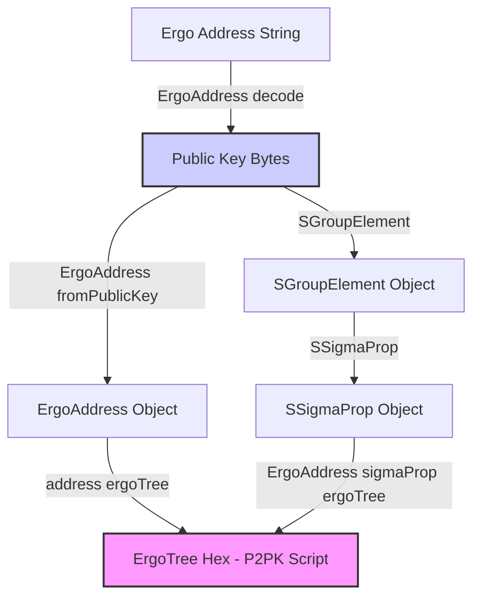

---
tags:
  - fleet-sdk
  - typescript
  - javascript
  - sigmaprop
  - ergotree
  - registers
  - p2pk
  - validation
  - tutorial
  - serialization
  - deserialization
  - token-id
  - numeric-registers
  - compiler
  - troubleshooting
---

# Fleet SDK Recipes

This page contains useful code snippets, patterns, and troubleshooting tips for common tasks when using the [Fleet SDK](fleet.md) in TypeScript/JavaScript.

## Table of Contents
- [Fleet SDK Recipes](#fleet-sdk-recipes)
  - [Table of Contents](#table-of-contents)
  - [Validating Box Ownership (SigmaProp from Register)](#validating-box-ownership-sigmaprop-from-register)
    - [Complete Example:](#complete-example)
  - [Working with Numeric Registers](#working-with-numeric-registers)
  - [Extracting Token IDs from Registers](#extracting-token-ids-from-registers)
  - [Decoding Complex Types (Tuples, Options, Collections)](#decoding-complex-types-tuples-options-collections)
  - [Compiling ErgoScript to ErgoTree](#compiling-ergoscript-to-ergotree)
  - [Troubleshooting Common Issues](#troubleshooting-common-issues)
    - [1. ErgoTree Comparison Failures](#1-ergotree-comparison-failures)
    - [2. Unexpected Register Format](#2-unexpected-register-format)
  - [Relationship Diagram](#relationship-diagram)
  - [Related Documentation](#related-documentation)

---

## Validating Box Ownership (SigmaProp from Register)

A common requirement when building off-chain logic is to validate conditions that mirror on-chain checks. One such check is verifying that an input box belongs to a specific owner whose public key (as a [SigmaProp](../scs/sigma.md)) is stored in another box's [register](../scs/boxes-and-registers.md). This is often needed for refund scenarios or proving ownership before allowing an action.

The core task involves:

1. Extracting the owner's SigmaProp bytes from a register (e.g., R4).
2. Deserializing these bytes correctly.
3. Converting the public key bytes into the owner's P2PK [ErgoTree](../scs/ergotree.md).
4. Comparing this derived ErgoTree with the ErgoTree of the box being validated.

**Important:** Directly constructing `ErgoAddress` from `SSigmaProp` is not the correct approach in Fleet SDK. You need to extract the public key bytes first.

### Complete Example:

```typescript
import { 
  Box, 
  ErgoAddress, 
  SByte, // Note: SByte might not be directly needed for deserialization logic
  SColl, 
  SGroupElement, 
  SSigmaProp 
} from "@fleet-sdk/core";
import { deserialize } from "@fleet-sdk/serializer"; // Fleet's serializer is key

/**
 * Validates if a box belongs to the owner specified in another box's register R4.
 * Assumes R4 contains a serialized SigmaProp representing the owner's public key.
 * @param boxToValidate The box whose ownership we want to verify.
 * @param boxWithOwnerInfo Box containing owner's SigmaProp in R4.
 * @returns boolean indicating if ownership is valid.
 */
function validateBoxOwnership(boxToValidate: Box, boxWithOwnerInfo: Box): boolean {
  try {
    // 1. Extract SigmaProp bytes from register R4
    const registerValueHex = boxWithOwnerInfo.additionalRegisters.R4;
    if (!registerValueHex) {
      console.error("Register R4 is empty or not present.");
      return false;
    }
    
    // 2. Deserialize the register value (hex string)
    // The register often contains a serialized SigmaProp, typically starting with '07' (SColl(SByte)) or 'cd' (SSigmaProp)
    const deserializedValue = deserialize(registerValueHex);
    
    // 3. Extract the raw public key bytes based on common serialization formats
    let publicKeyBytes: Uint8Array;
    
    if (deserializedValue.type === "SColl" && deserializedValue.elemType === "SByte") {
      // Format: SColl(SByte) - a simple collection of bytes
      publicKeyBytes = new Uint8Array(deserializedValue.value);
    } else if (deserializedValue.type === "SSigmaProp") {
      // Format: SSigmaProp(SGroupElement(bytes))
      if (deserializedValue.value?.type === "SGroupElement") {
        publicKeyBytes = new Uint8Array(deserializedValue.value.value);
      } else {
        throw new Error(`Unsupported SigmaProp inner type: ${deserializedValue.value?.type}`);
      }
    } else {
      throw new Error(`Unsupported register format type: ${deserializedValue.type}`);
    }

    // Ensure we got valid public key bytes (typically 33 bytes for compressed keys)
    if (!publicKeyBytes || publicKeyBytes.length !== 33) {
        throw new Error(`Extracted public key bytes are invalid (length ${publicKeyBytes?.length})`);
    }
    
    // 4. Create the ErgoAddress from the public key bytes
    const ownerAddress = ErgoAddress.fromPublicKey(publicKeyBytes);
    
    // 5. Get the ErgoTree (P2PK script) from the derived address
    const ownerErgoTree = ownerAddress.ergoTree;
    
    // 6. Compare the derived ErgoTree with the ErgoTree of the box to validate
    return boxToValidate.ergoTree === ownerErgoTree;
    
  } catch (error) {
    console.error("Error validating box ownership:", error);
    return false;
  }
}

// --- Usage Example ---
/* 
// Assume 'clientBox' is the box we need to validate
// Assume 'sessionBox' holds the owner's SigmaProp in R4
const clientBox: Box = { ... }; // Populate with actual box data
const sessionBox: Box = { ... }; // Populate with actual box data

const isOwnerValid = validateBoxOwnership(clientBox, sessionBox);
console.log("Box ownership validation result:", isOwnerValid); 
*/
```

---

## Working with Numeric Registers

Contracts often store numeric values like deadlines (timestamps), counts, or amounts in registers. These are typically stored as `SInt` or `SLong`.

```typescript
import { Box, SLong, SInt } from "@fleet-sdk/core"; // SInt might be needed depending on contract
import { deserialize } from "@fleet-sdk/serializer";

/**
 * Extracts a numeric value (BigInt) from a specified register.
 * Handles SLong and SInt types.
 * @param box The box containing the register.
 * @param register The register name (R4-R9).
 * @returns The numeric value as BigInt, or null if not found/not a supported number type.
 */
function getNumericFromRegister(box: Box, register: "R4" | "R5" | "R6" | "R7" | "R8" | "R9"): bigint | null {
  try {
    const registerValueHex = box.additionalRegisters[register];
    if (!registerValueHex) {
        // console.warn(`Register ${register} not found in box ${box.boxId}`);
        return null;
    }
    
    const deserialized = deserialize(registerValueHex);
    
    // Handle different numeric types
    if (deserialized.type === "SLong") {
      // SLong stores value as string, convert to BigInt
      return BigInt(deserialized.value); 
    } else if (deserialized.type === "SInt") {
      // SInt stores value as number, convert to BigInt
      return BigInt(deserialized.value); 
    } else {
      // console.warn(`Register ${register} has non-numeric type: ${deserialized.type}`);
      return null;
    }
    
  } catch (error) {
    console.error(`Error extracting numeric value from ${register} in box ${box.boxId}:`, error);
    return null;
  }
}

// --- Usage Example ---
/*
const contractBox: Box = { ... }; // Populate with actual box data
const deadlineTimestamp = getNumericFromRegister(contractBox, "R4");

if (deadlineTimestamp !== null) {
  if (BigInt(Date.now()) > deadlineTimestamp) {
    console.log("Deadline has passed!");
  } else {
    console.log("Deadline is still in the future.");
  }
} else {
  console.log("Could not read deadline from R4.");
}
*/
```

---

## Extracting Token IDs from Registers

Token IDs are frequently stored in registers, usually as a collection of bytes (`SColl(SByte)`).

```typescript
import { Box } from "@fleet-sdk/core";
import { deserialize } from "@fleet-sdk/serializer";
import { Buffer } from 'buffer'; // Use Buffer for hex conversion

/**
 * Extracts a token ID (hex string) from a register containing SColl(SByte).
 * @param box The box containing the register.
 * @param register The register name (R4-R9).
 * @returns The token ID as a hex string, or null if not found or not CollByte format.
 */
function getTokenIdFromRegister(box: Box, register: "R4" | "R5" | "R6" | "R7" | "R8" | "R9"): string | null {
  try {
    const registerValueHex = box.additionalRegisters[register];
    if (!registerValueHex) {
      // console.warn(`Register ${register} not found in box ${box.boxId}`);
      return null;
    }
    
    const deserialized = deserialize(registerValueHex);
    
    // Handle CollByte format (most common for token IDs / Box IDs / Tx IDs)
    if (deserialized.type === "SColl" && deserialized.elemType === "SByte") {
      // Convert byte array (deserialized.value) to hex string
      return Buffer.from(deserialized.value).toString('hex');
    } else {
      // console.warn(`Register ${register} is not in CollByte format: ${deserialized.type}`);
      return null;
    }
    
  } catch (error) {
    console.error(`Error extracting token ID from ${register} in box ${box.boxId}:`, error);
    return null;
  }
}

// --- Usage Example ---
/*
const contractBox: Box = { ... }; // Populate with actual box data
const requiredTokenId = getTokenIdFromRegister(contractBox, "R5");

if (requiredTokenId) {
  console.log(`Contract requires token ID: ${requiredTokenId}`);
  // Now you can check if an input box contains this token
} else {
  console.log("Could not read required token ID from R5.");
}
*/
```

---

## Decoding Complex Types (Tuples, Options, Collections)

Contracts might store more complex data structures in registers, such as tuples `(TypeA, TypeB)`, optional values `Option[TypeA]`, or collections `Coll[TypeA]`. Fleet's `deserialize` function handles these, returning a nested object structure that mirrors the on-chain type. You need to inspect this structure to extract the individual components.

**General Approach:**

1.  Call `deserialize(registerValueHex)`.
2.  Check the `type` property of the result (e.g., `"STuple"`, `"SColl"`, `"SOption"`).
3.  Access the `value` property.
    *   For `STuple` and `SColl`, `value` is typically an array. Iterate through it, inspecting the `type` and `value` of each element.
    *   For `SOption`, `value` is either `null` (representing `None`) or an object representing the `Some(value)` content. Check if `value` is `null` before accessing its properties.
4.  Recursively apply this process for nested structures.

---
**Example 1: Decoding a Tuple `(SigmaProp, Long)` from R5**

Assume R5 contains a serialized tuple where the first element is a `SigmaProp` (owner's public key) and the second is a `Long` (deadline).

```typescript
import { Box } from "@fleet-sdk/core";
import { deserialize } from "@fleet-sdk/serializer";
import { Buffer } from 'buffer'; 

/**
 * Extracts data from a register assumed to contain a serialized (SigmaProp, Long) tuple.
 * @param box The box containing the register.
 * @param register The register name (R4-R9).
 * @returns An object { ownerPubKeyHex: string, deadline: bigint } or null if format is wrong.
 */
function decodeSigmaPropLongTuple(box: Box, register: "R4" | "R5" | "R6" | "R7" | "R8" | "R9"): { ownerPubKeyHex: string; deadline: bigint } | null {
  try {
    const registerValueHex = box.additionalRegisters[register];
    if (!registerValueHex) return null;

    const deserialized = deserialize(registerValueHex);

    // Expecting STuple with two items
    if (deserialized.type !== "STuple" || !Array.isArray(deserialized.value) || deserialized.value.length !== 2) {
      console.warn(`Register ${register} is not the expected STuple format.`);
      return null;
    }

    const [item1, item2] = deserialized.value;

    // Extract SigmaProp (assuming SSigmaProp(SGroupElement(bytes)))
    let ownerPubKeyBytes: Uint8Array | null = null;
    if (item1?.type === "SSigmaProp" && item1.value?.type === "SGroupElement" && item1.value.value) {
       ownerPubKeyBytes = new Uint8Array(item1.value.value);
    } else {
       console.warn(`First tuple item in ${register} is not the expected SSigmaProp(SGroupElement(...)) format.`);
       return null;
    }
    
    if (!ownerPubKeyBytes || ownerPubKeyBytes.length !== 33) {
        console.warn(`Extracted public key bytes from tuple in ${register} are invalid.`);
        return null;
    }
    const ownerPubKeyHex = Buffer.from(ownerPubKeyBytes).toString('hex');


    // Extract Long
    let deadline: bigint | null = null;
    if (item2?.type === "SLong" && typeof item2.value === 'string') {
        deadline = BigInt(item2.value);
    } else {
        console.warn(`Second tuple item in ${register} is not the expected SLong format.`);
        return null;
    }

    return { ownerPubKeyHex, deadline };

  } catch (error) {
    console.error(`Error decoding tuple from ${register} in box ${box.boxId}:`, error);
    return null;
  }
}

// --- Usage Example ---
/*
const contractBox: Box = { ... }; // Populate with actual box data
const tupleData = decodeSigmaPropLongTuple(contractBox, "R5");

if (tupleData) {
  console.log(`Owner PubKey Hex: ${tupleData.ownerPubKeyHex}`);
  console.log(`Deadline: ${tupleData.deadline}`);
  // You can now use ErgoAddress.fromPublicKey(Buffer.from(tupleData.ownerPubKeyHex, 'hex'))
} else {
  console.log("Could not decode (SigmaProp, Long) tuple from R5.");
}
*/
```

---
**Example 2: Decoding an `Option[Int]` from R6**

Assume R6 might contain an optional integer value.

```typescript
import { Box } from "@fleet-sdk/core";
import { deserialize } from "@fleet-sdk/serializer";

/**
 * Extracts an optional integer value from a register assumed to contain Option[Int].
 * @param box The box containing the register.
 * @param register The register name (R4-R9).
 * @returns The integer value if Some(Int), or null if None or wrong format.
 */
function decodeOptionInt(box: Box, register: "R4" | "R5" | "R6" | "R7" | "R8" | "R9"): number | null {
  try {
    const registerValueHex = box.additionalRegisters[register];
    if (!registerValueHex) return null;

    const deserialized = deserialize(registerValueHex);

    // Expecting SOption
    if (deserialized.type !== "SOption") {
      console.warn(`Register ${register} is not the expected SOption format.`);
      return null;
    }

    // Check if value is null (representing None)
    if (deserialized.value === null) {
      return null; // It's None
    }

    // If not null, it should be Some(value). Check the inner type.
    const innerValue = deserialized.value;
    if (innerValue?.type === "SInt" && typeof innerValue.value === 'number') {
      return innerValue.value;
    } else {
      console.warn(`Inner value of Option in ${register} is not the expected SInt format.`);
      return null;
    }

  } catch (error) {
    console.error(`Error decoding Option[Int] from ${register} in box ${box.boxId}:`, error);
    return null;
  }
}

// --- Usage Example ---
/*
const contractBox: Box = { ... }; // Populate with actual box data
const optionalValue = decodeOptionInt(contractBox, "R6");

if (optionalValue !== null) {
  console.log(`R6 contains the value: ${optionalValue}`);
} else {
  console.log("R6 is empty (None) or has an unexpected format.");
}
*/
```

---
**Example 3: Decoding a `Coll[Int]` from R7**

Assume R7 contains a collection (array) of integers.

```typescript
import { Box } from "@fleet-sdk/core";
import { deserialize } from "@fleet-sdk/serializer";

/**
 * Extracts an array of integers from a register assumed to contain Coll[Int].
 * @param box The box containing the register.
 * @param register The register name (R4-R9).
 * @returns An array of numbers, or null if wrong format.
 */
function decodeCollInt(box: Box, register: "R4" | "R5" | "R6" | "R7" | "R8" | "R9"): number[] | null {
  try {
    const registerValueHex = box.additionalRegisters[register];
    if (!registerValueHex) return null;

    const deserialized = deserialize(registerValueHex);

    // Expecting SColl with SInt elements
    if (deserialized.type !== "SColl" || deserialized.elemType !== "SInt" || !Array.isArray(deserialized.value)) {
      console.warn(`Register ${register} is not the expected SColl[SInt] format.`);
      return null;
    }

    // The value is already an array of numbers for SColl[SInt]
    return deserialized.value as number[];

  } catch (error) {
    console.error(`Error decoding Coll[Int] from ${register} in box ${box.boxId}:`, error);
    return null;
  }
}

// --- Usage Example ---
/*
const contractBox: Box = { ... }; // Populate with actual box data
const integerArray = decodeCollInt(contractBox, "R7");

if (integerArray) {
  console.log(`R7 contains integers: ${integerArray.join(", ")}`);
  // integerArray.forEach(num => console.log(num));
} else {
  console.log("Could not decode Coll[Int] from R7.");
}
*/
```

---
**Note on `SigmaProp` and `Coll[Byte]`:**

*   Decoding a `SigmaProp` (typically to get the underlying public key bytes) is shown in the [Validating Box Ownership](#validating-box-ownership-sigmaprop-from-register) example.
*   Decoding a simple `Coll[Byte]` (often used for Token IDs, Box IDs, Tx IDs, or sometimes raw public keys) is shown in the [Extracting Token IDs](#extracting-token-ids-from-registers) example.

---

## Compiling ErgoScript to ErgoTree

The Fleet SDK includes a compiler module to convert [ErgoScript](../scs/ergoscript.md) source code into its corresponding ErgoTree hex string, which is needed when creating contract boxes.

```typescript
import { compile } from "@fleet-sdk/compiler";

/**
 * Compiles an ErgoScript string to its ErgoTree hex representation.
 * @param script The ErgoScript source code.
 * @returns Promise resolving to the compiled ErgoTree hex string.
 * @throws Error if compilation fails.
 */
async function compileToErgoTree(script: string): Promise<string> {
  try {
    // The compile function returns an object with address, ergoTree, template, etc.
    const result = await compile(script); 
    if (!result || !result.ergoTree) {
        throw new Error("Compilation result did not contain ErgoTree.");
    }
    return result.ergoTree;
  } catch (error) {
    console.error("ErgoScript Compilation Error:", error);
    // Rethrow or handle as needed
    throw error; 
  }
}

// --- Usage Example ---
const timedContractScript = `{
  // Contract allows spending only after a certain height (deadline)
  val deadline = SELF.R4[Long].getOrElse(0L) // Get deadline from R4, default 0
  sigmaProp(HEIGHT >= deadline) // Proposition is true if current height >= deadline
}`;

async function exampleCompilation() {
  try {
    const compiledTree = await compileToErgoTree(timedContractScript);
    console.log("Compiled ErgoTree:", compiledTree);
    // Use this compiledTree when building an output box
  } catch (error) {
    console.error("Failed to compile contract script.");
  }
}

// exampleCompilation(); // Uncomment to run
```

---

## Troubleshooting Common Issues

Working with registers and ErgoTrees off-chain can sometimes lead to unexpected issues. Here are some common problems and how to approach them:

### 1. ErgoTree Comparison Failures

**Problem:** You've derived an ErgoTree from a register's SigmaProp, but it doesn't match the `ergoTree` property of the box you expect it to match, even though you believe they represent the same P2PK address.

**Possible Causes & Solutions:**

*   **Serialization Mismatch:** The most likely cause is that the `deserialize` function didn't correctly interpret the register data into the raw public key bytes needed by `ErgoAddress.fromPublicKey`. Double-check how the SigmaProp was serialized *into* the register on-chain. Common formats include `SColl(SByte)` containing the 33 public key bytes, or `SSigmaProp(SGroupElement(...))` containing the same bytes nested deeper. Use `detectRegisterFormat` below or inspect the raw hex.
*   **Incorrect Prefix:** ErgoTrees can have different hexadecimal prefixes depending on their structure (e.g., `00` for basic P2PK, `0e` for hashes, etc.). Ensure you are comparing apples to apples. If one tree starts with `0008cd` (standard P2PK) and the other doesn't, they represent different script types.
*   **Address Type Mismatch:** Are you sure the register contains a standard P2PK SigmaProp? If the contract uses a more complex script (P2S), deriving the ErgoTree from just a public key won't work. You'd need to compile the corresponding ErgoScript.

```typescript
function troubleshootErgoTreeComparison(ergoTree1: string, ergoTree2: string): string {
  if (ergoTree1 === ergoTree2) return "Exact Match: Trees are identical.";
  
  // Check for common P2PK prefix (00 + ProveDlog op code + cd)
  const p2pkPrefix = "0008cd";
  const tree1IsP2PK = ergoTree1.startsWith(p2pkPrefix);
  const tree2IsP2PK = ergoTree2.startsWith(p2pkPrefix);

  if (tree1IsP2PK && tree2IsP2PK) {
    // Both seem P2PK, but don't match. Check lengths.
     if (ergoTree1.length !== ergoTree2.length) {
         return "Mismatch: Both seem P2PK but have different lengths. Possible data corruption or different public keys.";
     }
     // If lengths match, the public keys themselves must be different.
     return "Mismatch: Both seem P2PK with same length, but represent different public keys.";
  } else if (tree1IsP2PK !== tree2IsP2PK) {
    return `Mismatch: One tree appears P2PK (${p2pkPrefix} prefix), the other does not. Comparing different script types?`;
  } else {
    // Neither starts with P2PK prefix, could be complex scripts or other data
     if (ergoTree1.length !== ergoTree2.length) {
         return "Mismatch: Neither seems standard P2PK, and lengths differ.";
     }
     return "Mismatch: Neither seems standard P2PK, but lengths match. Comparing complex scripts?";
  }
}
```

### 2. Unexpected Register Format

**Problem:** You try to deserialize a register value, but the resulting type (`deserialized.type`) is not what you expected (e.g., you expected `SLong` but got `SColl(SByte)`).

**Solution:** Inspect the raw register value (hex string) and use a helper function to guess the format, or consult the contract source code to understand what type *should* be stored.

```typescript
function detectRegisterFormat(registerHex: string): string {
  if (!registerHex || registerHex.length < 2) return "Invalid or empty register value";

  const prefix = registerHex.substring(0, 2);
  const lengthByte = parseInt(registerHex.substring(2, 4), 16); // For CollByte length

  if (prefix === "0e") { // SConstant placeholder + length byte
      if (registerHex.length === 68) return "Likely a Blake2b256 hash (0e + 20 + 32 bytes)";
      return `Likely some hash or ID prefixed with 0e, length byte ${lengthByte}`;
  } else if (prefix === "00") {
      if (registerHex.startsWith("0008cd")) return "Likely a P2PK ErgoTree";
      return "Starts with 00, possibly complex ErgoTree or other structure.";
  } else if (prefix === "04") { // SInt
      return "Likely an SInt (Integer)";
  } else if (prefix === "05") { // SLong
      return "Likely an SLong (Long Integer / BigInt)";
  } else if (prefix === "07") { // SColl(SByte)
      return `Likely a CollByte (serialized byte array), length byte indicates ${lengthByte} bytes follow`;
  } else if (prefix === "cd") { // SSigmaProp direct serialization (less common in registers)
      return "Likely a raw SSigmaProp (without 00 ErgoTree wrapper)";
  } else {
      // Add more checks for other SType prefixes if needed (e.g., 01 for SBoolean, etc.)
      // See: https://github.com/ScorexFoundation/sigmastate-interpreter/blob/develop/sigmastate/src/main/scala/sigmastate/serialization/TypeSerializer.scala
      return `Unknown format starting with prefix ${prefix}`;
  }
}

// --- Usage Example ---
/*
const r4Value = contractBox.additionalRegisters.R4;
if (r4Value) {
    console.log(`R4 Format Guess: ${detectRegisterFormat(r4Value)}`);
}
*/
```

---

## Relationship Diagram
<!--
*(Placeholder for a visual diagram illustrating how ErgoAddress, Public Key (GroupElement), SigmaProp, and ErgoTree (P2PK Script) relate to each other)*
-->



*This diagram shows the typical conversion paths for P2PK addresses.*

---

## Related Documentation
- [ErgoScript Sigma Propositions](../scs/sigma.md)
- [Box Registers Specification](../scs/boxes-and-registers.md)
- [ErgoTree Specification](../scs/ergotree.md)
- [Fleet SDK GitHub Examples](https://github.com/fleet-sdk/fleet-by-example)
- [Fleet SDK Compiler](https://fleet-sdk.github.io/docs/compiler)
- [Fleet SDK Serializer](https://fleet-sdk.github.io/docs/serializer-overview)
