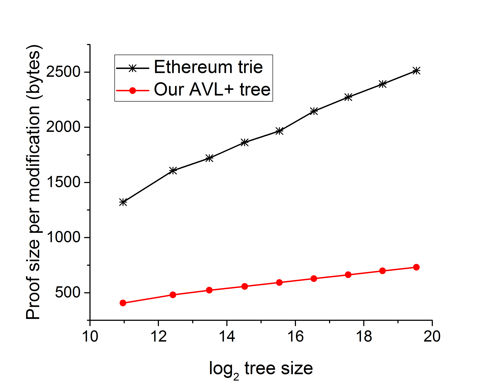
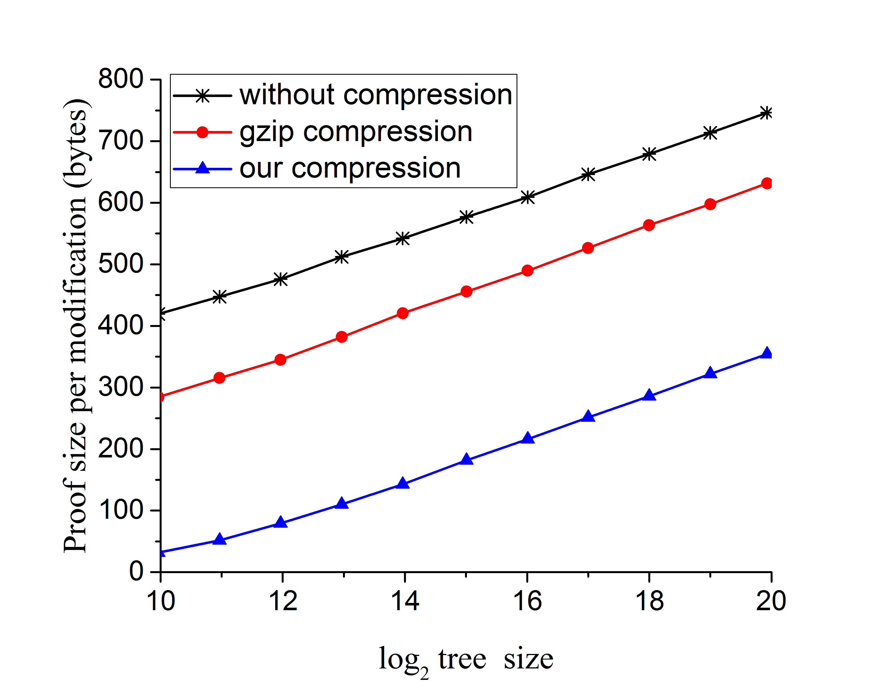
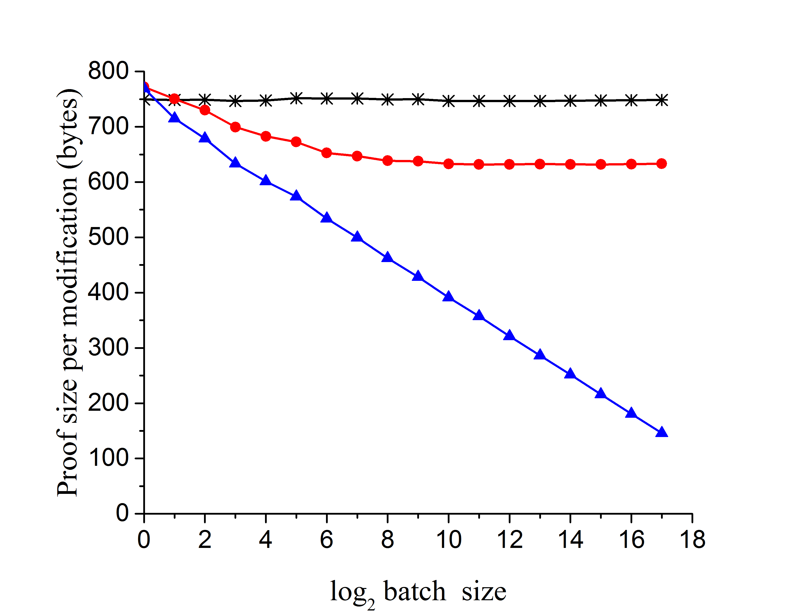
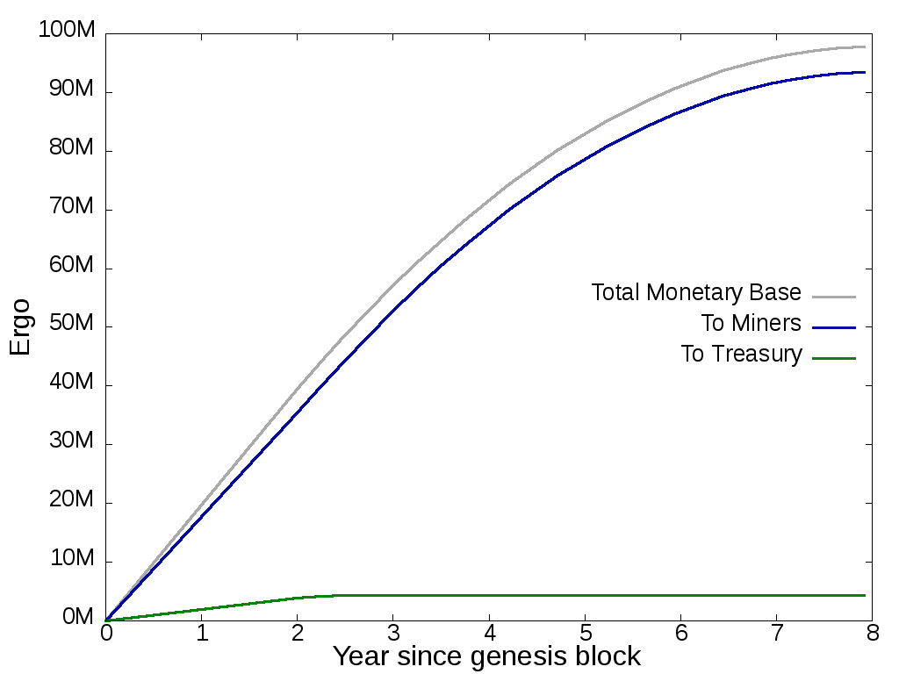

---
tags:
  - Ergo
  - Blockchain
  - Cryptography
  - Whitepaper
  - Contractual Money
---

$$
\newcommand{\knote}[1]{{\textcolor{green}{Alex notes:{#1}}}}
\newcommand{\dnote}[1]{{\textcolor{red}{DNotes:{#1}}}}
\newcommand{\snote}[1]{{\textcolor{blue}{SNotes:{#1}}}}
\newcommand{\Ergo}{Ergo}
\newcommand{\Erg}{Erg}
\newcommand{\nanoErg}{nanoErg}
\def\Let#1#2{\State #1 $:=$ #2}
\def\LetRnd#1#2{\State #1 $\gets$ #2}
$$

# Ergo: A Resilient Platform For Contractual Money

**Authors:** Ergo Developers  
**Date:** May 14, 2019  
**Version:** v1.0

## Abstract

We present Ergo, a new flexible blockchain protocol.
Ergo is designed for developing decentralized applications with the main focus of providing an efficient, secure and easy way to implement financial contracts.

To achieve this goal, Ergo includes various technical and economic improvements to existing blockchain solutions. Every coin in Ergo is protected by a program in ErgoScript, which is a powerful and protocol-friendly scripting language based on $\Sigma$-protocols. Using ErgoScript, we can encode the conditions under which coins may be used: who can spend them, when, under what external conditions, to whom, and so on.

Extended support for light nodes makes Ergo friendly for end users because it allows running contracts on untrusted commodity hardware. To be usable in the long-term, Ergo follows a survivability approach -- it uses widely-researched solutions that don't result in security issues in the future, while also preventing performance degradation over time with a new economic model. Finally, Ergo has a self-amendable protocol that allows it to absorb new ideas and improve itself in the future.

## Introduction

Beginning more than ten years ago with Bitcoin[@nakamoto2008bitcoin], blockchain technology has so far proved to be a secure way of maintaining a public transaction ledger and disintermediating trusted third parties such as traditional financial institutions to some degree. Even after achieving a market capitalization over $300bn in $2017$[@btcPrice], no severe attacks were performed on the Bitcoin network despite the high potential yield. This resilience of cryptocurrencies and the financial empowerment and self-sovereignty they promise to bring is achieved by a combination of modern cryptographic algorithms and decentralized architecture.

However, this resilience comes at a cost and has not yet been proven for existing systems in the long-run at economy-wide scale. To use a blockchain without any trust, its participants should check each other by downloading and processing all the transactions in the network, utilizing network resources. Besides network utilization, transaction processing also utilizes computational resources, especially if the transactional language is sufficiently flexible. Finally, blockchain participants have to keep a significant amount of data in their local storages and the storage requirements are growing fast. Of this, certain data must be maintained in memory. Thus, transaction processing utilizes various resources of hundreds of thousands of computers all over the world and consumption of these resources is paid for by regular users in the form of transaction fees[@chepurnoy2018systematic]. Despite the generous block reward subsidy in some existing systems, their fees can still be very high at times[@bitcoinFees]. Due to this, even after being around for more than ten years, blockchain technology is still primarily being used in financial applications, where the advantage of high security outweighs the disadvantage of high transaction costs.

Besides the vanilla currency example, the other use of blockchains is to build decentralized applications. Such applications utilize the ability of the underlying platform to write smart contracts[@szabo1994smart] implementing their logic by means of a blockchain-specific programming language. One way to classify blockchains in terms of their ability to write smart contracts is based on if they are UTXO-based (e.g., Bitcoin) or account-based (e.g., Ethereum)[@zahnentferner2018chimeric].

Account-based cryptocurrencies, such as Ethereum, introduce special contract accounts controlled by code, that may be invoked by incoming transactions. Although this approach allows performing arbitrary computation, the implementation of complex spending conditions can lead to bugs such as the one in an Ethereum's "simple" multi-signature contract that caused a loss of $150 million in 2017[@parityLock]. In UTXO-based cryptocurrencies, every coin has a script associated with it, and to spend that coin, one must satisfy the conditions given in the script. Implementing such protecting conditions is much easier with the UTXO model but doing arbitrary Turing-complete computation is quite complex[@chepurnoy2018self]. However, most financial contracts do not require Turing-completeness[@jansenDo]. Ergo is based on the UTXO model and provides a convenient way to implement financial applications covering an overwhelming majority of public blockchain use-cases.

While the contractual component is important for building decentralized applications, it is also essential that the blockchain survives in the long-term. Application-oriented blockchain platforms have existed only for a few years and the whole area is quite young. Since such platforms have already encountered problems with performance degradation over time[@ethSlow1, ethSlow2], their long-term survivability is questionable. Even older UTXO-based money-oriented blockchains have not been proven to be fully resilient in the long-run under changing conditions because we only have about $10$ years of blockchain history up to this point. Solutions for long-term survivability include concepts such as light nodes with minimal storage requirements[@reyzin2017improving], storage-rent fee component to prevent bloating of full-nodes[@chepurnoy2018systematic], and self-amendable protocols that can adapt to the changing environment and improve themselves without trusted parties[@goodman2014tezos]. What is needed is a combination of various scientific ideas together to fix these problems, while also providing a way for further improvements without any breaking changes and this is exactly what Ergo seeks to accomplish.

## Ergo Vision

The $Ergo$ protocol is very flexible and may be changed in the future by the community. In this section, we define the main principles that should be followed in $Ergo$ which might be referred to as "Ergo's Social Contract." In case of intentional violation of any of these principles, the resulting protocol should not be called $Ergo$.

- **Decentralization First.** $Ergo$ should be as decentralized as possible: any parties (social leaders, software developers, hardware manufacturers, miners, funds and so on) whose absence or malicious behavior may affect the security of the network should be avoided. If any of these parties do appear during $Ergo$'s lifetime, the community should consider ways to decrease their impact level.
- **Created for Regular People.** $Ergo$ is a platform for ordinary people, and their interests should not be infringed upon in favor of big parties. In particular, this means that centralization of mining should be prevented and regular people should be able to participate in the protocol by running a full node and mining blocks (albeit with a small probability).
- **Platform for Contractual Money.** $Ergo$ is the base layer to applications that will be built on top of it. It is suitable for several applications but its main focus is to provide an efficient, secure and easy way to implement financial contracts.
- **Long-term Focus.** All aspects of $Ergo$ development should be focused on a long term perspective. At any point of time, $Ergo$ should be able to survive for centuries without expected hard forks, software or hardware improvements or some other unpredictable changes. Since $Ergo$ is designed as a platform, applications built on top of $Ergo$ should also be able to survive in the long term. This resiliency and long term survivability may also enable $Ergo$ to be a good store of value.
- **Permissionless and Open.** $Ergo$ protocol does not restrict or limit any categories of usage. It should allow anyone to join the network and participate in the protocol without any preliminary actions. Unlike the traditional financial system, no bailouts, blacklists or other forms of discrimination should be possible on the core level of $Ergo$ protocol. On the other hand application developers are free to implement any logic they want, taking responsibility for the ethics and legality of their application.

## Autolykos Consensus Protocol

The core component of any blockchain system is its consensus protocol and Ergo utilizes a self-developed unique Proof of Work (PoW) consensus protocol called _Autolykos_, which is described below. Despite extensive research on possible alternatives, the original PoW protocol with the longest chain rule is still in demand due to its simplicity, high-security guarantees, and friendliness to light clients. However, a decade of extensive testing has revealed several problems with the original one-CPU-one-vote idea.

The first known problem of a PoW system is the development of specialized hardware (ASICs), which allows a small group of ASIC-equipped miners to solve PoW puzzles orders of magnitude faster and more efficiently than everyone else. This problem can be solved with the help of memory-hard PoW schemes that reduce the disparity between ASICs and commodity hardware. The most promising approach here is to use asymmetric memory-hard PoW schemes that require significantly less memory to verify a solution than to find it[@biryukov2017equihash,ethHash].

The second known threat to a PoW network decentralization is that even big miners tend to unite in mining pools, leading to a situation when just a few pool operators (5 in Bitcoin, 2 in Ethereum at the time of writing) control more than 51% of computational power. Although the problem has already been discussed in the community, no practical solutions have been implemented before _Ergo_.

Ergo's PoW protocol, Autolykos[@Ergopow], is the first consensus protocol that is both memory-hard and pool-resistant. Autolykos is based on the _one list $k$-sum problem_: a miner has to find $k=32$ elements from a pre-defined list $R$ of size $N=2^{26}$ (which has a size of 2 Gb), such that:

$$
\sum_{j \in J} r_{j} - sk = d \text{ in the interval } \{-b,\dots,0,\dots,b\mod q\}.
$$

Elements of list $R$ are obtained as a result of one-way computation from index $i$, two miner public keys $pk, w$ and hash of block header $m$ as:

$$
r_i = H(i||M||pk||m||w),
$$

where $H$ is a hash function which returns values in $\mathbb{Z}/q\mathbb{Z}$, and $M$ is a static big message used to make hash calculation slower. Also, a set of element indexes $J$ is to be obtained by a one-way pseudo-random function `genIndexes`, which prevents possible solution search optimizations.

Thus, we assume that the only option for a miner is to use the simple brute-force method given in the following algorithm to create a valid block.

### Algorithm: Block Mining

$$
\begin{aligned}
    &\textbf{Input:} \text{ upcoming block header hash } m, \text{ key pair } pk = g^{sk} \\
    &\text{Generate randomly a new key pair } w = g^x \\
    &r_{i \in [0,N)} = H(i||M||pk||m||w) \\
    &\textbf{While true:} \\
    &\quad \text{Let nonce } \gets \mathsf{rand} \\
    &\quad \text{Let } J \gets \text{genIndexes}(m||\text{nonce}) \\
    &\quad \text{Let } d = \sum_{j \in J} r_j \cdot x - sk \mod q \\
    &\quad \textbf{if } d < b: \\
    &\quad\quad \textbf{return } (m, pk, w, \text{nonce}, d)
\end{aligned}
$$

Note that although the mining process utilizes private keys, the solution itself only contains public keys. Solution verification is done by the following algorithm.

#### Algorithm: Solution Verification

$$
\begin{aligned}
    &\textbf{Input: } m, pk, w, \text{nonce}, d \\
    &\text{require } d < b \\
    &\text{require } pk, w \in \mathbb{G} \text{ and } pk, w \neq e \\
    &\text{Let } J \gets \text{genIndexes}(m||\text{nonce}) \\
    &\text{Let } f = \sum_{j \in J} H(j||M||pk||m||w) \\
    &\text{require } w^f = g^d \cdot pk
\end{aligned}
$$

This approach prevents mining pool formation because the secret key $sk$ is needed for mining: once any pool miner finds a correct solution, they can use this secret to steal the block reward. On the other hand, it is secure to reveal a single solution, as it only contains public keys and reveals a single linear relation between the two secrets $sk, w$.

Memory-hardness follows from the fact that the block mining algorithm requires keeping the whole list $R$ for the main loop execution. Every list element takes 32 bytes, so the whole list of $N$ elements takes $N \cdot 32 = 2 \text{ Gb}$ of memory for $N = 2^{26}$. A miner can try to reduce memory requirements by calculating these elements "on the fly" without keeping them in memory; however, they will need to calculate the same hash $H$ multiple times (about $10^4$ times for modern GPUs), thereby reducing efficiency and profit.

Calculating the list $R$ is also a computationally heavy task: our initial implementation[@ergoMiner] consumes ~25 seconds on Nvidia GTX 1070 to fill all the $2^{26}$ elements of the list. This part, however, may be optimized if a miner also stores a list of unfinalized hashes $u_{i \in [0,N)}=H(i||M||pk)$ in memory, consuming 5 more Gigabytes of it. In such a case, work to calculate unfinalized hashes should be done only once during mining initialization, while finalizing them and filling the list $R$ for the new header only consumes a few milliseconds (~50 ms on Nvidia GTX 1070).

The target parameter $b$ is built-in into the puzzle itself and is adjusted to the current network hash rate via a difficulty adjustment algorithm[@meshkov2017short] to keep the time interval between blocks close to 2 minutes. This algorithm predicts the hash rate of an upcoming 1024-block-long epoch based on data from the previous 8 epochs via the well-known _linear least squares method_. This improves predictions over traditional difficulty adjustment algorithms and makes "coin-hopping" attacks less profitable.

## Ergo State

To check a new transaction, a cryptocurrency client does not use the ledger with all the transactions that happened before this one. Instead, it uses a ledger state snapshot from its history. In the Bitcoin Core reference implementation, this snapshot is the active one-time coins (i.e., UTXOs), and a transaction destroys some coins and also creates new ones. In Ethereum, this snapshot is of long-lived accounts and a transaction modifies monetary balance and internal storage of some accounts. Also, in Ethereum (unlike Bitcoin), the representation of the snapshot is fixed within the protocol because an authenticating digest of the snapshot is written into the block header.

Ergo follows Bitcoin's UTXO design and represents the snapshots using one-time coins. The difference from Bitcoin is that in addition to monetary value and protecting script, an Ergo one-time coin, called a _box_, also contains user-defined data. Similar to Ethereum, an Ergo block also stores an authenticating digest, called the _stateRoot_, of the global state after applying the block.

An Ergo box is made of registers (and nothing but registers). Such a box can have 10 registers labeled $R_0, R_1, \ldots, R_9$, of which the first four are filled with mandatory values and the rest may contain arbitrary data or be empty.

- _$R_0$ (monetary value):_ Amount of $Erg$ locked in this box.
- _$R_1$ (guard script):_ Serialized script protecting this box.
- _$R_2$ (tokens):_ A box can carry multiple tokens. This register contains an array of $(\text{token\_identifier} \to \text{amount})$ pairs locked in this box.
- _$R_3$ (transaction info):_ Contains (1) declared creation height (should be no more than the actual height of a block which contains the transaction), (2) a unique identifier of the transaction that created this box, and (3) the index of this box in that transaction's output boxes.
- _$R_4 - R_9$ (additional data):_ Contains arbitrary user-defined data.

One-time immutable objects (as in Bitcoin's UTXO model) have some advantages over Ethereum's long-lived mutable accounts. Firstly, it gives easier and safer protection from replay or reordering attacks. Secondly, it is easier to process transactions in parallel because they don't modify the state of the objects they access. Also, a transaction either modifies the system state exactly as intended, or does not change it at all (with no possible side-effects resulting from "out-of-gas" exceptions, reentrancy issues, and so on). Finally, it seems easier to build fully stateless clients using one-time coins[@chepurnoy2018edrax] (although research in this area is still in the initial stage).

One major criticism of one-time coins is that this model does not seem suitable for non-trivial decentralized applications. However, Ergo has overcome the problems and shown this assertion to be false by demonstrating many non-trivial prototype applications built on top of it (see [Contractual Money](#contractual-money)).

The Ergo protocol fixes the ledger snapshot representation in the form of boxes not destroyed by previous transactions. In detail, a miner should maintain a Merkle-tree-like authenticated data structure built on top of the UTXO set and must include a short digest (just 33 bytes) of this structure in each block header. This digest must be calculated _after_ applying the block. This authenticated data structure is built on top of an AVL+ tree[@reyzin2017improving], which, like a regular hash tree, allows generating proofs of existence or non-existence of particular elements in the tree. Thus, users maintaining the full tree are capable of generating proofs that their boxes are unspent, and a small 33-byte digest is sufficient for verifying these proofs. However, unlike regular hash trees, an AVL+ tree also allows generation of proofs of tree modifications that allow verifiers to compute the new tree digest. Ergo miners are required to generate proofs of block modifications, and a hash of this proof is included into the block header along with the digest of the resulting state. Hence, light nodes that only maintain a small digest of the current state are able to verify a full block—they can check that all spent boxes were removed from the state, all created boxes were added to it, and no more changes were made.

AVL+ trees allow building efficient authenticated dictionaries that reduce the proof size and speed up verification by $1.4-2.5\times$ in comparison to prior solutions, making them better suited for cryptocurrency applications. For instance, our proofs are about 3 times smaller than proofs of a Merkle Patricia trie used in Ethereum for the same purpose:

Finally, proofs for multiple transactions in a single block are compressed together, reducing their total length by approximately an additional factor of 2:

Thus, Ergo state provides an efficient and secure way to prove existence or non-existence of certain elements in it, as well as proofs of tree modifications. These tree operations are supported by the Ergo smart contract language, thereby providing the ability to implement sophisticated contracts like those discussed in [Contractual Money](#contractual-money).

## Resiliency and Survivability

Being a platform for contractual money, Ergo should also support long-term contracts for a period of at least an average person's lifetime. However, even young existing smart contract platforms are experiencing issues with performance degradation and adaptability to external conditions. This leads to a situation where the cryptocurrency depends on a small group of developers to provide a fixing hard fork, or the cryptocurrency won't survive. For example, the Ethereum network was started with a Proof-of-Work consensus algorithm with a plan to switch to Proof-of-Stake in the near future. However, delays in the Proof-of-Stake development have led to several fixing hard forks[@ethDifficultyBomb] and the community is still forced to rely on core developers promising to implement the next hard fork.

The first common survivability issue is that in pursuit of popularity, developers tend to implement ad-hoc solutions without proper preliminary research and testing. Such solutions inevitably lead to bugs, which then lead to hasty bug fixes, then to fixes of those bug fixes, and so on, making the network unreliable and even less secure. A notable example is the IOTA cryptocurrency, which implemented various scaling solutions, including its own hash function and DAG structure, that allowed it to achieve high popularity and market capitalization. However, a detailed analysis of these solutions revealed multiple serious problems, including practical attacks that enabled token theft[@heilmancryptanalysis, de2018break]. A subsequent hard fork[@IOTAReport] then fixed these problems by switching to the well-known SHA3 hash function, thereby confirming the uselessness of such kinds of innovations. Ergo's approach here is to use stable well-tested solutions, even if they lead to slower short-term innovations. Most of the solutions used in Ergo are formalized in papers presented at peer-reviewed conferences[@reyzin2017improving,meshkov2017short,chepurnoy2018systematic,chepurnoy2018self,chepurnoy2018checking,duong2018multi] and have been widely discussed in the community.

A second problem that decentralization (and thus survivability) faces is the lack of secure trustless light clients. Ergo tries to fix this problem of blockchain technology without creating new ones. Since Ergo is a PoW blockchain, it easily allows extraction of a small header from the block content. This header alone permits validation of the work done in the block and a headers-only chain is enough for best chain selection and synchronization with the network. A headers-only chain, although much smaller than the full blockchain, still grows linearly with time. Recent research on light clients provides a way for light clients to synchronize with the network by downloading an even smaller amount of data, thereby unlocking the ability to join the network using untrusted low-end hardware such as mobile phones[@kiayias2017non,luuflyclient]. Ergo uses an authenticated state and for transactions included in a block, a client may download a proof of their correctness. Thus, regardless of the blockchain size, a regular user with a mobile phone can join the network and start using Ergo with the same security guarantees as a full node.

Readers may notice a third potential problem in that although support for light clients solves the problem for Ergo users, it does not solve the problem for Ergo miners, who still need to keep the whole state for efficient transaction validation. In existing blockchain systems, users can put arbitrary data into this state. This data, which lasts forever, creates a lot of dust and its size increases endlessly over time[@perez2019another]. A large state size leads to serious security issues because when the state does not fit in random-access memory, an adversary can generate transactions whose validation becomes very slow due to required random access to the miner's storage. This can lead to DoS attacks such as the one on Ethereum in 2016[@ethDos2016]. Moreover, the community's fear of such attacks along with the problem of "state bloat" without any sort of compensation to miners or users holding the state may have prevented scaling solutions that otherwise could have been implemented (such as larger block sizes, for example). To prevent this, Ergo has a storage rent component: if an output remains in the state for 4 years without being consumed, a miner may charge a small fee for every byte kept in the state.

This idea, which is similar to regular cloud storage services, was only proposed quite recently for cryptocurrencies[@chepurnoy2017space] and has several important consequences. Firstly, it ensures that Ergo mining will always be stable, unlike Bitcoin and other PoW currencies, where mining may become unstable after emission is done[@carlsten2016instability]. Secondly, growth of the state's size becomes controllable and predictable, thereby helping Ergo miners to manage their hardware requirements. Thirdly, by collecting storage fees from outdated boxes, miners can return coins to circulation, and thus, prevent the steady decrease of circulating supply due to lost keys[@wsj2018]. All these effects should support Ergo's long-term survivability, both technically and economically.

A fourth vital challenge to survivability is that of changes in the external environment and demands placed on the protocol. A protocol should adapt to the ever-changing hardware infrastructure, new ideas to improve security or scalability that emerge over time, the evolution of use-cases, and so on. If all the rules are fixed without any ability to change them in a decentralized manner, even a simple constant change can lead to heated debates and community splits. For instance, discussion of the block-size limit in Bitcoin led to its splitting into several independent coins. In contrast, Ergo protocol is self-amendable and is able to adapt to the changing environment. In Ergo, parameters like block size can be changed on-the-fly via voting of miners. At the beginning of each 1024-block voting epoch, a miner proposes changes of up to 2 parameters (such as an increase of block size and a decrease of storage fee factor). During the rest of the epoch, miners vote to approve or reject the changes. If a majority of votes within the epoch support the change, the new values are written into the extension section of the first block of the next epoch, and the network starts using the updated values for block mining and validation.

To absorb more fundamental changes, Ergo follows the approach of _soft-forkability_ that allows changing the protocol significantly while keeping old nodes operational. At the beginning of an epoch, a miner can also propose to vote for a more fundamental change (e.g., adding a new instruction to ErgoScript) describing affected validation rules. Voting for such breaking changes continues for 32,768 blocks and requires at least $90\%$ of "Yes" votes to be accepted. Once accepted, a 32,768-block-long activation period starts to give outdated nodes time to update their software version. If a node's software is still not updated after the activation period, then it skips the specified checks but continues to validate all the known rules. A list of previous soft-fork changes is recorded into the extension to allow light nodes of any software version to join the network and catch up to the current validation rules. A combination of soft-forkability with the voting protocol allows changing almost all the parameters of the network except the PoW rules that are responsible for the voting itself.

## Ergo's Native Token

Ergo platform has its native token, which is called $Erg$ and is divisible to up to $10^9$ smallest units, $nanoErg$s (a $nanoErg$ is one billionth of an $Erg$). $Erg$s are important for Ergo platform stability and security for several reasons discussed below.

During the initial phase of Ergo's life, miners will receive the reward in $Erg$s according to a predefined and hard-coded token emission schedule (see [Emission](#emission) for more details). These coins will incentivize miners to participate in the Ergo network, securing it from hashrate-based attacks like the known 51% attack[@reorgAttack].

$Erg$ emission will be finished within just eight years, and after that miners will only receive $Erg$s from fees. Although adjustable over time through miner on-chain voting, Ergo block size and maximum block computational cost at any given point in time will be limited, and thus miners are forced to choose only a subset of transactions from the mempool during times of high load. Fees will help miners to sort the transactions, preventing spam attacks while allowing miners to include transactions from honest users in blocks.

Besides network and computation resources, a transaction utilizes storage by increasing state size. In existing cryptocurrencies, an element of the state (a UTXO in UTXO-based blockchains, called a box in Ergo) once created lives possibly forever without any compensation to miners and some users who must keep this state in high-cost random-access memory. This leads to a misalignment of incentives and continuously increasing state size. In contrast, Ergo has a storage rent component that periodically charges users $Erg$ for every byte included in the state. This storage rent makes the system more stable by limiting state size or ensuring proper compensation for larger state size, returning lost coins into circulation, and providing an additional stable and predictable reward to miners.

Thus, being a platform for contractual money, Ergo is suitable to build applications and monetary systems on top of it. However, participating in such systems would require using the Ergo native token, $Erg$, as well in order to pay storage rent and transaction fees, which will provide miners strong ongoing incentives to secure the network with adequate hash power. Users, for their part, will be highly incentivized to purchase, use, and save $Erg$s if they find applications for Ergo to be of high value.

### Emission

All $Erg$ tokens that will ever circulate in the system are presented in the initial state, which consists of three boxes:

- **No Premine Proof.** This box contains exactly one $Erg$ and is protected by a script that prevents it from being spent by anyone. Thus, it is a long-lived box that will stay in the system until the storage-rent component destroys it. Its main purpose is to prove that $Ergo$ mining was not started privately by anyone before the declared launch date. To achieve this, additional registers of this box contain the latest headlines from the media (The Guardian, Vedomosti, Xinhua), as well as the latest block identifiers from Bitcoin and Ethereum. Thus, $Ergo$ mining could not have started before certain events in the real world and the cryptocurrency space.

- **Treasury.** This box contains 4,330,791.5 $Erg$s that will be used to fund $Ergo$ development. Its protecting script[@scriptTreasury] consists of two parts:

  - First, it ensures that only a predefined portion of the box value is unlocked. During blocks 1–525,599 (2 years) 7.5 $Erg$s will be released every block. Then during blocks 525,600–590,399 (3 months) 4.5 $Erg$s will be released every block. Finally, during blocks 590,400–655,199 (3 months) 1.5 $Erg$s will be released every block. This rule ensures the presence of funds for $Ergo$ development for 2.5 years and, at any moment in time, rewards do not exceed 10% of the total number of coins in circulation.
  - Second, it has custom protection from unexpected spending. Initially, it requires the spending transaction to be signed by at least 2 of 3 secret keys that are under control of the initial team members. When they spend the box, they are free to change this part of the script as they wish, for example by adding new members to protect foundation funds. During the first year, these funds will be used to cover the pre-issued EFYT token. After that, they will be distributed in a decentralized manner via a community voting system that is under development.

- **Miners Reward.** This box contains 93,409,132 $Erg$s that will be collected by block miners as a reward for their work. Its protecting script[@scriptEmission] requires the spending transaction to have exactly two outputs with the following properties:
  - The first output should be protected by the same script, and the number of $Erg$s in it should equal the remaining miners' reward. During blocks 1–655,199, a miner will be able to collect 67.5 $Erg$s from this box. During blocks 655,200–719,999 (3 months), a miner will be able to collect 66 $Erg$s, and after that, the block reward will be reduced by 3 $Erg$s every 64,800 blocks (3 months) until it reaches zero at block 2,080,800.
  - The second output should contain the remaining coins and should be protected by the following condition: it can be spent by a miner that solved the block's PoW puzzle and not earlier than 720 blocks after the current block.

### Emission Curve

All of these rules result in the following curve denoting the number of coins in circulation with time:

## Contractual Money

In our opinion, the overwhelming majority of use-cases for public blockchains (even those that claim to provide a general-purpose decentralized world computer) are for financial applications, which do not require Turing-completeness. For instance, if an oracle writes down non-financial data into the blockchain (such as temperature), this data is usually used further in a financial contract. Another trivial observation we make is that many applications use digital tokens with mechanics different from the native token.

For an application developer, the Ergo Platform offers custom tokens (which are first-class citizens) and a domain-specific language for writing box protecting conditions in order to implement flexible and secure financial applications. Ergo applications are defined in terms of protecting scripts built into boxes, which may also contain data involved in the execution. We use the term _contractual money_ to define $Erg$s (and secondary tokens) whose usage is bounded by a contract. This applies to all tokens on the platform in existence because any box with its contents ($Erg$s, tokens, data) is bounded by a contract.

However, we can distinguish between two types of contractual $Erg$s. The first, called _free $Erg$s_, are the ones that could change their contracts easily and have no restrictions on the outputs or the other inputs of a spending transaction. The second type is _bounded $Erg$s_, whose contracts require the spending transaction to have input and output boxes with specific properties.

For example, if a box $A$ is protected by just a public key (so providing a signature against a spending transaction is enough in order to destroy the box), the public key owner can spend $A$ and transfer the $Erg$s to any arbitrary output box. Thus, the $Erg$s within $A$ are free. In contrast, imagine a box $B$ protected by a combination of a public key and a condition that demands the spending transaction to create an output box with the same amount of $Erg$s as in $B$ and whose guarding script has the hash `rBMUEMuPQUx3GzgFZSsHmLMBouLabNZ4HcERm4N` (in Base58 encoding). In this case, the $Erg$s in $B$ are bounded $Erg$s.

Similarly, we can define free and bounded tokens. An Ergo contract can have several hybrids such as bounded $Erg$s and free tokens or both bounded under one public key and free under another.

### Preliminaries For Ergo Contracts

While in Bitcoin, a transaction output is protected by a program in a stack-based language named _Script_, in Ergo a box is protected by a logic formula which combines predicates over a context with cryptographic statements provable via zero-knowledge protocols using AND, OR, and $k$-out-of-$n$ connectives. The formula is represented as a typed direct acyclic graph, whose serialized form is written in a box. To destroy a box, a spending transaction needs to provide arguments (which include zero-knowledge proofs) satisfying the formula.

However, in most cases, a developer is unlikely to develop contracts in terms of graphs. Instead, they would like to use a high-level language such as ErgoScript, which is provided with the reference client.

Writing scripts in ErgoScript is easy. For example, for a one-out-of-two signature, the protecting script would be `$pk_1 \lor pk_2$`, which means "prove knowledge of a secret key corresponding to the public key $pk_1$ or knowledge of a secret key corresponding to public key $pk_2$." Two separate documents are available for help in developing contracts with ErgoScript: the _ErgoScript Tutorial_[@ergoTutorial] and the _Advanced ErgoScript Tutorial_[@ergoAdvTutorial]. Thus, we do not get into the details of developing contracts with ErgoScript. Instead, we provide a couple of motivating examples in the following sections.

Two more features of Ergo shaping contracting possibilities are:

- **Data Inputs:** To be used in a transaction, a box need not be destroyed but can instead be read-only. In the latter case, we refer to the box as being part of the _data input_ of the transaction. Thus, a transaction gets two box sets as its arguments, the inputs and data inputs, and produces one box set named _outputs_. Data inputs are useful for oracle applications and interacting contracts.
- **Custom Tokens:** A transaction can carry many tokens as long as the estimated complexity for processing them does not exceed a limit, a parameter that is set by miner voting. A transaction can also issue a single token with a unique identifier which is equal to the identifier of a first (spendable) input box of the transaction. The identifier is unique assuming the collision resistance of an underlying hash function. The amount of the tokens issued could be any number within the range $[1, 9223372036854775807]$. The weak preservation rule is followed for tokens, which requires that the total amount of any token in a transaction's outputs should be no more than the total amount of that token in the transaction's inputs (i.e., some amount of token could be burnt). In contrast, the strong reservation rule is followed for $Erg$s, which requires that the total amount of $Erg$s in the inputs and outputs must be the same.

### Contract Examples

In this section, we provide some examples which demonstrate the superiority of Ergo contracts compared to Bitcoin's. The examples include betting on oracle-provided data, non-interactive mixing, atomic swaps, complementary currency, and an initial coin offering implemented on top of the Ergo blockchain.

#### An Oracle Example

Equipped with custom tokens and data inputs, we can develop a simple oracle example which also shows some design patterns that we discovered while playing with Ergo contracts. Assume that Alice and Bob want to bet on tomorrow's weather by putting money into a box that becomes spendable by Alice if tomorrow's temperature is more than 15 degrees, and spendable by Bob otherwise. To deliver the temperature into the blockchain, a trusted oracle is needed.

In contrast to Ethereum with its long-lived accounts, where a trusted oracle's identifier is usually known in advance, delivering data with one-time boxes is more tricky. For starters, a box protected by the oracle's key cannot be trusted, as anyone can create such a box. It is possible to include signed data into a box and check the oracle's signature in the contract, but this is quite involved. Instead, a solution with custom tokens is very simple.

Firstly, a token identifying the oracle should be issued. In the simplest case, the amount of this token could be one. We call such a token _a singleton token_. The oracle creates a box containing this token along with its data (i.e., the temperature) in register $R_4$ and the UNIX epoch time in register $R_5$. In order to update the temperature, the oracle destroys this box and creates a new one with the updated temperature.

Assume that Alice and Bob know the oracle's token identifier in advance. With this knowledge, they can jointly create a box with a contract that requires first (read-only) data input to contain the oracle's token. The contract extracts the temperature and time from the data input and decides who gets the payout.

#### A Mixing Example

Privacy is important for a digital currency but implementing it can be costly or require a trusted setup. Thus, it is desirable to find a cheaper way for coin mixing. As a first step towards that, we offer a non-interactive mixing protocol between two users, Alice and Bob, that works as follows:

1. Alice creates a box which demands the spending transaction to satisfy certain conditions. After that, Alice only listens to the blockchain; no interaction with Bob is needed.
2. Bob creates a transaction spending Alice's box along with one of his own to generate two outputs having identical scripts but different data. Each of Alice and Bob may spend only one of the two outputs, but an observer cannot decide which output belongs to whom because they look indistinguishable.

We refer to the _Advanced ErgoScript Tutorial_[@ergoAdvTutorial] for more details and examples.

#### More Examples

Additional examples include atomic swaps, crowdfunding, local exchange trading systems, and initial coin offerings (ICOs). For a complete list of examples and tutorials, refer to[@ergoTutorial, @ergoAdvTutorial].

\bibliography
