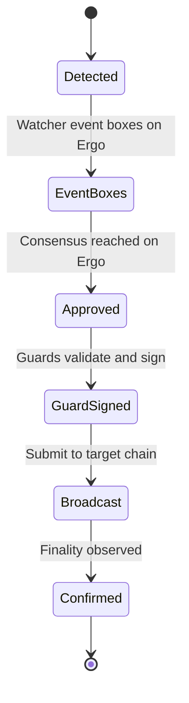

# RosenBridge Events & Status

This page explains the event lifecycle as shown in the Rosen app (Events page) and how to interpret each status. It complements the flow diagrams and troubleshooting guidance.

See also:
- Flows: [token-transfer-flows.md](token-transfer-flows.md)
- Troubleshooting: [rosen-troubleshooting.md](rosen-troubleshooting.md)
- Security posture: [security-model.md](security-model.md)
- Glossary: [rosen-glossary.md](rosen-glossary.md)

## Event Lifecycle

Typical stages for a bridge operation (direction-agnostic):

1) Detected
- The source-chain transaction has been observed and preliminarily meets criteria.
- For ChainX ➜ Ergo, watchers have seen the deposit to the multisig/threshold wallet.
- For Ergo ➜ ChainX, watchers have seen the relevant Bank box transaction.

2) Event Boxes
- Individual watchers create “event boxes” on Ergo, each attesting to the same observed event.
- Multiple event boxes for the same event are required to advance.

3) Approved Event
- Enough watcher event boxes for the same event exist on Ergo to reach consensus.
- This is recorded as an “approved event box.”
- Guards now consider the event for verification and signing.

4) Guard Signed
- Guards independently verify the event against the source chain (confirmations, amounts, metadata).
- Once sufficient guard signatures are collected (m-of-n/threshold), the target-chain transaction is ready.

5) Broadcast
- The mint/burn (or release/unlock) transaction is submitted to the relevant chain (Ergo or ChainX).
- This is the network propagation step; success depends on fees/gas and congestion.

6) Confirmed
- Sufficient confirmations have been observed on the target chain.
- The event is considered final; users should see the rTokens (ChainX ➜ Ergo) or receive native tokens (Ergo ➜ ChainX).

## Status Mapping in the App

- Pending/Detected: Waiting for required confirmations and watcher submissions.
- Approved: Watcher consensus achieved on Ergo.
- Signed: Guards have signed the transaction; ready to broadcast or already submitted.
- Broadcast/Submitted: Sent to the network, awaiting inclusion.
- Confirmed/Completed: Reached finality on the target chain.

Note: Labels may vary slightly over time in the UI. The lifecycle above remains valid.

## Typical Timing

- Normal windows: ~1–2 hours for many routes
- Longer cases:
  - Bitcoin or high-congestion periods
  - Very large transfers (may require cold ➜ hot wallet movements and extra checks)
- Always consult the Events page for the latest status: https://app.rosen.tech/events

## What to Do at Each Stage

- Detected/Pending:
  - Ensure your source transaction has enough confirmations on a reliable explorer.
  - Avoid repeating the same action; duplicating can cause confusion or spam.
- Approved:
  - Guards are working; no user action needed. Monitor Events page.
- Signed/Broadcast:
  - For EVMs, high gas volatility can affect inclusion time. Be patient.
- Confirmed:
  - For ChainX ➜ Ergo: your rTokens should appear; import tokens if needed (EVM).
  - For Ergo ➜ ChainX: check target wallet or explorer.

## When to Troubleshoot

- Stuck in “Pending/Detected” far beyond typical windows:
  - Check source confirmations; Bitcoin can take longer than EVM or Cardano.
  - Review [rosen-troubleshooting.md](rosen-troubleshooting.md)
- Signed but no inclusion for a long period:
  - Target chain congestion or fee scarcity; continue monitoring.
- Asset not visible:
  - Verify the official token contract (https://app.rosen.tech/assets), and add it to your wallet (EVM).

## Visual Reference

For detailed flow charts by direction, see:
- ChainX ➜ Ergo and Ergo ➜ ChainX: [token-transfer-flows.md](token-transfer-flows.md)
