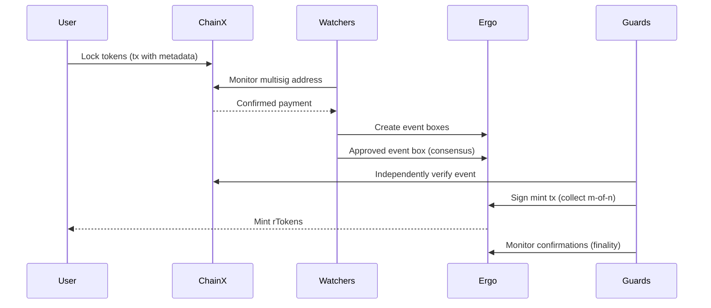
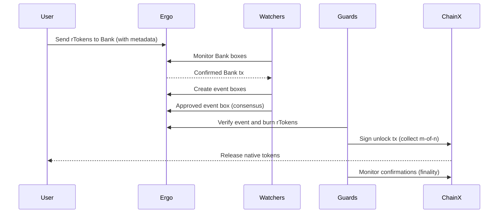
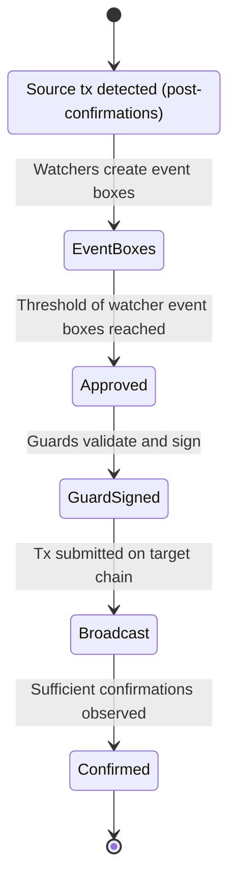

# RosenBridge Token Transfer Flows

This guide explains the end-to-end flows for moving value through RosenBridge in both directions: from an external chain (ChainX) to Ergo, and from Ergo back to ChainX. It highlights the roles of Watchers and Guards, consensus checkpoints, and finality.

See also: [Watcher](watcher.md), [Rosen Guards](rosen-guard.md), [Fees & Dust](fees-and-dust.md), [Events & Status](events-and-status.md), [Metadata Schema](metadata-schema.md)

## Token Transfer from ChainX to Ergo

Transferring tokens from ChainX to Ergo involves securely locking the native tokens on the source chain (e.g., BTC on Bitcoin) and minting representative tokens (rTokens, e.g., rBTC) on Ergo.

1) Initiating the Transfer
- User sends tokens to the bridge’s multisignature/threshold wallet on ChainX.
- The transaction includes metadata specifying the destination Ergo address.
- Users typically construct this transaction through the RosenBridge UI for safety and convenience.

2) Monitoring for Events (Watchers)
- Watchers continuously monitor the ChainX multisig wallet for incoming transactions.
- They detect candidate events indicating that a user initiated a token transfer.

3) Creating Event Boxes on Ergo
- After the payment receives the required number of confirmations on ChainX, each Watcher creates an “event box” on the Ergo blockchain representing the detected transfer.

4) Approving the Event (Watcher Consensus)
- When sufficient event boxes are present for the same transfer, an “approved event box” is recognized on Ergo.
- This records that Watchers reached consensus on the event.

5) Validation by Guards
- Guards scan for approved event boxes on Ergo.
- Each Guard independently verifies the event on ChainX.
- If valid, Guards sign the corresponding Ergo transaction that mints the representative rTokens.

6) Broadcasting the Transaction on Ergo
- Once enough Guard signatures are collected, the minting transaction is broadcast on Ergo.

7) User Receives rTokens
- The user receives representative rTokens on Ergo, equivalent to the assets locked on ChainX.

8) Ensuring Transaction Confirmation (Guard Oversight)
- Guards monitor the Ergo chain to ensure the transaction is mined and reaches sufficient confirmations.

### Sequence diagram: ChainX -> Ergo

## Transferring rTokens from Ergo to ChainX

Returning rTokens from Ergo to ChainX burns the rTokens on Ergo and unlocks the original tokens on ChainX.

1) Initiating the Transfer on Ergo
- User sends rTokens to a designated Bank contract on Ergo or creates a new Bank box via a transaction.
- The transaction includes metadata specifying the destination address on ChainX.

2) Monitoring Bank Contract Events (Watchers)
- Watchers continuously monitor the Bank contract for new transactions that indicate a withdrawal back to ChainX.

3) Event Box Creation on Ergo
- After required confirmations on Ergo, each Watcher creates an event box recording the initiated transfer out of Ergo.

4) Event Approval (Watcher Consensus)
- When enough event boxes are present for the same transaction, an approved event box is recognized.

5) Validation and Signing by Guards
- Guards verify the approved event on Ergo.
- If valid, Guards sign the transaction for ChainX that will release the original tokens.

6) Broadcasting the Transaction on ChainX
- Once enough Guard signatures are collected, the ChainX transaction is broadcast to unlock assets.

7) Completion of Token Receipt on ChainX
- The user receives the original tokens on ChainX.

8) Ensuring Transaction Finality (Guard Oversight)
- Guards monitor ChainX to confirm the transaction is mined and reaches sufficient confirmations.

### Sequence diagram: Ergo -> ChainX

### Event lifecycle (Ergo)

## Related

- Roles and security:
  - [Watcher](watcher.md)
  - [Rosen Guards](rosen-guard.md)
  - [Fees & Dust](fees-and-dust.md)

- Practical tutorials:
  - [rsERG-LP](rsERGLP.md)
  - [rsERG-LP (BNB)](rsERGLP-BNB.md)
  - [Token Integration Guides](token_integration.md)
