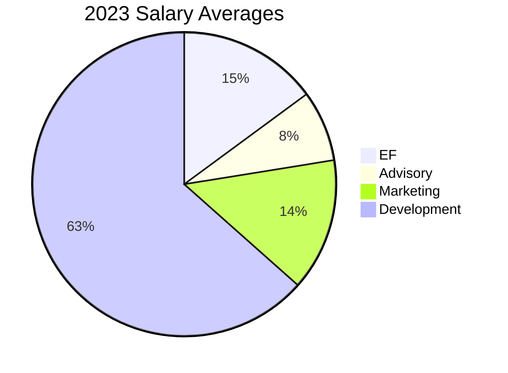

# Ergo Foundation Treasury

## Quick Navigation
- [Ergo Foundation Treasury](#ergo-foundation-treasury)
  - [Quick Navigation](#quick-navigation)
  - [Initial Allocation](#initial-allocation)
  - [Holdings](#holdings)
  - [Wallets](#wallets)
  - [Salaries](#salaries)
  - [Historic Spending](#historic-spending)

## Initial Allocation

//// details | Initial Allocation & EFYT
    {type: info, open: false}
This page covers the structure of the transactions section of an Ergo block. For more general information on transactions, see [this](transactions.md) page.

The Ergo Foundation initially received an allocation of 4,330,776 ERG, which is equivalent to 4.43% of the total supply.

A significant portion of this Treasury has been expended for the benefit of the Ergo protocol and community. Even during periods of low ERG price, the Foundation continued to invest in order to foster and grow the Ergo ecosystem.

/// details | EFYT
     {type: info, open: true}
Additionally, the Treasury exchanged 1,782,615 ERG for [EFYT](efyt.md), a token issued on the Waves Platform in 2017 to build an early community through airdrops and raise funds before the Ergo mainnet launch.

After subtracting the 1,782,615 ERG exchanged for EFYT, the Ergo Foundation was left with 2,548,161 ERG, which is approximately 2.6% of the total supply.
///
////
For more information on Ergo's emission schedule, tokenomics and allocation, visit the [emission](emission.md) section.

## Holdings

As of January 2025, the complete treasury of the foundation is as follows:

| Asset | Indicator Amount | Indicative US$ Price | Indicative Total US$ Value |
|-------|------------------|----------------------|----------------------------|
| **Liquid Assets in Self-Hosted Wallets** |
| ERG | 156,160 | 1.7 | 265,475 |
| BTC | 2.230499 | 108,059 | 241,025 |
| **Subtotal - Liquid Assets** | | | $506,500 | 506500
| **Illiquid Assets in Self-Hosted Wallets** |
| Gluon | 335,000 | 1.00 | 335,000.00 |
| SPF | 26,600,000 | 0.01292 | 277,970 |
| RSN | 30,000,000 | 0.06639 | 2,805,900 |
| **Subtotal - Illiquid Assets** | | | $3,418,870 |
| **Assets in MM Accounts (Illiquid)** |
| ERG | 58,715 | 1.7 | 99,815.5 |
| USDT | 35,746 | 1.00 | 35,746 |
| **Subtotal - Assets in MM Accounts** | | | $135,561 |
| **Total Liquid Assets** | | | $506,500 |
| **Total Illiquid Assets** | | | $3,554,431 |
| **Total Assets** | | | $4,060,931 |

/// details | Liquid vs Illiquid Funds
     {type: warning, open: true}
The Ergo Foundation's treasury consists of both liquid and illiquid assets, providing a diverse portfolio to support the growth and development of the Ergo ecosystem. The liquid assets, such as ERG and BTC, can be readily utilized for various purposes, while the illiquid assets, like Gluon, SPF, and RSN tokens, are held strategically to avoid exerting downward pressure on these early-stage projects.

As these projects mature and their tokens become more liquid, the Ergo Foundation will have the opportunity to leverage these assets to further augment its expenditure capabilities and support the Ergo ecosystem more effectively.
///

## Wallets

You can find the Ergo Foundation treasury and current balance on-chain at the following locations:

- [EF Multi-sig for ERG + Tokens](https://ergexplorer.com/addresses#2BggBDgr9n9geTKjCJBCEWMReb2i7wcocw7fjVd3QyM7qFMtmVHyoFr78kChAxGekJxUTZru2aMjyZKcVoPfHX5d12RqNrnEAgzGqUCoJ2v9xCqmT75V5xdhT1JBqQbeRKJZT4XGMg7hZAqVvbMsQF26nkWRPqiCqPoKfy7GZw9zuvr15qaqbB2ZcZXaGTrvqDN2o15SRTJwvVADDx2inzrk3U25cdjFWYBc6ECKSjmYpPWL8fn4msxsBZKNiGbP8vDrYWqQuPtMwJ5Ag)
     - [Hot Wallet](https://ergexplorer.com/addresses#9g1ReLmsbGevkTjfPGMdRMoFRdrAVskZVmSBpaEdVW2DfG4HDWm) managed by the Treasurer when sending payments.
- [EF BTC Multi-sig](https://www.blockchain.com/explorer/addresses/BTC/bc1qhps44rcl0rln47te839wr5rx25z624gawsgdye0cs4m0pq2mkhnq8dmkkc)

## Salaries

Several receive monthly salaries or rewards for their contributions to the Ergo ecosystem. The vast majority were promoted from within the community after exceptional contributions, demonstrating the Foundation's commitment to recognizing and rewarding talent within the Ergo community.

An average breakdown of how people in Ergo are awarded.

/// details | Roles
     {type: info, open: true}
More information on each of these roles can be seen on [this page](ef-scope.md#key-areas-of-focus).
///

## Historic Spending

The Ergo Foundation has spent the majority of the Treasury for the benefit of the protocol and community. Funds were even spent when the ERG price was low, as it was necessary to bootstrap the thriving community Ergo now boasts.

<!--TODO: Yearly figures don't add up to total difference between total allocation & spending, 90k difference, probably missed a tx -->

| **Spent** | **ERG**      | **SPF**       | **BTC**     | **TOTAL VALUE**   |
|-----------|--------------|---------------|-------------|-------------------|
| 2024      | 209,646      | 1,627,500     | 1.95        | TBC               |
| 2023      | 424,150      | 1,622,000     | -           | $589,777          |
| 2022      | 723,000      | -             | -           | $2,247,640        |
| 2021      | 889,001      | -             | -           | $3,793,485        |
| 2020      | 1,080,000    | -             | -           | $500,292          |
| 2019      | 757,051      | -             | -           | $590,239          |
| **Total** | **4,082,848**| **3,249,500** | **1.95**    | **$7,721,433**    |

In addition to the direct ERG spending above in 2023, 

- 972,000 SPF was liquidated for 43,020 ERG 
- 650,000 SPF was paid as compensation ($21,000)
- 160,000 SPF was donated to the [Sigmanauts](sigmanauts.md) Treasury
- Totaling 1,622,000 SPF 

/// details | The Ergo Foundations Future
     {type: info, open: true}
Please see [this page](ef-future.md) for more information on the long-term goals of The Foundation.
///
