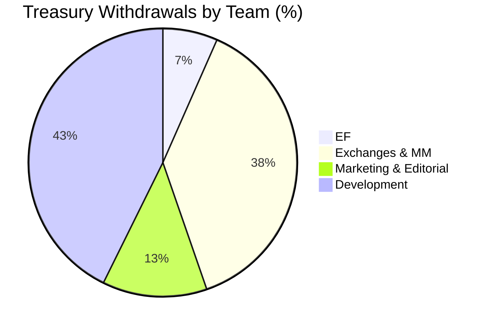
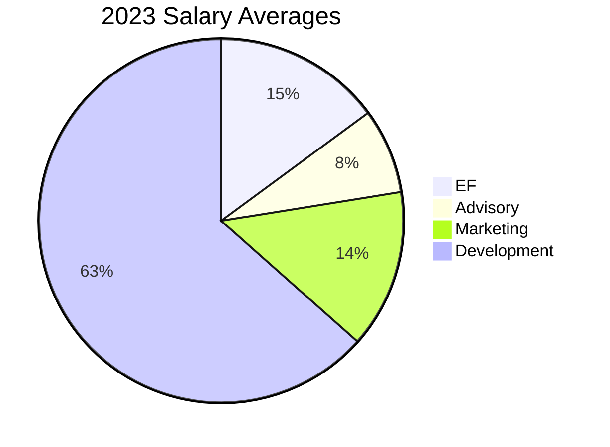
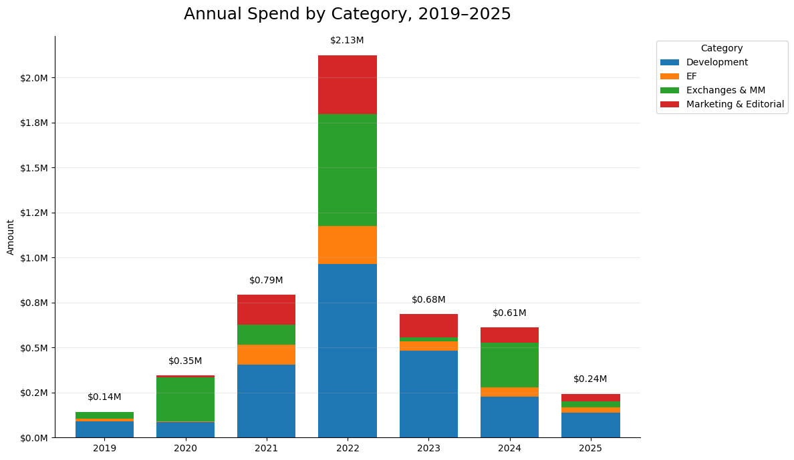
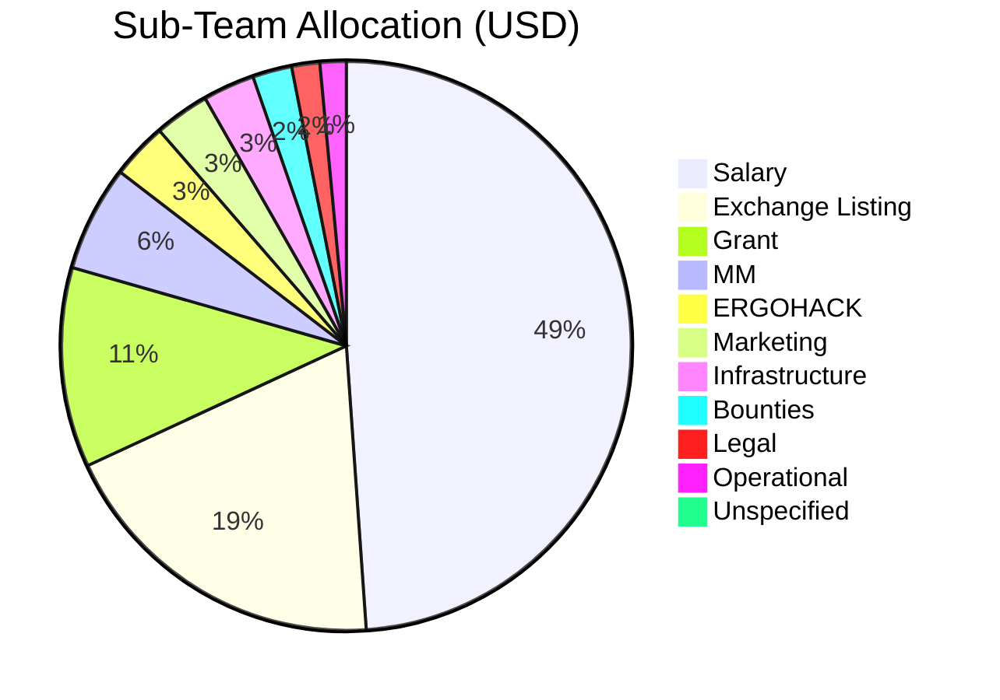

---
tags:
  - Ergo Foundation
  - EF
  - Treasury
  - Funding
  - Transparency
---

# Ergo Foundation Treasury

The Ergo Foundation initially received an allocation of 4,330,776 ERG, which is equivalent to 4.43% of the total supply.

Additionally, the Treasury exchanged 1,782,615 ERG for [EFYT](efyt.md), a token issued on the Waves Platform in 2017 to build an early community through airdrops and raise funds before the Ergo mainnet launch.

After subtracting the 1,782,615 ERG exchanged for EFYT, the Ergo Foundation was left with **2,548,161 ERG**, which is approximately **2.6%** of the total supply.

A significant portion of this treasury has been withdrawn to fund protocol development, ecosystem infrastructure, market access, events, marketing, and other community work. The charts and tables below summarise those withdrawals and the Foundation's remaining reported holdings.

```mermaid
pie title Treasury Withdrawals by Team (%)
    "EF" : 6.6
    "Exchanges & MM" : 38.1
    "Marketing & Editorial" : 12.6
    "Development" : 42.7
```
*(Please note that this summary is based on EF accounting records and, where available, information from EF Forum discussions and voting records. Before the current accounting records, accounting was managed by kushti, and a complete transaction-level record is not available. Most significant transactions should be reflected here.)*

See [More Summary Data](#more-summary-data) for additional category and yearly breakdowns.

For more information on Ergo's emission schedule, tokenomics and allocation, visit the [emission](emission.md) section.

## Current Holdings

The latest reported treasury balances are:

| Asset | Indicative Amount | Indicative US$ Price | Indicative Total US$ Value |
|-------|------------------|----------------------|----------------------------|
| **Liquid Assets in Self-Hosted Wallets** |
| ERG | 2,506.4214 | 0.22069 | 553.14 |
| BTC | 0 | - | 0 |
| **Subtotal - Liquid Assets** | | | $553.14 |
| **Illiquid Assets in Self-Hosted Wallets** |
| SPF | 23,830,000 | 0.00017539 | 4,179.50 |
| Gluon | 335,000 | 1.00 | 335,000.00 |
| RSN | 30,000,000 | 0.02431 | 729,300 |
| **Subtotal - Illiquid Assets** | | | $1,068,479.50 |
| **Total Liquid Assets** | | | $553.14 |
| **Total Assets** | | | $1,069,032.64 |

The former market-making fund held in centralised exchange wallets has been passed to the Sigmanauts to manage market making.

/// details | Liquid vs Illiquid Funds
     {type: warning, open: true}
The Ergo Foundation's remaining treasury consists mostly of illiquid ecosystem assets. Liquid ERG is limited, and the self-hosted BTC balance is currently zero.

Illiquid assets such as Gluon, SPF, and RSN are not treated as immediately spendable treasury. They may become more useful if the relevant markets deepen.
///

## Wallets

You can find the Ergo Foundation treasury and current balance on-chain at the following locations:

- [EF Multi-sig for ERG + Tokens](https://ergexplorer.com/addresses#2BggBDgr9n9geTKjCJBCEWMReb2i7wcocw7fjVd3QyM7qFMtmVHyoFr78kChAxGekJxUTZru2aMjyZKcVoPfHX5d12RqNrnEAgzGqUCoJ2v9xCqmT75V5xdhT1JBqQbeRKJZT4XGMg7hZAqVvbMsQF26nkWRPqiCqPoKfy7GZw9zuvr15qaqbB2ZcZXaGTrvqDN2o15SRTJwvVADDx2inzrk3U25cdjFWYBc6ECKSjmYpPWL8fn4msxsBZKNiGbP8vDrYWqQuPtMwJ5Ag)
  - [Hot Wallet](https://ergexplorer.com/addresses#9g1ReLmsbGevkTjfPGMdRMoFRdrAVskZVmSBpaEdVW2DfG4HDWm) managed by the Treasurer when sending payments.
- [EF BTC Multi-sig](https://www.blockchain.com/explorer/addresses/BTC/bc1qhps44rcl0rln47te839wr5rx25z624gawsgdye0cs4m0pq2mkhnq8dmkkc)

## Historic Spending

The Ergo Foundation has withdrawn the majority of its treasury allocation. These withdrawals funded development, listings and market making, marketing, events, grants, infrastructure, legal work, and operations.

<!--TODO: Yearly figures don't add up to total difference between total allocation & spending, 90k difference, probably missed a tx -->

/// admonition | Recalculated
    type: warning

These tables are rough guides using manual calculations of asset prices at the time of withdrawal. Categories are best-effort and may be refined as the records are consolidated.

///

### Treasury Funds Withdrawn

| **Year**  | **ERG**      | **SPF**       | **BTC**     | **Total USD Value** |
|-----------|--------------|---------------|-------------|-------------------|
| 2026      | 20,958       | 0             | 0.12985400  | $17,144.07        |
| 2025      | 132,696      | 2,770,000     | 2.10064500  | $243,531          |
| 2024      | 209,646      | 1,627,500     | 1.95        | $372,217          |
| 2023      | 424,150      | 1,622,000     | -           | $589,777          |
| 2022      | 723,000      | -             | -           | $2,247,640        |
| 2021      | 889,001      | -             | -           | $3,793,485        |
| 2020      | 1,080,000    | -             | -           | $500,292          |
| 2019      | 757,051      | -             | -           | $590,239          |
| **Total** | **4,236,502**| **6,019,500** | **4.18049900** | **$8,354,325.07** |

<!--

| Month      | ERG (USD)   | SPF (USD) | BTC (USD) | Total (USD) | Notes                            |
|------------|-------------|-----------|-----------|-------------|-----------------------------------|
| January    | $30,406.77  | $0.00     | $0.00     | $30,406.77  |                                   |
| February   | $15,300.09  | $0.00     | $0.00     | $15,300.09  |                                   |
| March      | $15,750.09  | $0.00     | $0.00     | $15,750.09  |                                   |
| April      | $7.57       | $0.00     | $16,925.13| $16,932.70  |                                   |
| May        | $38,899.80  | $0.00     | $0.00     | $38,899.80  | 20k to MEXC                       |
| June       | $44,524.81  | $837.00   | $0.00     | $45,361.81  | Includes large tx from 01/07      |
| July       | $23,968.81  | $2,169.00 | $0.00     | $26,137.81  | 49,472 ERG for ERGOHACK           |
| September  | $2,925.00   | $1,440.00 | $0.00     | $4,365.00   |                                   |
| October    | $6,703.20   | $1,260.00 | $14,923.61| $22,886.81  |                                   |
| November   | $5,140.00   | $1,635.20 | $25,664.91| $32,440.11  | 8k ERG MM                          |
| December   | $4,706.80   | $2,066.40 | $21,797.59| $28,570.79  | $15k for Hackathon/MiningGrant    |
| **Total**  | **$283,498.94** | **$9,407.60** | **$79,311.24** | **$372,217.78** |                                   |

-->

<!--
Outdated, included in table above
In addition to the direct ERG spending above in 2023, 

- 972,000 SPF was liquidated for 43,020 ERG 
- 650,000 SPF was paid as compensation ($21,000)
- 160,000 SPF was donated to the [Sigmanauts](sigmanauts.md) Treasury
- Totaling 1,622,000 SPF 
-->

## Salaries

Several contributors have received monthly salaries or rewards for work on the Ergo ecosystem. Most were promoted from within the community after sustained contributions.

The chart below shows a 2023 average salary allocation.

```mermaid
pie title 2023 Salary Averages
    "EF" : 14.8
    "Advisory" : 7.5
    "Marketing" : 14
    "Development" : 63
```

/// details | Roles
     {type: info, open: true}
More information on each of these roles can be seen on [this page](ef-scope.md#key-areas-of-focus).
///

/// details | The Ergo Foundation's Future
     {type: info, open: true}
Please see [this page](ef-future.md) for more information on the long-term goals of the Foundation.
///

## More Summary Data

The charts below are summary views based on the same accounting records, forum/voting context, and manual categorisation used above. Older periods may not have complete transaction-level records, so these figures should be read as a best-effort historical overview rather than audited financial statements.

### USD Withdrawals by Team

| **Year**        | **Development** | **EF**       | **Exchanges & MM** | **Marketing & Editorial** | **Grand Total** |
|-----------------|-----------------|--------------|--------------------|---------------------------|-----------------|
| 2019            | 88,133          | 15,702       | 36,966             | 2,665                     | 143,466         |
| 2020            | 85,638          | 6,002        | 242,904            | 11,048                    | 345,592         |
| 2021            | 406,079         | 108,501      | 111,895            | 167,870                   | 794,344         |
| 2022            | 963,218         | 212,628      | 623,634            | 325,577                   | 2,125,056       |
| 2023            | 484,049         | 50,508       | 20,923             | 129,349                   | 684,828         |
| 2024            | 226,806         | 52,205       | 248,414            | 84,991                    | 612,416         |
| 2025            | 136,538         | 32,198       | 33,000             | 41,795                    | 243,531         |
| **Grand Total** | **2,390,460**   | **477,743**  | **1,317,735**      | **763,294**               | **4,949,233**   |

### USD Withdrawals by Sub-Team

```mermaid
pie title Sub-Team Allocation (USD)
    "Salary" : 2416153
    "Exchange Listing" : 949317
    "Grant" : 560650
    "MM" : 296673
    "ERGOHACK" : 157632
    "Marketing" : 154363
    "Infrastructure" : 145045
    "Bounties" : 110158
    "Legal" : 78683
    "Operational" : 73559
    "Unspecified" : 7000
```

### Split by End Product
| End Product                  | SUM of Amount, USD |
| ---------------------------- | -----------------: |
| Sigma Rust                   |            288,412 |
| Sigma                        |            281,482 |
| Rosen                        |            277,437 |
| ERGOHACK                     |            143,695 |
| sigmaverse.io                |            135,352 |
| ErgoDex                      |            133,135 |
| Explorer                     |            133,080 |
| Terminus                     |            125,852 |
| Docs                         |            117,049 |
| Nautilus                     |            117,045 |
| Uncategorized / Dev Unknown  |             65,101 |
| Research                     |             59,193 |
| Operational                  |             48,636 |
| Yoroi                        |             46,735 |
| Auction House                |             45,340 |
| Subscriptions / Server / etc |             43,324 |
| Node                         |             40,026 |
| Ledger                       |             21,552 |
| SigMining                    |             19,969 |
| Explorer(s)                  |             15,070 |
| ergonames                    |             12,180 |
| Cyberverse                   |             10,107 |
| Blog / ergoplatform.org      |              8,697 |
| Sigmanauts                   |              9,163 |
| Gluon                        |              4,469 |
| Lithos                       |              2,000 |
| ergo-nix                     |              1,123 |
| ErgoFund                     |              1,020 |
| Mining                       |                661 |
| Rosen Team                   |                533 |
| Oracles                      |                200 |
| **Grand Total**              |      **2,207,639** |
