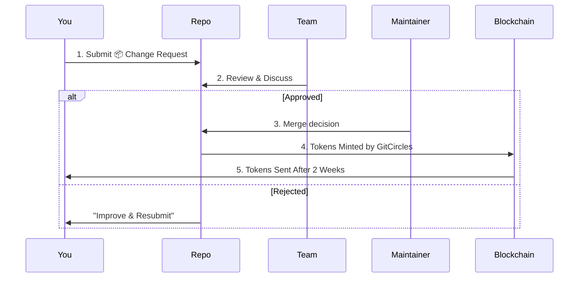

# GitCircles: Turning Open Source Contributions Into Real-World Rewards

Open source powers the digital world. But for too long, the people behind it — the contributors — have worked without clear recognition or reward. Enter **GitCircles**, an innovative platform that automates contributor recognition and converts meaningful contributions into **cryptocurrency rewards**.

Whether you're a maintainer looking for a fairer system or a developer hoping to earn from your code, GitCircles is poised to change the way we think about open source value.

---

## 🔍 What Is GitCircles?

At its core, **GitCircles** is an automated engine that tracks contributions in Git-based projects (like GitHub, GitLab, Gitea, and Bitbucket) and issues **on-chain cryptocurrency tokens** to contributors — based on the actual impact of their work.

It bridges the world of Git and decentralized finance (DeFi):

```
Work (PRs/MRs) ➡️ Analysis ➡️ Token Rewards ➡️ Your Crypto Wallet
```

In this system, each code contribution becomes a quantifiable, rewarded action.

---

## 💡 Why Does This Matter?

Here's the current state of open source:

```diff
- Developers contribute for free
- Maintainers struggle to incentivize high-quality work
- Reward systems (if any) are ad-hoc or biased
+ GitCircles automates fair, transparent rewards based on measurable contributions
```

In short, **it makes open source sustainable.**

---

## 📦 The “Change Request” Concept

Git platforms have different names for contributions:

* GitHub: Pull Request (PR)
* GitLab: Merge Request (MR)
* Gitea: PR
* Bitbucket: PR

GitCircles standardizes all of these under one universal term:
**📦 Change Request** – *any code proposal with discussion, tracked in Git.*

---

## 🛠️ How GitCircles Works

Here's how your contribution transforms into tokens:



**🕒 Safety Delay**: There's a 2-week holding period where maintainers can cancel bad payouts by inserting:

```markdown
<!-- STOP -->
Reason: This change breaks compatibility.
```

---

## 📊 How Rewards Are Calculated

Reward = `Scope × Complexity Factor`

* **Scope**: Lines changed × file importance
* **Complexity Factor**: Owner-defined weight (e.g., backend logic = 2x docs)

### Example:

Emily submits a PR:

* +50 lines in API code (1.5x weight)
* +20 lines in tests (0.8x)
* +5 lines in docs (0.2x)

Total tokens:

```
= (50×1.5) + (20×0.8) + (5×0.2) = 75 + 16 + 1 = 92 tokens
```

---

## 💸 How to Set Up Your Reward Profile

To receive tokens:

1. Create a GitHub repo named `gitcircles-profile`

2. Add your [Ergo wallet address](https://docs.ergoplatform.com/dev/wallet/address/address_types/):

   ```bash
   echo "YOUR_ERGO_KEY" > P2PK.pub
   git add P2PK.pub
   git commit -m "Add payment key"
   git push
   ```

3. Done! GitCircles will track rewards and send tokens to your latest key.

---

## 🔧 Under the Hood: GitCircles-Github Adapter

All this automation is powered by adapters — with **[GitCircles-Github](https://github.com/GitCircles/GitCircles-Github)** serving as the GitHub data bridge.

### What It Does:

* Interfaces with GitHub API to fetch contribution metadata
* Normalizes “Change Requests” across platforms
* Converts repo data into reward-ready formats
* Written in fast, memory-safe **Rust**

Think of it as a microservice that continuously listens, interprets, and prepares data — all so contributors can get paid.

This adapter is modular and can be paired with GitLab, Bitbucket, and other platform equivalents.

---

## 🧠 Smart, But Not Perfect

| Challenge           | Status              | What’s Next           |
| ------------------- | ------------------- | --------------------- |
| 🧾 Squashed commits | Attribution is hard | Improving SHA mapping |
| 🧵 Non-code input   | Not yet rewarded    | Comment/issue scoring |
| 🔐 Key security     | Manual address file | Signed commits + 2FA  |
| 💼 Legal/Taxation   | Not integrated      | On-demand compliance  |

---

## 🎯 Why It Matters

GitCircles is more than a tool. It’s a **movement** toward fairness in open source:

```diff
+ You write meaningful code
+ You get measurable recognition
+ You earn real crypto tokens
```

No more working “for the love of it” alone. GitCircles makes it possible to **love your work — and be rewarded for it.**

---

## 🚀 Join the Future of Open Source

* 💻 Developers: Start contributing, get rewarded.
* 🛠️ Maintainers: Adopt GitCircles to attract high-quality contributions.
* 🤝 Communities: Build transparent, sustainable ecosystems.

Check out:

* [GitCircles-Github adapter](https://github.com/GitCircles/GitCircles-Github)
* [Main platform](https://gitcircles.org) *(if/when available)*

Let’s build the future of open source — together, and fairly.
